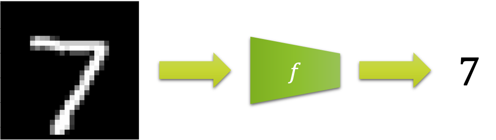

# 좋은 인공지능이란?

## 인공지능 모델이란?

인공지능 모델은 $x$ 가 입력으로 주어졌을 때, $y$ 를 출력으로 반환하는 함수라고 할 수 있습니다.

$$\begin{gathered}
y=f(x)
\end{gathered}$$

즉, 주어진 입력에 대해서 정해진 방식대로 출력을 반환하는 프로그램이자 함수라고 볼 수 있습니다.
이때 이 함수가 어떻게 동작할지 정해놓은 내용을 파라미터weight paramter $\theta$ 라고 부릅니다.
따라서 함수는 $\theta$ 의 구성에 따라 입력을 받았을 때, 어떤 출력 값 $y$ 를 반환할지 결정됩니다.

우리가 하고 싶은 일은 머릿속에 존재하는 구체적인 동작 방식을 알 수 없는 함수 $f^*$ 를 인공지능 모델을 통해 근사approximate하는 것입니다.
만약 $f^*$ 의 동작 방식을 이미 잘 알고 있다면, 우리는 모델을 통해 근사할 필요 없이 바로 프로그래밍을 통해 함수 자체를 정의할 수 있을 것입니다.
하지만 우리는 정확한 동작 방식을 알 수 없기 때문에 데이터를 $f^*$ 로부터 수집하여 모델이 똑같이 동작하도록 학습시키고자 합니다.

우리는 위 그림에서 왼쪽의 숫자 손글씨를 본 순간 어쩔 수 없이 7을 떠올렸을 것입니다.
우리의 머릿속에는 글씨 영상을 입력으로 받아 숫자로 변환하는 함수 $f^*$ 가 들어있습니다.
하지만 이 함수의 동작 방식은 아무도 정확하게 정의할 수 없습니다.
당장 저 이미지만 해도 $28\times28$ 의 크기에 각 픽셀별로 256가지의 숫자로 표현되기 때문에, 경우의 수만 따져보더라도 $200,704$ 가지에 이릅니다.

따라서 학습이란 수집된 데이터 $x$ 와 $y$ 쌍을 통해, 함수 $f$ 가 $x$ 로부터 $y$ 로 가는 관계를 배우는 것을 의미합니다.
또는 $x$ 와 $y$ 를 통해 적절한 함수의 동작 방식 파라미터 $\theta$ 를 찾아내는 과정이라고 볼 수 있습니다.[[1]](#footnote_1)

> 사실 모델이라는 단어 자체는 종종 의미가 혼용되기도 합니다.
> 상황에 따라 넓은 의미에서는 함수의 종류인 알고리즘 자체를 의미하기도 하고, 좁은 의미에서는 학습이 완료된 파라미터 $\theta$ 를 이르기도 합니다.

<a name="footnote_1">[1]</a>: 때로는 $y$ 없이, $x$ 만을 수집하여 $x$ 의 분포를 학습하기도 합니다.

## 좋은 인공지능 모델이란?

그럼 좋은 인공지능 모델이란 무엇일까요?
여기에는 많은 의견이 있을 수 있습니다.
저는 일반화generalization를 잘하는 모델이라고 생각합니다.
여기서 일반화란 보지 못한unseen 데이터에 대해서 좋은 예측prediction을 하는 것을 의미합니다.

만약 우리가 모든 존재할 수 있는 경우의 수에 해당하는 $x$ 와 $y$ 의 쌍을 모을 수 있다면, 우리는 컴퓨터로 하여금 그냥 $x$ 에서 $y$ 로 가는 맵핑 테이블mapping table을 만들도록 하면 될 것입니다.
추론inference의 과정은 입력이 주어졌을 때, 테이블에서 입력에 해당하는 키key 값을 찾아서, 이에 대응하는 값value을 반환하면 될 것입니다.
하지만 우리는 잘 알고 있듯이, 모든 경우의 수에 대해서 당연히 수집할 수 없습니다.
따라서 모델은 수집된 한정된 데이터로부터 관계를 학습한 후, 보지 못한 데이터에 대해서 알맞은 추론 또는 예측을 수행해야 합니다.

## 기존 머신러닝의 한계

예로부터 인간은 자신을 닮은 존재를 만들고 싶어했는지도 모릅니다.
어쩌면 나 대신 일해줄 녀석이 필요했을 수 있습니다.
따라서 예전부터 $f^*$를 근사하기 위한 노력들은 존재해왔습니다.

즉, 딥러닝 이전에도 많은 머신러닝 기법들이 연구되어 왔습니다.
딥러닝도 이 머신러닝의 기법들 중 하나입니다.
기존 머신러닝의 경우에는 주로 선형linear 또는 낮은 차원low dimensional의 데이터를 다루기 위해 설계되었습니다.
물론 커널kernel과 같은 방법들을 활용하여 비선형non-linear 데이터를 다룰 수 있지만, 그 한계는 명확합니다.
따라서 이미지, 텍스트, 음성과 같은 훨씬 더 높은 차원의 비선형 데이터들에 대해 낮은 성능을 보여줍니다.

하지만 딥러닝의 경우에는 매우 유연한 비선형 함수이므로 이미지, 텍스트, 음성과 같은 데이터들에 대해 매우 잘 동작합니다.
우리는 이 책을 통해 이러한 딥러닝의 특징과 동작 방법에 대해 자세히 배우고자 합니다.
