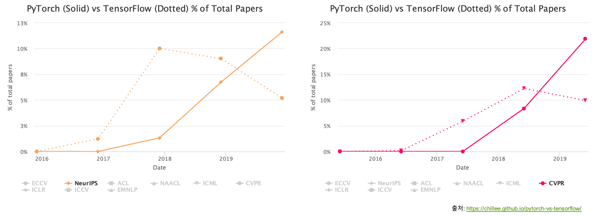

# 왜 파이토치인가?

이번 섹션에서는 왜 우리가 파이토치를 통해 딥러닝을 배우면 좋은지 이야기하고자 합니다.
그에 앞서 제 이야기를 통해 딥러닝 프레임워크의 역사도 간단하게 이야기하면 재미있을 것 같습니다.

저는 2013년 즈음 처음 딥러닝을 접했습니다.
당시에는 테아노Theano[[1]](#footnote_1)라는 파이썬 라이브리를 통해 딥러닝을 구현할 수 있었습니다.
해당 라이브러리는 필요한 미분 계산을 C++을 통해 자동으로 수행해주는 기능이 있었습니다.
덕분에 디버깅은 너무나도 어려운 일이었고, 설치도 쉽지 않았던 기억이 납니다.
사실은 이것도 기존의 인공신경망 개발 과정에 비하면 훨씬 쉬운 것이었을텐데, 지금의 난이도를 생각하면 지금의 폭발적인 딥러닝 학계의 발전속도를 이해할 수 있습니다.
참으로 격세지감이 아닐 수 없습니다.

그러던 차에 테아노의 어려움을 해결하고자 케라스Keras가 출시되었습니다.
당시의 케라스는 테아노를 백본으로 사용하여 감싼 형태로, 훨씬 더 쉽게 딥러닝을 구현할 수 있었습니다.
하지만 자유도의 한계가 아쉬움으로 남아있었습니다.
그러던 차에 구글에서 텐서플로Tensorflow를 출시하였지만, 당시에는 아직 저의 실력이 부족했던터라 어려워보여서 차마 넘어갈 생각을 못하고 있었습니다.
그러던 와중에 2017년에 이직을 하였는데, 마침 페이스북에서 파이토치를 출시하기에, 뭔가 새롭게 업무를 시작하는 김에 얼른 갈아탄 기억이 납니다.
지금 생각하면 참 잘한 일이고, 운이 좋아 다행스러운 일이었습니다.
왜 다행스러운 일이었는지 다음의 내용들을 통해 살펴보도록 하겠습니다.

<a name="footnote_1">[1]</a>: https://en.wikipedia.org/wiki/Theano_(software)

## 장점

누군가 이런 이야기를 했던 기억이 납니다.
독일 자동차메이커 3개 회사의 자동차 중에서 가장 좋은 차가 무엇이냐고.
물론 다들 생각이 다르실 수 있지만, 그 분은 가장 나중에 나온 차가 좋다고 하셨습니다.

그런 의미에서 파이토치는 경쟁 프레임워크들(e.g. 텐서플로)에 비해 가장 늦게 출시되었기 때문에 앞서 출시된 경쟁자들의 장점을 많이 흡수한 채로 태어났습니다.
어떤 장점들이 있는지 살펴보도록 하겠습니다.

### 문서화

저도 2017년에 파이토치가 처음 나오자마자 접했다고 위에 이야기했습니다.
즉, 당시에 참고할만한 자료는 딱 하나 밖에 없었습니다.
바로 파이토치 공식 문서[[2]](#footnote_2)였습니다.
파이토치는 문서화documentation가 너무 훌륭하게 되어 있어서 처음 접하는데 있어서 어려움이 전혀 없었습니다.
DSLR을 처음 샀을 때 메뉴얼을 3번 정독하라는 이야기도 있는데, 여러분들도 그런 마음가짐으로 파이토치 문서를 대하시면 좋겠습니다.
저 같은 경우에도 모든 함수들을 외우고 있는 것이 아니기 때문에, 항상 들락날락거리며 주소도 외워서 사용합니다.

<a name="footnote_2">[2]</a>: https://pytorch.org/docs

### 난이도 & 편의성

파이토치는 매우 쉽게 구현이 가능하도록 설계되었습니다.
보통 쉬운 인터페이스에는 구현 자유도의 제한이라는 댓가가 따르기 마련인데, 자유도에 있어서도 그 어떤 프레임워크 부럽지 않게 설계되어 있습니다.
따라서 같은 기능을 구현함에 있어서 다른 라이브러리에 비해서 코드 가독성 부분에서도 훨씬 뛰어납니다.
더욱이 넘파이numpy와 매우 비슷한 함수를 제공하기 때문에, 기존에 넘파이를 즐겨쓰던 사용자들이 심리적 저항없이 받아들일 수 있도록 되어 있습니다.

### Autograd

파이토치는 Autograd라는 기능을 제공합니다.
텐서플로와 달리 텐서들의 연산에 따라 실시간으로 구성된 계산 그래프computational graph를 따라 자동으로 오류역전파back-propagation가 계산되므로, 신경망 아키텍처에 대한 컴파일 과정이 존재하지 않습니다.
즉, 코드가 실행되는 와중에 계산 수식이 상황에 따라 바뀌더라도 미분 과정이 자연스럽게 따라서 적용될 것이라는 것입니다.
이것은 마치 C++과 같은 언어들은 컴파일러 방식이지만 BASIC 언어는 인터프리터 방식을 통해 실행되는 것과 비슷하다고 볼 수 있습니다.

## 단점

파이토치가 나오기에 앞서 텐서플로가 이미 시장 점유율을 높여 놓은 상태였기 때문에, 예전에는 공개되어 있는 코드들이 텐서플로로 구현되어 있는 경우가 더 많았습니다.
하지만 이것또한 후술할 파이토치의 점유율 증가로 인해서 더이상 파이토치의 단점으로 꼽히기 어렵습니다.
또한, 구글 TPU[[3]](#footnote_3)가 적용되지 않던 시절도 있었습니다.
하지만 이제 파이토치도 TPU에서도 동작할 수 있게 되는 등 많은 부분에서 텐서플로를 따라잡았기에 더이상 단점이 되지 않습니다.
다만, 상용화 지원 부분에 있어서는 아직 텐서플로가 파이토치를 앞선다고 평가할 수 있을텐데, 이 부분에 있어서도 곧 파이토치가 대등한 수준으로 따라잡을 것으로 기대해봅니다.

<a name="footnote_3">[3]</a>: https://ko.wikipedia.org/wiki/%ED%85%90%EC%84%9C_%EC%B2%98%EB%A6%AC_%EC%9E%A5%EC%B9%98

## 파이토치의 점유율 증가

실제로 파이토치는 상기한 장점들로 인해 학계의 전폭적인 지지를 받으며 계속해서 성장해왔습니다.
비록 출시 이후 첫 몇년간은 텐서플로에 점유율에서 밀려왔지만, 이제는 점유율 면에서도 텐서플로를 확실히 제껴가는 모습입니다.
실제로 유명 머신러닝 학회들에 제출된 논문들의 구현 코드들에 대한 통계를 살펴보면 파이토치가 확연한 우세를 보이는 것을 볼 수 있습니다.

아마 이러한 추세는 앞으로도 계속될 것으로 기대되어, 향후 파이토치와 텐서플로의 행보가 궁금해집니다.
