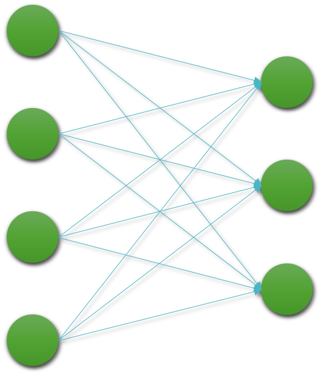
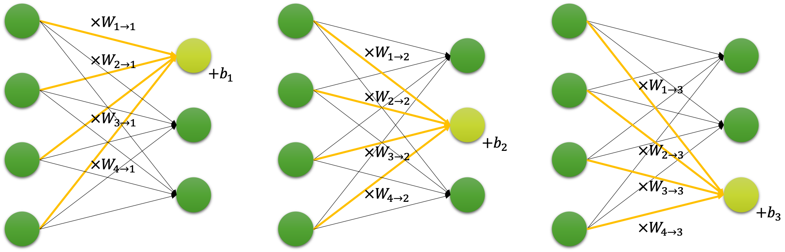

# 선형 계층

우리는 데이터를 모아서 알수 없는 함수 $f^*$ 를 근사하고 싶습니다.
어떤 모델로 그 함수를 근사할 수 있을까요?
이 장에서는 가장 기본 모델이 될 수 있는 선형 계층linear layer에 대해서 다뤄보겠습니다.
이 선형 계층은 후에 다룰 심층신경망deep neural networks의 가장 기본 구성요소가 됩니다.
뿐만 아니라, 앞서 언급한 것처럼 하나의 모델로 동작할 수도 있습니다.

다음의 그림은 선형 계층을 도식화하여 나타낸 것입니다.

이 선형 계층 또한 하나의 함수로 볼 수 있습니다.
따라서 4개의 입력을 받아 3개의 출력을 반환하는 함수로 생각할 수 있습니다.

$$\begin{gathered}
f:\mathbb{R}^4\rightarrow\mathbb{R}^3
\end{gathered}$$

즉, 앞의 수식과 같이 4차원의 실수 벡터를 입력을 받아 3차원의 실수 벡터를 반환하는 함수로 생각할 수 있습니다.

## 선형 계층 함수의 동작 방식

이때 이 함수는 가중치 파라미터weight paramter를 가지고 있으며, 이 가중치 파라미터에 의해서 함수의 동작이 정의됩니다.
이 가중치 파라미터는 다음 그림과 같이 동작하게 됩니다.
각각의 출력 노드의 값은, 입력 노드로부터 들어오는 값에 가중치 파라미터 $W_{i\rightarrow{j}}$ 를 곱하고, 또 다른 가중치 파라미터 $b_j$ 를 더해주어 결정됩니다.

상기한 동작 방식은 행렬 곱셈과 벡터의 덧셈으로 나타낼 수 있기 때문에, 이를 일반화 하여 수식으로 나타내면 다음과 표현할 수 있습니다.

$$\begin{gathered}
y=f(x)=W^\top\cdot{x}+b, \\
\text{where }x\in\mathbb{R}^n\text{, }W^\top\in\mathbb{R}^{m\times{n}}\text{, }b\in\mathbb{R}^m\text{ and }y\in\mathbb{R}^m.
\end{gathered}$$

입력 벡터 $x$ 는 n차원의 실수 벡터이며, 출력 벡터 $y$ 는 m차원의 실수 벡터입니다.
따라서 n차원을 m차원으로 변환해주기 위해선, $W$ 는 $n\times{m}$ 차원의 행렬이 되어야 합니다.

만약 수 백만개의 입력 벡터가 주어졌을 때, 이것을 단순히 순차적으로 처리한다면 매우 비효율적일 것입니다.
따라서 우리는 이 연산을 다수의 입력을 처리하기 위한 병렬parallel 연산으로 생각해볼 수도 있습니다.
우리는 N개의 n차원 벡터를 모아서 $N\times{n}$ 크기의 행렬로 만들 수 있습니다.
이것을 우리는 미니배치mini-batch라고 부르도록 하겠습니다.
이 미니배치 행렬을 선형 계층 함수에서 처리하기 위한 수식은 다음과 같이 표현될 것입니다.

$$\begin{gathered}
y=f(x)=x\cdot{W}+b, \\
\text{where }x\in\mathbb{R}^{N\times{n}}\text{, }W\in\mathbb{R}^{n\times{m}}\text{, }b\in\mathbb{R}^m\text{ and }y\in\mathbb{R}^{N\times{m}}.
\end{gathered}$$

앞서 수식에서 볼 수 있듯이, 우리는 입력을 N개 모아서 미니배치 행렬로 넣어주었기 때문에, 출력도 N개의 m차원의 벡터가 모여서 $N\times{m}$ 크기의 행렬이 됩니다.
이처럼, 우리는 병렬 연산을 통해 연산 속도를 높일 수 있으며, 이것은 GPU 상에서의 행렬 곱셈으로 처리 됩니다.

## 선형 계층의 의미

선형 계층은 행렬 곱셈과 벡터의 덧셈으로 이루어져있기 때문에, 선형 변환이라고 볼 수 있습니다.
따라서 선형 계층을 통해 모델을 구성할 경우, 우리는 선형 데이터에 대한 관계를 분석해볼 수 있습니다.
또는 선형 함수를 근사할 수 있습니다.

이제 실습을 통해 선형 계층을 좀 더 이해해보도록 하겠습니다.
