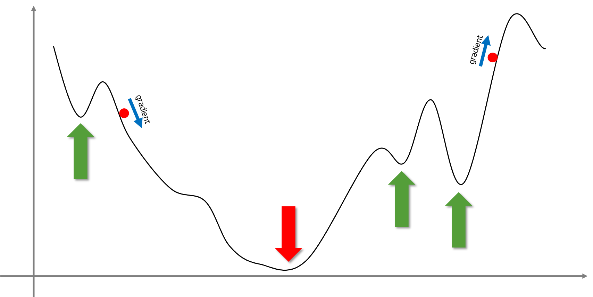
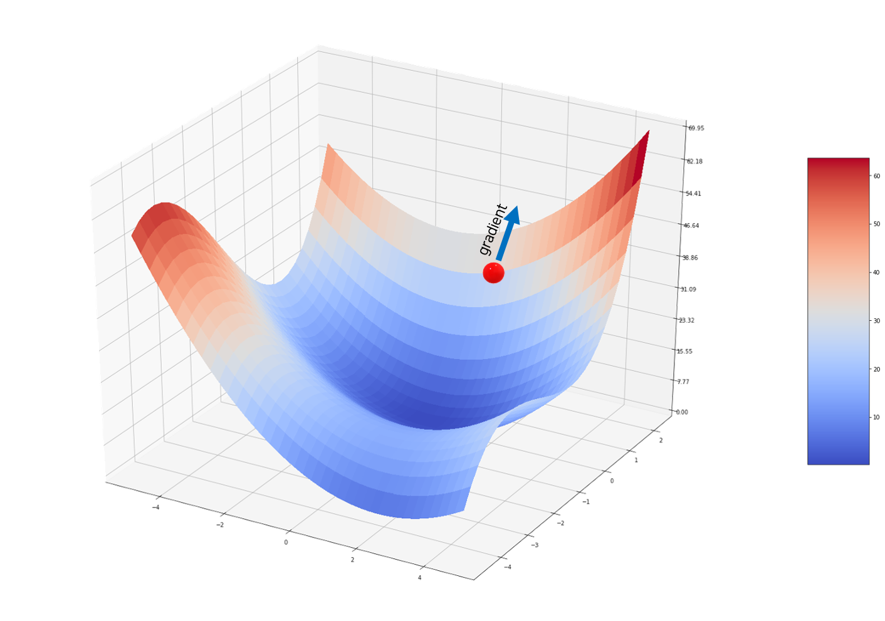
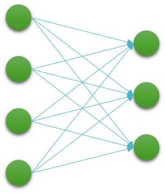

# 경사하강법

우리는 알수 없는 함수 $f^*$ 를 근사하기 위해 데이터셋 $\mathcal{D}$ 를 모아, 모델 함수가 최적의 출력값을 반환하도록 손실 함수가 최소가 되는 모델의 가중치 파라미터 $\hat{\theta}$ 를 찾고 싶습니다.
일단은 우린 선형 계층만을 모델로 활용하였을 때, 이를 수식으로 나타내면 다음과 같습니다.

$$\begin{gathered}
\mathcal{D}=\{(x_i, y_i)\}_{i=1}^N \\
\\
\mathcal{L}(\theta)=\sum_{i=1}^N\|y_i-f_\theta(x_i)\|_2^2, \\
\text{where }\theta=\{W,b\}\text{, if }f(x)=x\cdot{W}+b. \\
\\
\hat{\theta}=\underset{\theta\in\Theta}{\text{argmin }}\mathcal{L}(\theta)
\end{gathered}$$

앞서 우리는 해당 파라미터를 찾기 위한 가장 간단한 방법으로 가중치 파라미터의 값을 랜덤하게 생성하는 방법을 생각해보았습니다.
순수하게 운에 의존하는 이 방식은 당연히 너무나도 비효율적인 방법이 될 것입니다.

그럼 좀 더 나은 방법이 없을까요?
당연히 있습니다.
이번 섹션에서는 손실 함수의 출력을 최소로 만드는 입력을 찾기 위한 효율적인 방법인 경사하강법gradient descent에 대해 다뤄보겠습니다.

## 1차원에서의 경사하강법

경사하강법은 다음 그림과 같이 미분 가능한 복잡한 함수가 있을 때, 해당 함수의 최소점을 찾기 위한 방법입니다.

그림에 위치한 2개의 공들은 이대로 놓여진다면 마치 우리의 일상에서처럼 중력에 의해서 경사의 아래 방향으로 굴러가게 될 것입니다.
우리가 활용할 경사하강법도 비슷한 원리로 동작합니다.
공이 위치한 지점의 기울기 또는 그래디언트gradient를 활용하여 더 낮은 방향으로 점진적으로 이동합니다.

그림의 왼쪽에 위치한 공의 지점은 음의 기울기를 가지고 있습니다.
이때 우리는 그림에서 볼 수 있듯이 공은 오른쪽(양의 방향)으로 움직여야 합니다.
그림의 오른쪽에 위치한 공의 지점은 양의 기울기를 가지고 있습니다.
마찬가지로 우리는 공을 왼쪽(음의 방향)으로 움직여야 합니다.

## 경사하강법의 수식표현

앞서 설명한 공이 위치한 지점의 기울기에 따른 움직임의 방향을 수식으로 표현하면 다음과 같습니다.

$$\begin{gathered}
x\leftarrow{x}-\eta\frac{d{y}}{d{x}}, \\
\text{where }y=f(x).
\end{gathered}$$

함수 $f$ 의 출력값 $y$ 를 미분하면, 각 지점에 대한 기울기를 구할 수 있을 것입니다.
그럼 이제 움지여야 하는 다음 지점의 위치는 현재 지점의 기울기를 삐주면 구할 수 있습니다.
이때 기울기에 상수 $\eta$ 를 곱해주어, 움직임의 속도를 제어할 수 있습니다.
우리는 이 상수 $\eta$ 를 학습률learning rate이라고 부르도록 하겠습니다.

이것을 우리가 풀고자하는 문제에 대입하면 다음과 같이 수식으로 나타낼 수 있습니다.
가중치 파라미터 $\theta$ 는 손실 함수의 출력값을 낮추기 위해서 변경(업데이트)되어야 합니다.
이를 위해서 손실 함수를 가중치 파라미터로 미분하여 얻은 그래디언트를 (상수 $\eta$를 곱한 후) 현재 가중치 파라미터에서 빼 줍니다.

$$\begin{gathered}
\theta\leftarrow\theta-\eta\frac{\partial\mathcal{L}(\theta)}{\partial\theta} \\
\text{or} \\
\theta\leftarrow\theta-\eta\nabla_\theta\mathcal{L}(\theta).
\end{gathered}$$

좀 더 자세한 이야기는 조금 후에 이야기하겠습니다.

## 전역 최소점과 지역 최소점

이전의 그림에서 공을 각 위치에서 놓으면 어떻게 될까요?

왼쪽 공은 가운데에 위치한 빨간색 화살표가 가리키는 곳에 결국 멈추게 될 것 같습니다.
하지만 오른쪽에 위치한 공은 왼쪽으로 굴러가다가 골짜기에 빠져서 나오지 못할 수도 있겠네요.
방금의 예제에서처럼 우리가 목표로 하는 지점은 전체 구간에서 가장 낮은 함수의 출력값을 갖는 지점이 됩니다.
손실 함수를 대입하면, 손실 값이 최소가 되는 모델의 가중치 파라미터가 될 것입니다.
우리는 이 지점을 전역 최소점global minima라고 부릅니다.
이와 반대로 초록색 화살표들이 가리키고 있는 지점들은 지역 최소점local minima라고 부릅니다.
경사하강법은 미분 결과를 활용하므로 이와같은 지역 최소점들에 빠질 우려가 있습니다.
지역 최소점에 빠지게 된다면, 더 이상 손실 값을 낮추지 못하고 낮은 성능의 모델을 얻을 가능성도 있습니다.
다행인것은 실제 우리가 딥러닝에서 경사하강법을 활용할 때, 지역 최소점으로 인한 낮은 성능을 걱정할 일은 크지 않다는 점 입니다.
이와 관련해서는 이후에 다시 이야기 하겠습니다.

## 다차원으로 확장

앞서의 예제들은 1차원 함수 위에서의 경사하강법에 대해 이야기 한 것이었습니다.
이제는 이것을 다차원의 함수에서의 경사하강법에 대한 이야기로 확장해보고자 합니다.

다음과 같이 2차원 벡터를 입력으로 받는 함수에 대해서 생각해볼 수 있습니다.

$$\begin{gathered}
y=f(\begin{bmatrix}
    x_1 \\
    x_2
\end{bmatrix})
\end{gathered}$$

그럼 우리는 함수를 벡터의 각 요소들로 미분하여 그래디언트를 얻을 수 있습니다.

$$\begin{gathered}
\nabla_xf=\begin{bmatrix}
\frac{\partial{f}}{\partial{x_1}} \\
\frac{\partial{f}}{\partial{x_2}}
\end{bmatrix}
\end{gathered}$$

결과적으로 우리는 다음 $x$ 를 다음과 같이 업데이트 할 수 있습니다.

$$\begin{gathered}
x\leftarrow{x}-\eta\cdot\nabla_x{f}
\end{gathered}$$

이것은 마치 다음 그림과 같이 2차원 공간의 평면에서 공을 굴리는 것과 같은 일이 될 것입니다.
그럼 공은 그래디언트 화살표와 반대방향으로 굴러가겠지요.

## 모델 가중치 파라미터로 확장

마찬가지로 우리는 모델 함수의 가중치 파라미터에 대해서도 문제를 확장해볼 수 있습니다.
일단 모델 함수는 선형 계층 함수로 구성되어 있다고 가정한다면, 우리는 가중치 파라미터를 다음과 같이 정의할 수 있을 것입니다.

$$\begin{gathered}
f_\theta(x)=x\cdot{W}+b\text{, and }\theta=\{W,b\}, \\
\text{where }W\in\mathbb{R}^{n\times{m}}\text{ and }b\in\mathbb{R}^m.
\end{gathered}$$

수식에서 볼 수 있듯이 우리는 $n\times(m+1)$ 차원의 공간에서 최적의 가중치 파라미터를 찾아야 합니다.
이를 위해서 우리는 각 가중치 파라미터 $W$ 와 $b$ 로 손실 함수를 미분하여 그래디언트를 구하고, 가중치 파라미터들을 업데이트 할 수 있습니다.

$$\begin{aligned}
W&\leftarrow{W}-\eta\frac{\partial\mathcal{L}(\theta)}{\partial{W}}, \\
b&\leftarrow{b}-\eta\frac{\partial\mathcal{L}(\theta)}{\partial{b}}.
\end{aligned}$$

### 딥러닝에서의 지역 최소점 문제

앞서 우리는 $n\times(m+1)$ 차원의 공간에서 경사하강법을 수행한다고 이야기했습니다.
즉, 입력과 출력 차원에 따라 가중치 파라미터의 크기는 매우 커질 것입니다.
이것은 단순히 선형 계층 함수를 모델로 활용할 때 이야기이고, 우리가 심층신경망을 모델로 활용한다면 가중치 파라미터의 크기는 어마어마하게 커지게 됩니다.

이렇게 높은 차원의 공간에서는 지역 최소점이 큰 문제가 되지 않는다는 것이 학계의 중론입니다.
더욱이 우리가 움직일 '공'들이 지역 최소점에 빠지더라도 그 지역 최소점은 아마도 경험적으로 전역 최소점의 근방에 위치할 것이라는 이야기도 존재합니다.
이것은 지역 최소점을 구성하기 위한 조건들이 높은 차원에서는 만족되기 어렵기 때문이기도 하며, 따라서 우리는 나쁜 지역 최소점에 빠져서 모델의 성능이 매우 낮게 나오는 상황은 크게 걱정할 필요가 없다는 이야기로 해석할 수 있습니다.

실제로 저자의 경험으로도 매우 복잡한 모델 구조를 활용하지 않는 이상, 단순한 형태의 모델 구조에서는 지역 최소점 문제로 인한 성능 저하를 경험한 적이 거의 없습니다.
따라서 독자분들도 이러한 지역 최소점 문제에 대해서 큰 걱정하지 마시고 모델 최적화에 집중하셔도 좋습니다.
