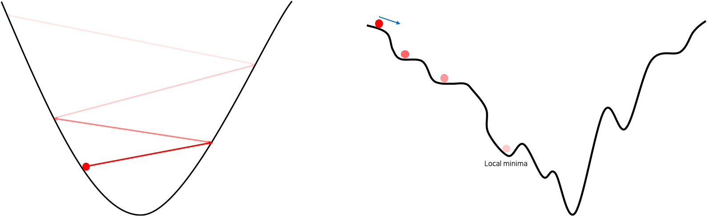

# 학습률에 따른 성질

우리는 앞서 경사하강법에 대해 이야기 할 때, 학습률learning rate에 대해서 언급하였습니다.

$$\begin{gathered}
\theta\leftarrow\theta-\eta\cdot\frac{\partial\mathcal{L}(\theta)}{\partial\theta} \\
\text{or} \\
\theta\leftarrow\theta-\eta\cdot\nabla_\theta\mathcal{L}(\theta).
\end{gathered}$$

수식에서 $\eta$ 로 표현되어있는 이 학습률이란 사용자에의해 주어진 보통 0에서 1사이의 값을 가진 상수로서 기울기 벡터인 그래디언트에 곱해지게 됩니다.
따라서 가중치 파라미터가 업데이트 될 때, 기울기의 값을 얼만큼 반영할 것인지 설정하는 것이라고 볼 수 있는데요.
이 파라미터 업데이트를 학습이라고 한다면, 학습에 얼마나 반영될 것인지 나타내는 값이므로 학습률이라는 이름을 가지는 것으로 이해할 수 있습니다.

이 학습률이 0에 가까울수록 파라미터 업데이트의 양은 줄어들 것이고, 커질수록 파라미터 업데이트의 양은 늘어날 것입니다.
또한 파라미터가 업데이트가 한번 되는 것을 한 스템step 움직인다고 부르기도 합니다.
즉, 학습률이 클수록 큰 스텝을 취할 것이고, 작을수록 작은 스텝을 취할 것입니다.

그럼 이때 학습률의 크기에 따라 학습이 진행되는 성질이 다르게 나타날 수 있습니다.
다음 그림은 학습률에 따른 성질을 그림으로 표현한 것입니다.

그림의 왼쪽은 학습률이 클 때를 나타낸 것으로, 기울기가 상대적으로 가파른 골짜기에서 만약 잘못해서 큰 학습률을 취하게 된다면 그림과 같이 손실 값이 낮아지는 위치로 파라미터가 업데이트 되는 것이 아니라 오히려 점점 손실 값이 커지는 결과가 나올 수 있습니다.
결국 이런 상황에서는 잘못하면 손실 값이 발산해버리는 상황이 발생하기도 합니다.
학습률이 너무 커서 손실 값이 발산해버리는 상황은 종종 실무를 하면서 마주할 수 있는데요.
이때는 학습률이 너무 큰 것이 원인일 수 있으므로 학습률을 반 또는 10%로 줄여주는 것이 좋습니다.

그림의 오른쪽은 학습률이 작을 때 발생할 수 있는 상황을 나타낸 것으로, 손실 표면loss surface이 그림과 같이 울퉁불퉁 굴곡진 상황에서는 자칫 발생할 수 있는 지역 최소점local minima에 빠질 수도 있습니다.[[1]](#footnote_1)
또한 공이 굴러가는 중간에 위치한 평평한 표면에서는 자칫 기울기가 0에 가까워져 이동이 더뎌지거나 잘 이동하지 않게되는 현상이 발생할 수도 있습니다.
분명한 것은 너무 작은 학습률을 사용할 경우에는 기울기가 적게 반영되어 업데이트되므로, 학습이 매우 더뎌지게 될 것이라는 점입니다.

이처럼 학습률은 사용자의 설정에 따라 모델 학습의 성질이 바뀔 수 있으며, 이는 유의미한 모델 성능의 변화로 이어질 수 있습니다.
데이터를 통해 학습이 진행되는 가중치 파라미터weight parameter와 달리, 이와 같이 모델의 성능에 영향을 줄 수 있지만 사용자에의해 직접 설정되어야하는 파라미터를 하이퍼파라미터hyper-parameter라고 부릅니다.
학습률과 같은 하이퍼파라미터들은 모델의 성능에 영향을 끼치지만 자동으로 최적의 값으로 학습되거나 설정되지는 않기 때문에, 이에 따라 지리멸렬한 실험과 직접적인 튜닝 과정을 거치기도 하며, 결국 사용자의 경험과 능력에 의해 좌지우지되는 경우가 많습니다.
따라서 하이퍼파라미터의 초기값을 잘 설정하고 효율적으로 튜닝해나가는 능력 또한 머신러닝 연구자 또는 엔지니어에게 매우 중요한 덕목이 됩니다.
이와 관련하여서는 이후 다른 챕터에서 다시 다루도록 하겠습니다.

<a name="footnote_1">[1]</a>: 하지만 파라미터 공간이 매우 큰 현실에서는 거의 일어나진 않습니다.
