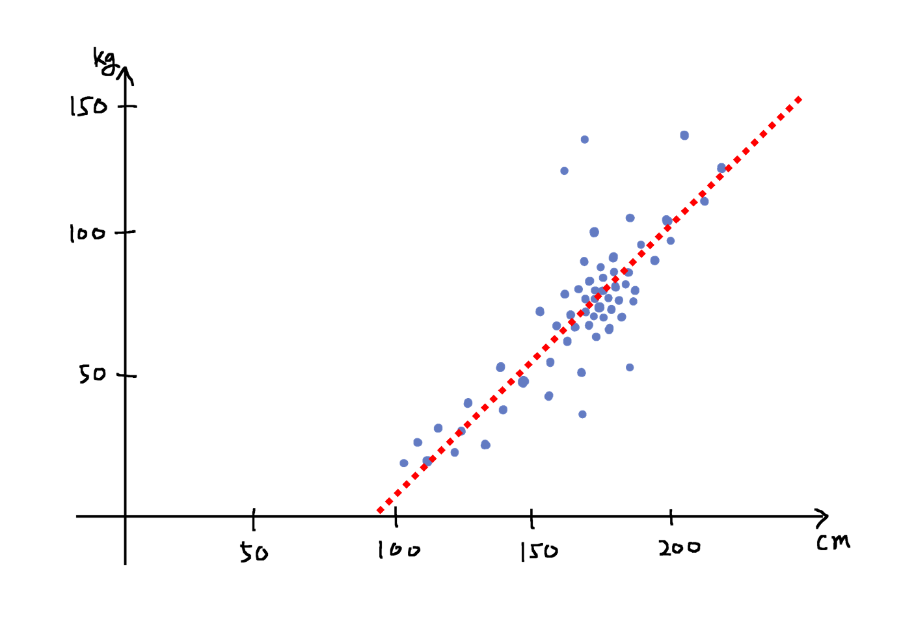

# 선형 회귀

우리는 데이터를 수집하여 선형 계층을 모델로 삼아 $f^*$ 를 근사하고자 합니다.
이를 위해서 손실 값을 최소로 만드는 손실 함수의 입력인 가중치 파라미터를 찾고자 합니다.
이때, 경사하강법을 통해 가중치 파라미터를 손실 함수가 작아지는 방향으로 점진적으로 업데이트 할 수 있다고 이야기 하였습니다.

이제 배운 내용을 통해 직접 문제를 풀어볼 차례입니다.
세상에는 다음 그림과 같이 선형 관계를 지닌 데이터가 많이 존재합니다.
이 그림은 키와 체중의 관계를 나타내고 있습니다.

비록 일부의 아웃라이어outlier들이 존재하긴하지만, 대부분 빨간 점선 위에 분포하고 있는 것을 확인할 수 있습니다.
만약 이 빨간 점선이 참ground-truth인 $f^*$ 라고 가정할 때 우리가 이것을 찾아낼 수 있다면, 키가 주어졌을 때 몸무게를 예측하거나 반대로 몸무게가 주어졌을 때 키를 예측하는 일을 수행할 수 있을 것입니다.

우리는 선형 계층을 통해 이런 선형 문제를 풀 수 있습니다.
이처럼 실수 벡터 입력이 주어졌을 때, 선형적 관계를 지닌 출력 실수 벡터 값을 예측하는 문제를 선형 회귀linear regression라고 부릅니다.

## 선형 회귀의 학습

그럼 선형 회귀 모델이 어떤 방식으로 학습되는지 먼저 그림을 통해 개념을 이해해보도록 하겠습니다.

데이터셋 $\mathcal{D}$ 는 N개의 n차원 입력 벡터들과 N개의 m차원 타겟 출력 벡터들로 구성되어 있을 것입니다.
즉, $N\times{n}$ 크기의 행렬과 $N\times{m}$ 크기의 행렬로 구성되어 있습니다.
그럼 입력 벡터를 가져와 선형 회귀 모델에 통과feed-forward시키면, m차원의 출력 벡터 $\hat{y}$ 을 얻을 수 있습니다.
모델로 부터 얻어진 출력 벡터를 실제 타겟 벡터와 비교하면 손실 값을 얻을 수 있게 됩니다.
이때 이 손실 값을 가중치 파라미터로 미분하게 되면 손실 값을 낮추는 방향으로 파라미터를 업데이트 할 수 있게 됩니다.
이와 같은 작업을 가중치 파라미터가 수렴할 때까지 반복하면, 손실 함수를 최소화시키는 가중치 파라미터를 구할 수 있게 됩니다.
