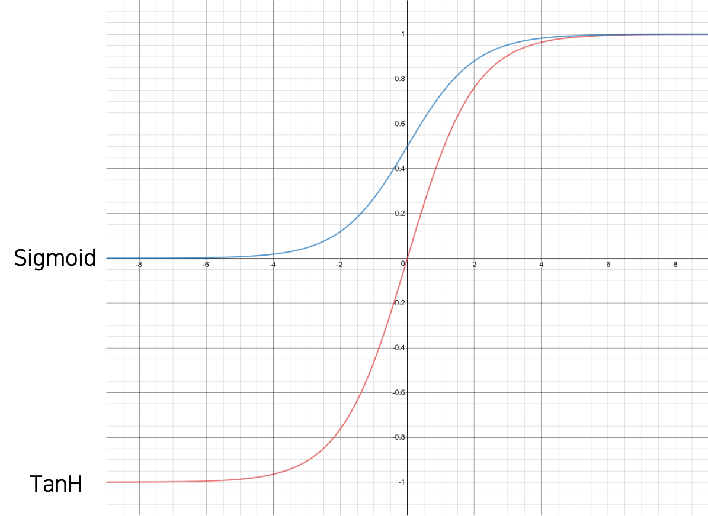

# 활성 함수

이번 챕터의 주인공인 로지스틱 회귀logistic regression을 이야기하기에 앞서, 한 가지를 배우고 넘어가도록 하겠습니다.
바로 활성 함수activation function이라고 불리우는 녀석들입니다.

다음 그림은 대표적인 활성 함수인 시그모이드sigmoid와 하이퍼볼릭 탄젠트hyperbolic tangent를 그래프로 나타낸것 입니다.
하이퍼볼릭 탄젠트는 탄에이치TanH라고 줄여서 불리우기도 합니다.

시그모이드는 음의 무한대에 가까울수록 0에 근접하는 값을 가지며, 양의 무한대에 가까울수록 1에 근접하는 값을 가집니다.
즉, 시그모이드 함수의 출력 값의 범위는 0에서 1사이로 정해져있습니다.
탄에이치의 경우에는 음의 무한대에 가까울수록 -1에 근접하는 값을 가지며, 양의 무한대에 가까울수록 1에 근접하는 값을 가집니다.
따라서 탄에이치 함수의 출력 값의 범위는 -1에서 1사이로 정해져있습니다.
두 함수 모두 전 구간에서 미분 가능하며, 그림에서 알 수 있듯이 양 극단의 기울기는 0에 근접하는 것이 특징입니다.
두 함수를 수식으로 나타내면 다음과 같습니다.

$$\begin{gathered}
\sigma(x)=\frac{1}{1+e^{-x}} \\
\text{Tanh}(x)=\frac{e^x-e^{-x}}{e^x+e^{-x}}
\end{gathered}$$

시그모이드는 소문자 시그마sigma 기호 $\sigma$ 로 나타내기도 합니다.[[1]](#footnote_1)
우리는 시그모이드를 활용하여 로지스틱 회귀를 구현할 수 있습니다.

<a name="footnote_1">[1]</a>: 경우에 따라, $\sigma$ 는 활성 함수 자체를 의미하기도 합니다.
