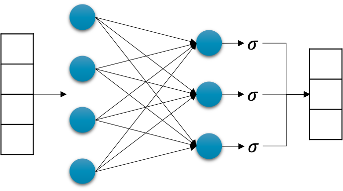
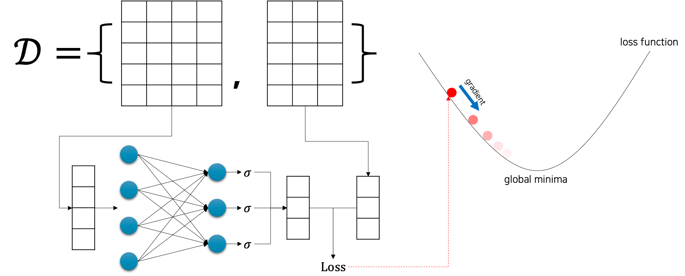

# 로지스틱 회귀

앞서 선형 회귀linear regression의 경우에는 키와 몸무게와 같은 선형 데이터의 관계를 학습하는 문제였습니다.
좀 더 정확히 이야기하면 n차원의 실수 벡터를 입력으로 받아 선형 관계의 m차원의 실수 벡터를 반환하도록 학습하는 문제입니다.
그럼 로지스틱 회귀logistic regression의 경우에는 어떤 문제에 적용될 수 있을까요?

우리는 n차원의 실수 벡터를 입력을 받아, m개의 불리언boolean 벡터를 반환하는 문제를 풀어야 하는 상황도 생각해봐야 합니다.
즉, 이 문제는 m개의 참True/거짓False 문제를 동시에 푸는 것으로 생각해볼 수 있습니다.
예를 들어 어떤 사람의 신상 정보(e.g. 키, 몸무게 등)가 주어졌을 때, "그 사람이 남자인가?"라는 물음에 대한 대답을 구하는 문제를 생각해볼 수 있습니다.
만약 남자인 경우에는 함수 $f^*$ 는 참을 반환하고, 여자인 경우에는 거짓을 반환할 것입니다.
이 경우에는 기존 선형 회귀로 문제를 풀기보단 다른 방법으로 접근해보는 것이 낫습니다.
이때 필요한 방법이 로지스틱 회귀 모델링 기법입니다.

## 로지스틱 회귀 모델의 구조 및 추론 방법

로지스틱 회귀 문제를 풀기위한 모델의 구조는 다음 그림과 같습니다.

사실 선형 회귀 문제를 풀기위한 선형 계층 함수의 구성과 크게 다르지 않습니다.
다만, 선형 계층 함수 직후에 시그모이드sigmoid 함수를 넣어주어 전체 모델을 구성합니다.[[1]](#footnote_1)
그럼 이 모델의 출력 값의 범위는 무조건 0에서 1사이로 고정될 것입니다.
이 점을 활용하여 우리는 참/거짓을 예측하는데 활용할 수 있습니다.

이 모델의 가중치 파라미터가 잘 학습되어있는 상태라고 했을 때, 우리는 0.5를 기준으로 참과 거짓을 판단할 수 있습니다.
만약 출력 벡터의 어떤 요소의 값이 0.5보다 같거나 클 경우 우리는 해당 요소에 예측하는 정답을 참이라고 결론지을 수 있으며, 반대로 0.5보다 작을 경우 예측하는 정답이 거짓이라고 결론내릴 수 있습니다.

<a name="footnote_1">[1]</a>: 시그모이드 함수의 경우에는 학습을 위한 가중치 파라미터는 없으므로, 가중치 파라미터의 크기는 선형 회귀 모델과 같습니다.

## 로지스틱 회귀 모델의 학습

앞서 이야기한 것 처럼, 로지스틱 회귀의 모델도 선형 회귀의 모델과 매우 비슷한 구조를 갖고 있기 때문에, 모델을 학습하는 방법 또한 매우 유사합니다.

n차원의 입력 벡터로 구성된 수집된 N개의 입력 샘플들을 모델에 통과feed-forward시키면, N개의 출력 벡터들을 얻을 수 있을 것입니다.
그럼 N개의 타겟 출력 벡터들과 모델에서 출력된 벡터들을 비교하면 손실 값을 계산할 수 있습니다.
이때, 선형 회귀와 마찬가지로 손실 값을 가중치 파라미터로 미분하게 되면, 손실 값이 낮아지는 방향으로 경사하강법을 수행할 수 있게 됩니다.
경사하강법을 통해 모델 가중치 파라미터를 업데이트 하는 작업을 반복하게 되면, 점진적으로 손실 값은 낮아질 것이고 점차 수렴하게 될 것입니다.
그럼 우리는 수렴한 가중치 파라미터를 통해 $f^*$ 를 근사한다고 볼 수 있습니다.
참고로 이때 손실 값을 계산하기 위한 손실 함수는 선형 회귀와 달리 MSE 손실 함수를 사용하지 않습니다.
로지스틱 회귀를 위한 손실 함수는 다음 섹션에서 다루도록 하겠습니다.

## 로지스틱 회귀의 의미

로지스틱 회귀의 경우, 이름에는 회귀regression이 붙어있지만 분류classification문제라고 봐야 합니다.
특히 참과 거짓 중에서 정답을 선택해야 하므로 이진 분류binary classification에 속합니다.

