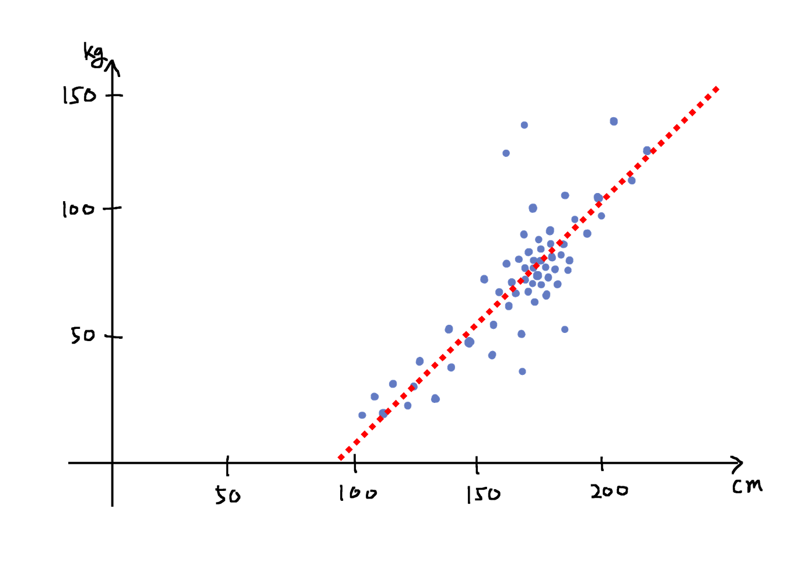
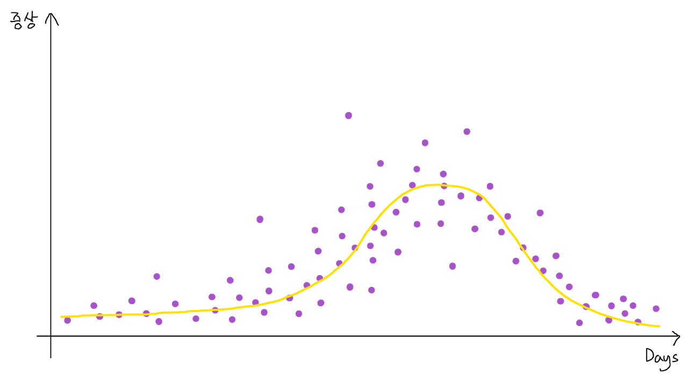
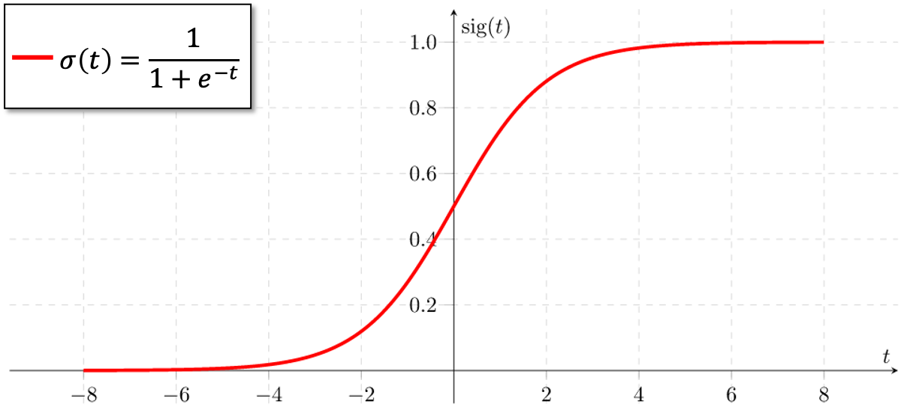
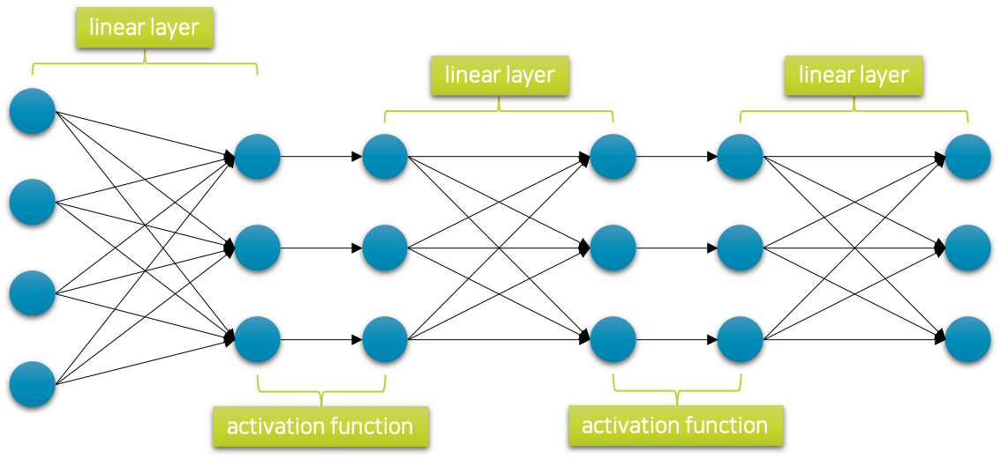
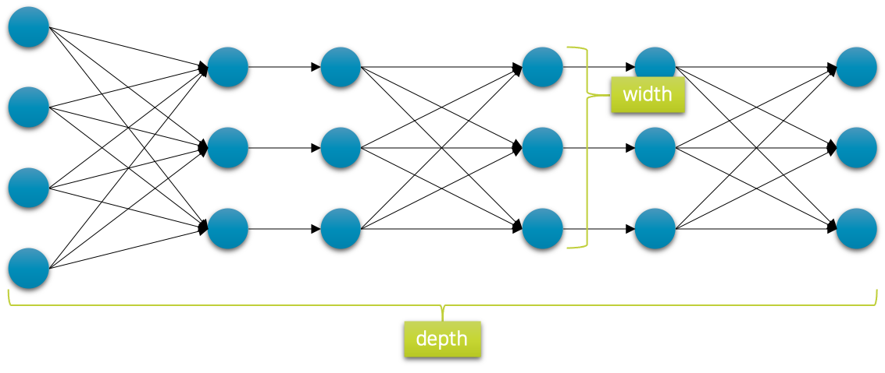

# 심층신경망

이제까지 우리는 선형 계층linear layer하나를 활용하여 회귀regression와 분류classification문제를 풀어왔습니다.
돌아보면 그때 풀고자 했던 문제들은 모두 선형 데이터와 관련된 문제들이었습니다.

하지만 알고보면 다음 그림과 같이 비선형non-linear 함수 형태를 근사해야 할 수도 있습니다.
예를 들어 이 그림은 감기에 걸렸을 때 날짜 경과에 따른 증상 발현의 정도를 나타낸 것이라고 생각해보겠습니다.
앞서 선형 데이터의 예제와 같이 아웃라이어outlier들이 존재하긴 하지만 대부분의 샘플들은 노란색 선 근처에 존재하는 것을 볼 수 있습니다.
이 노란색 선을 우리가 근사하고자 하는 함수 $f^*$ 라고 할 때, 기존의 선형 회귀 모델과 로지스틱 회귀 모델로는 이런 비선형 문제를 해결할 수 없습니다.

사실 세상은 선형 데이터들로만 구성되어 있지 않습니다.
오히려 알고보면 비선형 데이터들이 더 많을 것 같은데요.
예를 들어 이미지, 텍스트, 음성과 같은 데이터들은 비선형 데이터일 뿐만 아니라, 높은 차원의 공간high-dimensional space에 분포하고 있는 데이터이므로 심지어 앞선 그림과 같이 눈으로 데이터의 분포를 확인하는 것조차 불가능합니다.

기존의 머신러닝machine learning 기법들은 이런 비선형적이고 높은 차원의 데이터들을 다루기에는 어려움이 많았습니다.
하지만 딥러닝deep learning의 시대에 들어오면서, 심층신경망deep neural networks은 이러한 문제들을 해결하는데 특출남을 보여주었습니다.

이제 우리도 심층신경망을 통해 문제를 해결하는 방법을 살펴보고자 합니다.

## 심층신경망이란?

아마 이 책을 읽는 독자분들 중에서는 심층신경망에 대해 처음 듣는 분들은 없을 것이라 생각합니다.
따라서 심층신경망이란 계층layer을 깊게 쌓아올린 것이라는 말도 많이 들어보셨을 것입니다.
맞습니다.
우리는 서로 다른 선형 계층linear layer을 깊게 쌓아 심층신경망을 구성할 수 있습니다.
그런데 그냥 단순히 선형 계층을 많이 쌓는 것만으로 충분할까요?

$$\begin{gathered}
h=x\cdot{W_1}+b_1 \\
y=h\cdot{W_2}+b_2
\end{gathered}$$

예를 들어, 앞의 수식과 같이 두 개의 선형 계층을 가진 모델을 생각해볼 수 있습니다.
이 모델은 그럼 두 개의 계층을 지닌 심층신경망이 되는 것일까요?
아쉽게도 아닙니다.
그 이유는 다음 수식과 같이 $h$ 를 앞 계층의 수식으로 치환하여 전개해보면 알 수 있습니다.

$$\begin{aligned}
y&=h\cdot{W_2}+b_2 \\
&=(x\cdot{W_1}+b_1)\cdot{W_2}+b_2 \\
&=x\cdot\underbrace{
    {W_1}\cdot{W_2}
}_{
    \text{linear}
}+W_2^\intercal\cdot{b_1}+b_2 \\
&=x\cdot{W'}+b'
\end{aligned}$$

재미있게도 전개해보면 두 선형 계층을 통과하는 것은 또 다른 하나의 선형 계층을 통과하는 것과 같음을 알 수 있습니다.
즉, 선형 계층을 아무리 깊게 쌓아봤자 여전히 우리는 하나의 선형 계층을 마주하게되는 것입니다.
그럼 우리는 이런 방법으로는 비선형 문제를 풀 수 없겠지요.
어떻게 해야 할까요?

우리는 예전에 시그모이드sigmoid와 탄에이치TanH와 같은 활성 함수activation function들에 대해 배웠습니다.
다음 그림은 시그모이드를 나타낸 것인데요.

그림에서 볼 수 있듯이 이 함수는 전 구간에서 미분 가능한 비선형적인 단조 증가 형태를 띄고 있습니다.
가장 간단한 방법은 선형 계층을 쌓을 때 그 사이에 이와 같은 비선형 함수를 끼워 넣는 것입니다.[[1]](#footnote_1)
그럼 다음 그림과 같이 심층 신경망이 구성 될 수 있습니다.

이제 우리는 이런 형태의 심층신경망을 통해 복잡한 비선형 데이터에 대한 관계를 학습하거나 문제를 해결할 수 있게 되었습니다.

<a name="footnote_1">[1]</a>: 꼭 시그모이드나 탄에이치일 필요는 없습니다. 미분 가능한 비선형 함수이면 됩니다.

## 심층신경망의 크기

이론적으로 심층신경망은 세상에 존재하는 그 어떤 형태의 함수도 근사할 수 있음이 증명되어 있습니다.[[2]](#footnote_2)
이때 우리는 신경망의 깊이와 너비를 조절함으로써 함수가 더 복잡한 형태의 데이터 관계나 문제를 해결할 수 있도록 할 수 있습니다.
보통은 다음 그림과 같이 신경망을 구성할 때, 계층이 진행될수록 너비가 줄어드는 형태로 설계를 하게 되는데요.
이때 너비가 줄어드는 양을 조절하거나, 계층을 더 깊게 쌓을수록 네트워크의 표현 능력은 일반적으로 더 향상되게 됩니다.
따라서 우리는 더 복잡하고 어려운 데이터의 관계를 배우거나 문제를 풀고자 할 때에는 신경망을 더 넓게 깊게 쌓게 됩니다.

하지만 깊이가 깊어지거나 너비가 넓어지게 되면 계층들의 가중치 파라미터 크기가 늘어나게 되면서, 경사하강법gradient descent을 통해 최적화해야 하는 공간의 크기도 같이 늘어나게 됩니다.
따라서 비록 신경망의 크기가 커지더라도 최적화에 어려움을 겪을 수 있어, 실제로는 성능이 향상되는데에는 한계를 겪을 수 있습니다.
오히려 더 신경망으로도 충분히 해결되는 경우에는 독으로 작용할 수도 있습니다.
따라서 우리는 적절한 신경망의 크기를 정해주어 신경망이 데이터의 관계를 배우는데 잘 최적화가 진행될 수 있도록 도와주는 것이 중요합니다.

<a name="footnote_2">[2]</a>: Universal Approximation Theorem, UAT - https://en.wikipedia.org/wiki/Universal_approximation_theorem
