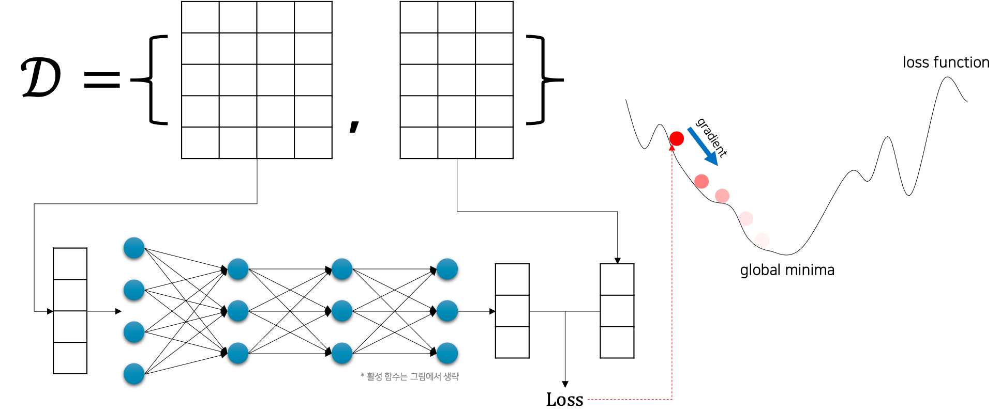
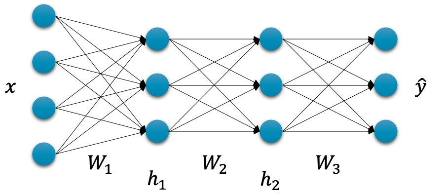
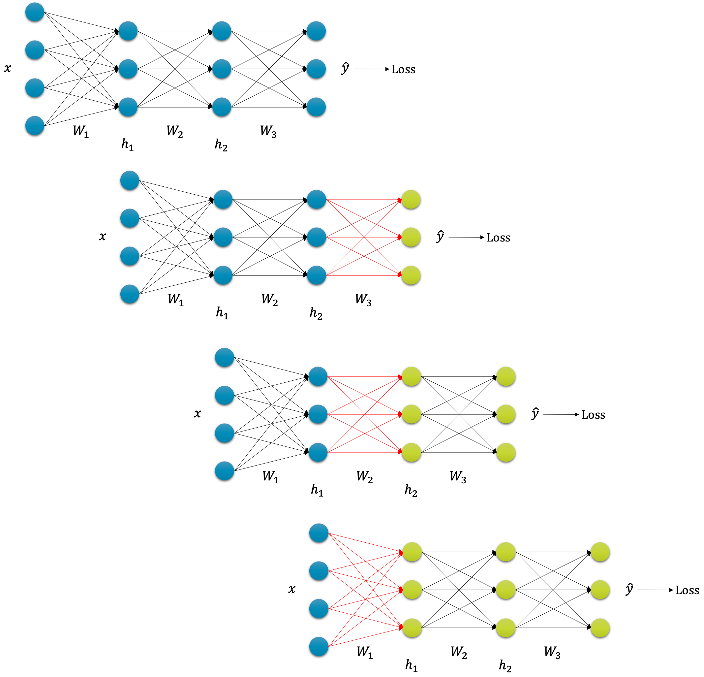

# 심층신경망의 학습

우리는 실재하지만 알 수 없는 함수 $f^*$ 를 근사하고자 합니다.
따라서 데이터를 모아서 입력을 넣었을 때, 원하는 출력 값이 반환되도록 우리의 모델 $f_\theta$ 를 학습시켜야 합니다.
이를 위해서 손실 함수를 활용하여, 손실 함수의 출력 값인 손실 값이 최소가 되는 손실 함수의 입력 가중치 파라미터를 찾도록 합니다.
이때 손실 함수를 가중치 파라미터로 미분하면, 우리는 손실 값이 낮아지는 방향으로 가중치 파라미터를 업데이트 할 수 있습니다.

여기까지가 우리가 이제까지 앞에서 배워 온 모델을 학습하는 방법입니다.
심층신경망의 학습은 그럼 다른 방법으로 진행될까요?

## 심층신경망의 학습 개요

심층신경망도 결국엔 똑같습니다.
심층신경망을 구성하는 여러 계층들의 가중치 파라미터들로 손실 함수를 미분하고, 그 결과를 경사하강법에 활용하여 각 가중치 파라미터를 업데이트합니다.
다음 그림은 심층신경망을 학습할 때를 대략적으로 나타낸 것입니다.

기존의 선형 회귀linear regression의 그림과 비교하면 선형 계층 하나로 구성됐던 모델이 심층신경망으로 바뀐 부분이 전부입니다.
마찬가지로 모델은 입력을 통과feed-forward시켜 출력 $\hat{y}$ 를 얻게 되고, 그럼 MSE 손실 함수 등을 활용하여 손실 값을 계산할 수 있습니다.
그럼 이 손실 값을 가중치 파라미터로 미분하여, 손실 값을 낮추는 방향으로 파라미터를 업데이트 하는 것입니다.

하지만 다음 그림과 같이 심층 신경망은 계층layer이 많아진 만큼, 가중치 파라미터도 늘어나게 됩니다.
따라서 업데이트 되어야 할 가중치 파라미터들이 늘어난 만큼, 손실 함수에 대해 미분을 해야 하는 일도 늘어나게 됩니다.

더 큰 문제는 그림에서 $W_1$ 과 같이 입력으로부터 가까운 계층의 파라미터일수록, 손실 함수의 수식을 전개해서 $W_1$ 으로 표현할 때 훨씬 복잡한 함수꼴이 된다는 것입니다.
이것을 미분하는 일은 신경망이 깊어질 수록 점점 더 비효율적이 되어갈 것입니다.

## 오류역전파

이때 오류역전파back-propgation 알고리즘을 통해 우리는 효율적으로 심층신경망을 학습시킬 수 있습니다.

### 체인 룰

오류역전파 알고리즘은 체인 룰chain rule을 통해 구현됩니다.
만약 다음과 같이 $f$ 와 $g$ 로 구성된 합성 함수가 있다고 가정해보죠.

$$\begin{gathered}
y=g\circ{f(x)}
\end{gathered}$$

이때 우리가 $y$ 를 $x$ 로 미분하고자 한다면, 가장 기본적인 방법은 $g$ 와 $f$ 를 모두 전개해서 하나의 수식으로 합쳐 표현한 이후에 수식 내의 $x$ 와 관련된 부분들에 미분을 적용하는 것이 될 것입니다.
하지만 그 대신 체인 룰을 통해 좀 더 쉽게 미분을 수행할 수 있습니다.
이를 위해서 우리는 매개변수 $h$ 를 추가해서 다음과 같이 표현할 수 있습니다.

$$\begin{gathered}
y=g(h) \\
h=f(x)
\end{gathered}$$

그럼 우리가 수행하고자 하는 $y$ 를 $x$ 로 미분하는 작업은, 체인 룰에 의해서 $y$ 를 $h$ 로 미분한 값에 $h$ 를 $x$ 미분한 값을 곱하는 것과 같아집니다.

$$\begin{gathered}
\frac{\partial{y}}{\partial{x}}=\frac{\partial{y}}{\partial{h}}\frac{\partial{h}}{\partial{x}}
\end{gathered}$$

수식에서 볼 수 있듯이 $\partial{h}$ 는 분모와 분자에 있으므로 없어질 수 있습니다.[[1]](#footnote_1)
심층신경망도 여러 계층이 쌓여서 만들어진 합성 함수라고 볼 수 있습니다.
그러므로 이런 성질을 이용하면 심층신경망의 미분도 간단한 수식들에 대한 미분의 곱으로 표현될 수 있고, 심지어 간단한 수식들에 대한 미분들은 다른 계층에 대한 미분을 구할 때 다시 재활용 될 수 있어 훨씬 효율적인 미분 계산이 가능해집니다.
따라서 다음의 그림과 같이 미분의 계산 과정이 계속해서 뒷 쪽 계층으로 전달 되는 것처럼 보이게 되고, 이것을 우리는 오류역전파back-propgation라고 부릅니다.

정리하면 오류역전파 알고리즘이 없어도 심층신경망의 학습은 얼마든지 가능하지만, 오류역전파 알고리즘을 통해 우리는 훨씬 효율적인 미분 계산을 할 수 있게 되어 부담 없이 더욱 깊은 심층신경망을 구성할 수 있게 되었다라고 해석해볼 수 있습니다.

<a name="footnote_1">[1]</a>: 정확하게 분모와 분자처럼 동작하는 아닙니다.