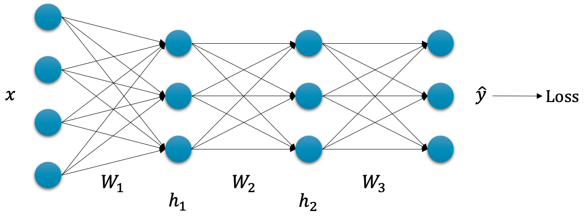

# 오류역전파 알고리즘의 수식

오류역전파 알고리즘은 심층신경망의 학습을 효율적으로 수행할 수 있도록 도와주는 도구입니다.
이번 섹션에서는 이 오류역전파 알고리즘을 수식 수준에서 이해해보도록 하겠습니다.

심층신경망을 활용하여 회귀regression문제를 풀고자 할 때, 다음 수식과 같이 MSE 손실 함수를 활용할 수 있습니다.

$$\begin{gathered}
\mathcal{L}(\theta)=\sum_{i=1}^N{\|y_i-\hat{y}_i\|_2^2}
\end{gathered}$$

이때, 만약 우리의 심층신경망 $f_\theta$ 가 3개의 선형 계층linear layer과 활성 함수activation function으로 이루어져 있다고 가정해볼까요.

그럼 $\hat{y}_i$ 를 구하기 위한 과정은 다음과 같을 것입니다.

$$\begin{aligned}
\hat{y}_i&=h_{2,i}\cdot{W_3}+b_3 \\
h_{2,i}&=\sigma(h_{1,i}\cdot{W_2}+b_2) \\
h_{1,i}&=\sigma(x_i\cdot{W_1}+b_1)
\end{aligned}$$

입력 $x_i$ 를 받아 첫 번째 계층[[1]](#footnote_1)
을 지나면 $h_{1,i}$ 가 나올 것이고, 이후 계속해서 이어지는 선형 계층과 활성화 함수를 통과하게 될 것입니다.

우리가 해야 할 일은 각 가중치 파라미터 별로 손실 함수를 미분하고, 결과를 통해 각 가중치 파라미터들을 업데이트 해야 합니다.

$$\begin{gathered}
W_1\leftarrow{W_1}-\eta\cdot\nabla_{W_1}\mathcal{L}(\theta) \\
W_2\leftarrow{W_2}-\eta\cdot\nabla_{W_2}\mathcal{L}(\theta) \\
W_3\leftarrow{W_3}-\eta\cdot\nabla_{W_3}\mathcal{L}(\theta)
\end{gathered}$$

문제는 손실 함수를 각 가중치 파라미터로 미분한 그래디언트( 예: $\nabla_{W_1}\mathcal{L}(\theta)$ )를 구하기 위해서는 각 가중치 파라미터로부터 손실 값을 구하는 과정 전체를 하나의 수식으로 만들어 전개한 후, 미분을 취해야 할 것이라는 점입니다.

$$\begin{gathered}
\nabla_{W_3}\mathcal{L}(\theta)=\nabla_{W_3}\sum_{i=1}^N{
    \Big(y_i-(h_{2,i}\cdot{W_3}+b_3)\Big)^2
 } \\
\nabla_{W_2}\mathcal{L}(\theta)=\nabla_{W_2}\sum_{i=1}^N{
    \Bigg(
        y_i-\Big(
            \sigma(
                h_{1,i}\cdot{W_2}+b_2
            )\cdot{W_3}+b_3
        \Big)
    \Bigg)^2
} \\
\vdots
\end{gathered}$$

물론 계산은 컴퓨터가 수행하겠지만, 컴퓨터에게도 매우 비효율적인 계산이 될 것입니다.
이때 우리는 체인 룰chain rule을 통해 손실 값을 각 가중치 파라미터로 미분하는 과정을 간단한 수식들의 미분의 곱으로 표현할 수 있습니다.[[2]](#footnote_2)

$$\begin{aligned}
\frac{\partial{\mathcal{L}}}{\partial{W_3}}&=\frac{\partial{\mathcal{L}}}{\partial{\hat{y}}}\cdot\frac{\partial{\hat{y}}}{\partial{W_3}} \\
\frac{\partial{\mathcal{L}}}{\partial{W_2}}&=\frac{\partial{\mathcal{L}}}{\partial{\hat{y}}}\cdot\frac{\partial{\hat{y}}}{\partial{h_2}}\cdot\frac{\partial{h_2}}{\partial{W_2}} \\
\frac{\partial{\mathcal{L}}}{\partial{W_1}}&=\frac{\partial{\mathcal{L}}}{\partial{\hat{y}}}\cdot\frac{\partial{\hat{y}}}{\partial{h_2}}\cdot\frac{\partial{h_2}}{\partial{h_1}}\cdot\frac{\partial{h_1}}{\partial{W_1}} \\
\end{aligned}$$

예를 들어 수식 마지막 줄의 $W_1$ 에 대한 미분을 할 때, 손실 값을 구하는 과정을 $W_1$ 에 대해서 하나의 수식으로 표현할 후 미분을 계산하는 것에 비해, 앞의 수식에서처럼 4단계로 나누어 각기 계산 후 곱해주는 것이 훨씬 나을 것입니다.
더욱이 $\frac{\partial{\mathcal{L}}}{\partial{\hat{y}}}$ 나 $\frac{\partial{\hat{y}}}{\partial{h_2}}$ 의 경우에는 한번 계산해 놓으면 이후에는 결과 값을 계산 없이 계속 재활용하여 사용할 수 있기 때문에, 계산량에 있어서 훨씬 효율적으로 개선될 수 있습니다.

이처럼 오류역전파 알고리즘은 심층신경망의 학습이 효율적으로 수행될 수 있는 방법을 제공합니다.
물론 오류역전파 알고리즘이 없더라도 학습은 가능하겠지만, 오류역전파 알고리즘을 활용했을 때에 비해서 계산량이 많아져 훨씬 비효율적이 될 것입니다.
비록 딥러닝을 처음 접하시는 독자분들은 오류역전파의 악명에 두려움을 느끼셨을 수 있지만, 그 동기motivation만 잘 이해한다면 어차피 심층신경망을 구현하는데 있어서 여러분들이 직접 이 부분들을 구현할 일은 없기 때문에 크게 문제 될 부분은 없습니다.

<a name="footnote_1">[1]</a>: 보통 선형 계층과 활성 함수 및 기타 부가 함수들을 뭉뚱그려서 하나의 계층으로 표현합니다.

<a name="footnote_2">[2]</a>: 이때 수식에 $\frac{\partial{W_3}}{\partial{W_2}}$ 와 같은 꼴이 없음에 주의하세요. 흔히 헷갈려하는 부분입니다.