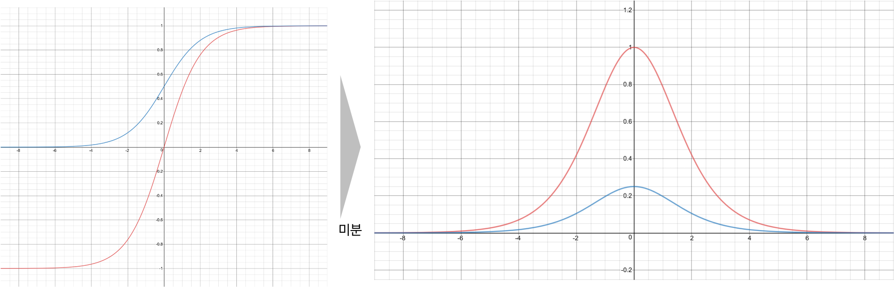

# 그래디언트 소실 문제

심층신경망은 너무 깊어지게 되면 (예를 들어 40층) 최적화가 잘 수행되지 않는 문제가 종종 발생합니다.
이 문제들은 특히 입력에 가까운 계층들의 가중치 파라미터가 잘 업데이트되지 않음으로써 발생하게 되는데요.
우리는 이러한 문제를 그래디언트 소실gradient vanishing 문제라고 부릅니다.
이번 장에서는 이 그래디언트 소실과 그 원인에 대해 알아보도록 하겠습니다.

앞서 오류역전파에서처럼 우리는 3개의 계층layer을 갖는 심층신경망을 생각해볼 수 있습니다.
그리고 각 계층은 선형 계층linear layer과 비선형 활성 함수non-linear activation function의 합성함수가 됩니다.
그럼 다음의 수식과 같이 손실 값을 계산하기 위한 과정을 나타낼 수 있습니다.

$$\begin{gathered}
\mathcal{L}(\theta)=\sum_{i=1}^N{\|y_i-\hat{y}_i\|_2^2} \\
\\
\begin{aligned}
\hat{y}_i&=h_{2,i}\cdot{W_3}+b_3 \\
h_{2,i}&=\sigma(\tilde{h}_{2,i}) \\
\tilde{h}_{2,i}&=h_{1,i}\cdot{W_2}+b_2 \\
h_{1,i}&=\sigma(\tilde{h}_{1,i}) \\
\tilde{h}_{1,i}&=x_i^\intercal\cdot{W_1}+b_1
\end{aligned}
\end{gathered}$$

이전의 오류역전파에서의 수식에서 추가된 것은 틸다tilde가 추가되어 선형 계층과 활성 함수를 분리하여 표현했다는 점입니다.
즉, 선형 계층의 결과 값을 $\tilde{h}$ 로 표현하고, 이것을 활성 함수에 넣어 얻은 결과를 이전과 같이 $h$ 로 배정하였습니다.
이때 활성 함수로 사용될 수 있는 함수들은 보통 시그모이드sigmoid와 하이퍼볼릭 탄젠트hyperbolic tangent가 될 것입니다.
재미있는 점은 시그모이드와 탄에이치를 미분하면 다음 그림과 같은 값을 지니게 됩니다.

보다시피 시그모이드는 전 구간에서 1보다 한참 작은 기울기를 가지며, 탄에이치의 경우에는 전 구간에서 1보다 같거나 작은 값을 갖는 것을 볼 수 있습니다.
따라서 만약 다음 수식과 같이 손실 값을 $W_1$ 으로 미분할 때, 체인 룰을 통해 펼쳐보면 계속해서 1보다 같거나 작은 값이 반복적으로 곱해지는 것을 볼 수 있습니다.

$$\begin{gathered}
\begin{aligned}
\frac{\partial{\mathcal{L}}}{\partial{W_1}}&=\frac{\partial{\mathcal{L}}}{\partial{\hat{y}}}\cdot\frac{\partial{\hat{y}}}{\partial{h_2}}\cdot\frac{\partial{h_2}}{\partial{h_1}}\cdot\frac{\partial{h_1}}{\partial{W_1}} \\
&=\frac{\partial{\mathcal{L}}}{\partial{\hat{y}}}\cdot\frac{\partial{\hat{y}}}{\partial{h_2}}\cdot\frac{\partial{h_2}}{\partial{\tilde{h}_2}}\cdot\frac{\partial{\tilde{h}_2}}{\partial{h_1}}\cdot\frac{\partial{h_1}}{\partial{\tilde{h}_1}}\cdot\frac{\partial{\tilde{h}_1}}{\partial{W_1}}
\end{aligned} \\
\text{where }\frac{\partial{h_\ell}}{\partial{\tilde{h}_\ell}}=\frac{\partial{\sigma}}{\partial{\tilde{h}_\ell}}<=1.
\end{gathered}$$

이 수식에서는 비록 2번 밖에 없었지만, 만약 심층신경망이 훨씬 깊었다면 더 많은 횟수가 참여되었을 것입니다.
따라서 이처럼 심층신경망이 깊어지게 될수록 입력에 가까운 계층의 가중치 파라미터는 점점 더 작은 그래디언트를 갖게 됩니다.
그럼 결과적으로 그래디언트는 0에 근접하게 되어, 입력에 가까운 계층의 가중치 파라미터는 업데이트의 양이 거의 없게 될 것입니다.
즉, 데이터에 대해서 알맞은 출력을 반환하기 위해 학습이 되지 않는 것이죠.

이처럼 깊어지는 심층신경망에서 입력에 가까운 계층이 잘 학습되지 않는 문제를 그래디언트 소실이라고 부릅니다.
다음 장에서는 이 그래디언으 소실 문제를 해결하기 위한 방법을 살펴보도록 하겠습니다.
