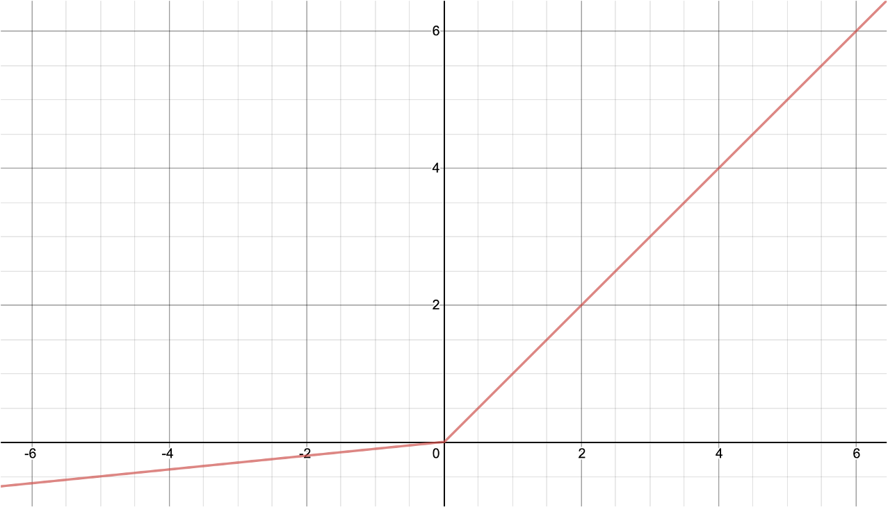

# 렐루(ReLU)

이전 장에서 시그모이드sigmoid와 같은 비선형 활성 함수non-linear activation function들로 인한 그래디언트 소실gradient vanishing 문제에 대해 이야기하였습니다.
이것은 활성 함수의 미분 계수가 전 구간에서 1보다 작기 때문에 발생하는 문제라고 볼 수 있습니다.

또한 시그모이드나 탄에이치의 경우에는 함수의 양 끝단에 갈수록 기울기가 0이 되는 형태를 띄고 있기 때문에, 모델의 학습이 진행되어 선형 계층의 결과 값이 0으로부터 멀어져서 어떤 의미를 지니게 될 수록 학습이 점점 더뎌지는 단점이 있었습니다.
즉, 같은 성능에 도달하기 위해서 수행되어야 하는 경사하강법의 통한 업데이트 횟수가 많을 수 밖에 없었습니다.

렐루Rectified Linear Unit, ReLU는 이러한 기존 활성 함수의 단점을 보완하기 위해 제안된 새로운 활성 함수입니다.
다음과 같은 수식으로 구현될 수 있으며, 이것을 그림으로 표현하면 매우 간단한 형태를 띄게 됩니다.

$$\begin{gathered}
y=\text{ReLU}(x)=\max(0,x)
\end{gathered}$$

음수 구간에서는 전부 0의 값을 지니게 되며, 양수 구간에서는 전부 기울기가 1인 형태가 됩니다.
양수 구간에서의 기울기가 1인 덕분에, 렐루를 통해 구현된 심층신경망은 매우 빠르게 최적화가 가능합니다.

하지만 단점도 존재합니다.
보다시피 음수 구간에서는 기울기가 0이 되므로 렐루의 입력이 0이 되는 샘플을 통해서는 렐루 뒷 단의 가중치 파라미터들에 대해 학습을 진행할 수 없습니다.
특히 혹시라도 데이터셋 내부의 모든 샘플들이 렐루의 음수 구간으로 입력되게 될 경우, 해당 렐루에 값을 전달해주는 노드와 관련된 가중치 파라미터들은 이후 학습 과정에서 영원히 업데이트 될 수 없는 문제가 발생합니다.[[1]](#footnote_1)

이러한 문제를 해결하기 위해서 제안된 것이 리키렐루leaky ReLU입니다.
리키렐루는 다음의 수식과 같이 구현되며, 음수 구간에서 비록 1보다 작지만 0이 아닌 기울기를 갖는 것이 특징입니다.[[2]](#footnote_2)

$$\begin{gathered}
y=\text{LeakyReLU}_\alpha(x)=\max(\alpha\cdot{x},x), \\
\text{where }0\le\alpha<1.
\end{gathered}$$

리키렐루가 기존 렐루의 단점을 보완했다고 해서, 무조건 리키렐루가 좋은 것은 아닙니다.
실제 실험을 해보면 주어진 문제와 데이터, 그리고 신경망의 구조에 따라 렐루가 좋을 때도 있고 리키렐루가 좋을 때도 있습니다.
따라서 렐루와 리키렐루 중에서 더 좋은 활성 함수를 선택해야 하는 일은 사용자의 몫이지만, 매우 중요한 일은 아니며 이것을 고민하는 데에 너무 큰 시간을 쏟는 것은 오히려 독이 될 수도 있습니다.

이번에는 그래디언트 소실 문제를 해결하기 위한 렐루와 리키렐루에 대해 살펴보았습니다.
렐루로 인해 기존에 학습할 수 없었던 좀 더 깊은 신경망도 큰 무리 없이 학습시킬 수 있게 되었습니다.
또한 학습이 진행됨에 따라 점점 속도가 더뎌지는 기존의 활성 함수들과 달리, 렐루의 경우에는 학습 속도가 매우 빠르게 진행됩니다.
학계에서는 이러한 렐루의 발명이 현재 딥러닝의 발전을 있게했다는 평이 있을 정도로, 렐루는 딥러닝의 역사에서 중요한 부분을 차지합니다.

하지만 렐루와 리키렐루를 사용하더라도 음수 구간은 기울기가 여전히 0보다 작기 때문에 사실 그래디언트 소실 문제가 완전히 해결된 것은 아닙니다.
여전히 수 십개가 넘는 계층을 쌓아보면 최적화가 원활하게 수행되지 않음을 확인할 수 있을 것입니다.
따라서 이러한 그래디언트 소실 문제를 완벽하게 해결하기 위해서는 다른 방법이 필요합니다.[[3]](#footnote_3)
그렇지만 보통 이 글을 읽고 있는 독자분들이 풀 문제들은 여전히 십 수개의 계층으로 충분히 풀릴 수 있는 문제들일 가능성이 높습니다.
그러므로 일단은 렐루와 리키렐루에 만족하셔도 당분간은 괜찮습니다.

<a name="footnote_1">[1]</a>: 데드 뉴런dead neuron 문제라고 부릅니다.

<a name="footnote_2">[2]</a>: 음수 영역 기울기가 0이 될 경우 일반 렐루가 되고, 1이 될 경우 비선형성을 잃게 됩니다.

<a name="footnote_3">[3]</a>: 레즈넷ResNet에 활용된 스킵-커넥션skip-connection을 통해 그래디언트 소실을 완벽하게 해결할 수 있습니다.
