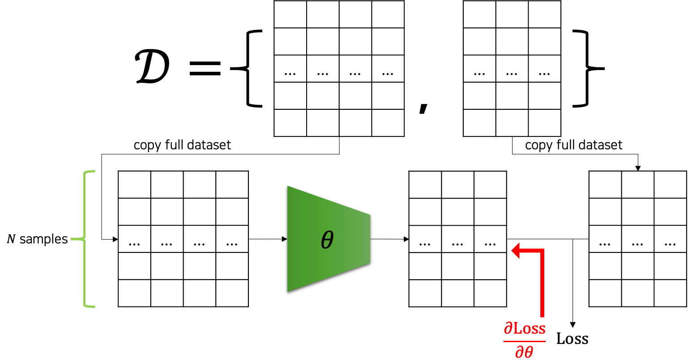
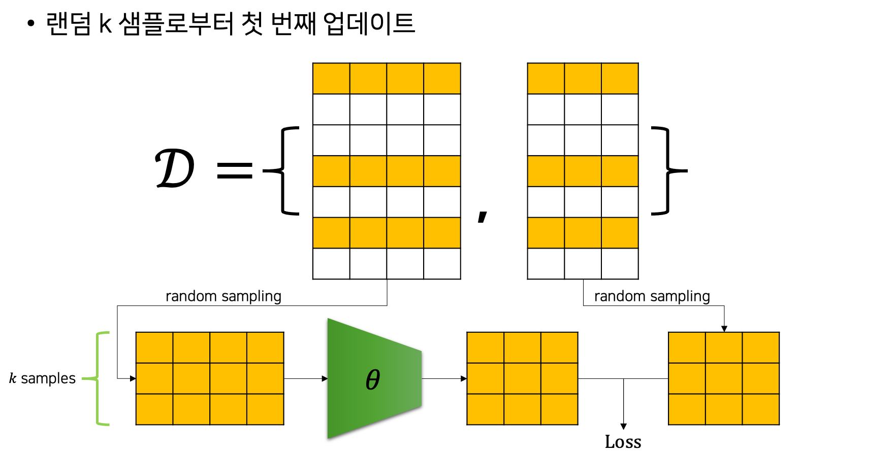
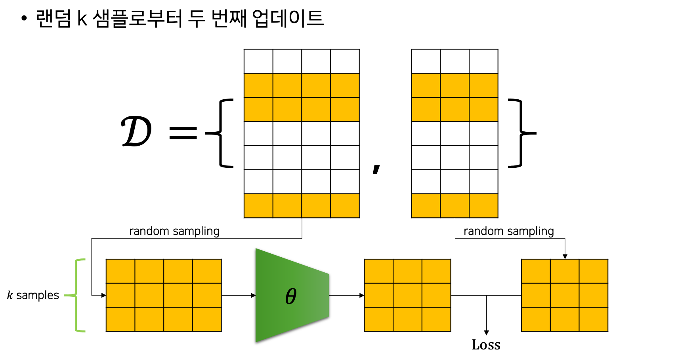

# 확률적 경사하강법

이제까지 우리는 파라미터 업데이트를 하기 위해 데이터셋의 모든 샘플들을 모델에 통과feed-forward시킨 후, 손실 값을 계산하였습니다.
그리고 손실 값을 가중치 파라미터들로 미분하여 파라미터 업데이트를 수행할 수 있었습니다.
즉 N개의 샘플이 존재할 때, 한 번의 파라미터 업데이트를 위해서 N개 샘플들이 모두 모델을 통과해야했습니다.

다음 그림은 이런 과정을 도식화해서 나타내고 있습니다.
다행인 점은 GPU의 병렬연산을 활용하여, N개의 입력을 한번에 통과시켜 손실 값을 계산할 수 있었다는 점입니다.

이와 같은 방법은 데이터셋이 큰 경우 여러 문제점을 가질 수 있습니다.
첫 번째로 GPU 메모리는 한계가 있기 때문에, 큰 데이터셋을 한번에 통과하는 것이 어려울 수도 있습니다.
이 문제는 GPU 메모리가 허용하는 범위 내에서 데이터를 나누어 모델에 통과시키고, 최종 손실 값에 더해줌으로써 해결할 수 있습니다.
그럼 두 번째 문제는 학습 속도의 문제입니다.
한 번의 파라미터 업데이트를 위해서 전체 데이터를 모델에 통과시키는 계산을 하는 것은 비효율적이라는 것인데요.

이때 우리는 확률적 경사하강법Stochastic Gradient Descent, SGD을 통해 이 문제를 해결할 수 있습니다.
전체 데이터셋을 모델에 통과시키는 대신, SGD는 랜덤 샘플링random sampling한 k개의 샘플을 모델에 통과시켜 손실 값을 계산하고, 미분 이후에 파라미터 업데이트를 수행합니다.
즉, 데이터셋의 부분 집합을 통해 학습을 수행하는데요.
이때 샘플링 과정에서 주의할 것은 비복원 추출을 수행한다는 점입니다.
랜덤 샘플링을 하는 과정이 확률적으로 동작하므로, 기존의 경사하강법gradient descent에 확률적stochastic이라는 단어가 붙어, 확률적 경사하강법(SGD)이라 부릅니다.
그리고 랜덤 샘플링된 k개의 샘플들의 묶음을 미니배치mini-batch라고 부릅니다.

이러한 SGD의 동작 방식을 그림으로 나타내면 다음과 같습니다.
다음은 SGD에서의 첫 번째 파라미터 업데이트를 나타낸 것입니다.

전체 데이터셋에서 랜덤 샘플링된 노란색 샘플들만 모델을 통과하여 손실 값 계산에 활용되는 것을 볼 수 있습니다.
다음은 두 번째 파라미터 업데이트를 나타낸 것입니다.

마찬가지로 랜덤 샘플링된 노란색 샘플들만 모델을 통과하는 것을 볼 수 있는데요.
앞서도 언급한 것처럼 중요한 것은 샘플링 과정이 비복원 추출이기 때문에 더 이상 모델을 통과하지 않은 샘플들이 없을 때까지 기존에 모델을 통과한 샘플들은 사용되지 않는다는 점입니다.
다시 말하면 남아있는 샘플들이 없을 때까지 비복원 랜덤 추출이 수행되며, 샘플들이 전부 소진되면 다시 전체 샘플들에 대해서 비복원 추출이 진행됩니다.
이렇게 전체 데이터셋의 샘플들이 전부 모델을 통과하는 것을 한 번의 에포크epoch이라고 부르며, 한 개의 미니배치를 모델에 통과시키는 것을 이터레이션iteration이라고 부릅니다.

그럼 데이터셋의 크기 N과 파라미터 업데이트(이터레이션) 횟수, 에포크 횟수, 그리고 미니배치의 크기 k는 다음과 같은 관계를 가집니다.

$$\begin{gathered}
\text{\#Iterations}/\text{Epoch}=\lceil\frac{N}{k}\rceil \\
\downarrow \\
\text{\#Iterations}=\lceil\frac{N}{k}\rceil\times\text{\#Epochs}
\end{gathered}$$

그러므로 미니배치의 크기가 작아질수록 파라미터 업데이트 휫수는 늘어나는 것을 우리는 알 수 있습니다.
또한 SGD를 실제로 구현하기 위해서는 자연스럽게 이중 for-loop가 만들어질 수 밖에 없습니다.[[1]](#footnote_1)

이처럼 SGD를 활용하면 기존 GD에 비해서 더 효율적으로 모델을 학습시킬 수 있습니다.
또한 미니배치의 크기에 따라서 학습의 성향이 바뀌기도 하는데요, 학습률과 마찬가지로 사용자에의해 정해져야하는 하이퍼파라미터hyper-parameter가 됩니다.
보통 실무에서는 미니배치의 크기를 GPU 메모리가 허용하는 한에서 크게 잡습니다.
하지만 4,000이 넘는 등의 너무 큰 미니배치 크기를 활용할 경우에는 오히려 성능에 독이 되기 때문에, 특별한 경우를 제외하고는 보통 256이나 512 정도의 크기에서 만족해도 좋습니다.[[2]](#footnote_2)

<a name="footnote_1">[1]</a>: 바깥쪽의 for-loop는 에포크를 위한 것이 될 것이고, 안쪽의 for-loop는 이터레이션을 위한 것이 될 것입니다.

<a name="footnote_2">[2]</a>: 어차피 모델이 커지고 데이터가 커지면 하나의 GPU에서는 큰 미니배치 크기를 가져가기 힘들어집니다.
