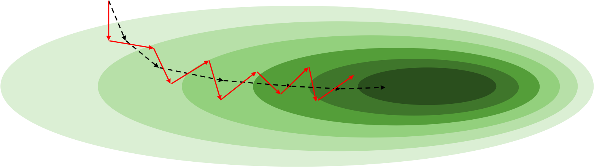

# SGD의 직관적 이해

SGD는 이름 그대로 확률적으로 동작하기 때문에 그 동작 특성에 대해 좀 더 자세히 생각해볼 필요가 있습니다.
일단은 다음 그림과 같이 손실 표면loss surface에 구덩이가 파여 있다고 생각해보겠습니다.
색깔이 짙어질수록 더 깊은 영역입니다.

그림의 좌상단 지점에서 경사하강법을 시작한다고 했을 때, 원래대로는 검은색 점선 화살표처럼 구덩이 속으로 미끄러져 들어갈 것입니다.

하지만 SGD가 적용되면 이것은 약간 달라지게 됩니다.
미니배치는 전체 데이터셋에서 랜덤 샘플링 되었기 때문에, 평균적으로는 전체 데이터셋의 분포를 따를 것이지만 어쩔 수 없이 편향bias이 생길 수 있습니다.
즉, 미니배치를 통해 구성한 손실 함수는 실제 전체 데이터셋의 손실 함수와 모양이 다를 것이므로, 이것을 미분하였을 때 얻을 수 있는 그래디언트의 방향과 크기도 다를 수 밖에 없습니다.[[1]](#footnote_1)
이렇게 미니배치의 다른 그래디언트를 그림에서는 빨간색 화살표로 표현하였습니다.

그림에서처럼 SGD를 통해 업데이트한 파라미터의 위치는 GD의 업데이트 파라미터 위치와 다를 수 밖에 없고, 이후의 과정들도 계속해서 달라지게 될 것입니다.
어쩌면 그림에서 빨간색 화살표들이 올바른 방향을 가리키지 못한 채, 중구난방으로 위치한 것과 같이 더 비효율적인 최적화를 수행하고 있는 것처럼 보일 수 있습니다.
하지만 검은색 점선 화살표는 전체 데이터셋을 모델에 통과시켜야 얻을 수 있는 것이지만, 빨간색 화살표는 이에 비해 굉장히 극소수 샘플들만을 통해 얻을 수 있는 것이므로 꼭 이것을 비효율적이라고 볼 수는 없습니다.
오히려 현실의 손실 표면은 이에 비해 훨씬 지저분하게 구성되어 있을 수 있으므로 어차피 검은색 점선 화살표도 삐뚤빼뚤 위치하고 있을 수도 있습니다.
또한 이렇게 빨간색 화살표가 실제 손실 표면과 다르기 움직이는 과정에서, 지역최소점에 빠지더라도 그것을 무시하고 빠져나올 수도 있는 것이죠.[[2]](#footnote_2)

사실 손실 표면이 어떻게 생겼는지는 알 수 없기 때문에 위의 내용들은 가설에 가깝습니다.
하지만 분명한 점은 미니배치 크기에 따라 실제 그래디언트에 비해서 미니배치의 그래디언트가 왜곡되는 정도가 바뀔 것이라는 것입니다.
미니배치가 커질수록 그래디언트는 실제 그래디언트와 비슷해질 확률이 높아질 것이고, 미니배치가 작아질수록 그래디언트는 실제 그래디언트와 달라질 확률이 높을 것입니다.

<a name="footnote_1">[1]</a>: 하지만 같은 가중치 파라미터 하에서 수많은 미니배치를 샘플링해서 계산한 그래디언트들의 평균은 전체 데이터셋의 그래디언트와 같을 것입니다.
