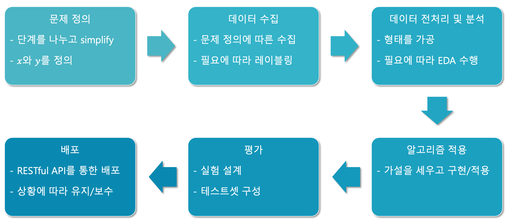

# 팁: 효율적인 연구/개발 진행 방법

이번에는 효율적인 연구/개발 진행 방법에 대해서 저의 경험에 기반하여 가볍게 이야기해볼까 합니다.

## 천리길도 한 걸음부터

아마 이 책을 읽으시는 대부분의 독자분들은 딥러닝 연구만을 목표로 하기보단 실무에 접목하여 어플리케이션을 개발하는 것이 목표일 것이라고 생각합니다.
그럼 아마 새로운 알고리즘을 처음부터 개발하는 등의 깊은 연구는 하지 않을 수도 있지요.
오히려 대부분은 인터넷에 공개되어 있는 코드들을 활용하는 형태가 될 것 같습니다.
하지만 그렇다고해서 여러분이 하는 일이 연구의 성격을 전혀띄지 않는 것은 아니라고 생각합니다.
어쨌든 여러분이 만들고자 하시는 어플리케이션도 딥러닝을 적용한 사례는 거의 없을 것입니다.
있다고 하더라도 똑같은 데이터셋에 완전 똑같은 환경에서 같은 업무를 한 사례는 없을거에요.

즉, 아무리 오픈된 모델과 코드를 그대로 가져오더라도 여러분의 문제에 곧바로 완벽하게 동작하지는 않을 것이라는 겁니다.
따라서 우리는 에베레스트를 등정하듯이, 고지에 깃발을 꽂기 위해서 계속해서 문제를 파악하고 성능을 개선하는 업무를 계속할겁니다.

그럼 우리가 저 높은 산을 정복하고자 한다면 어떤 일부터 해야 할까요?
저는 베이스캠프basecamp 구축이 가장 먼저라고 생각합니다.
실제로 에베레스트와 같은 산들은 등산이 가능한 날씨가 얼마 되지 않기 때문에, 밑에서 기다리는 시간이 굉장히 많다고 하지요.
등산을 하다가도 길을 잘못들거나 날씨가 갑자기 안좋아지면 다시 다음 기회를 기약해야 할 것입니다.
그때 우리는 베이스캠프가 있기 때문에 그곳으로 돌아가서 쉬면서 다른 경로를 구상하거나 과거의 실패를 반성하겠지요.

연구도 마찬가지라고 생각합니다.
여러분이 단순히 오픈된 코드를 활용하더라도 적용하고자 하는 데이터가 바뀌면 성능을 개선하는 작업이 필요합니다.
다시 말해, 첫 술에 배부를리가 없습니다.
그럼 성능이 낮게 나왔을 때, 왜 성능이 잘 나오지 않았을까 고민하고 분석해서 가설을 세우고 검증하는 작업이 반복되는 것입니다.
이때 든든한 베이스캠프가 있다면 실패하더라도 다시 돌아가서 다음번을 기약하면 됩니다.

따라서 우리는 연구에 있어서도 베이스캠프와 같은 베이스라인baseline 구축이 가장 중요합니다.
최소한의 가정과 가장 간단한 방법으로 베이스라인을 구축해 놓으면, 여기서부터 차근차근 하나씩 개선해나가면 됩니다.
물론 최신의 멋진 논문의 내용을 적용해보고 싶을 수 있지요.
하지만 우리의 시간은 한정되어 있고, 만약 논문의 내용이 우리의 문제에서 잘 동작하지 않는다면 우리는 시간을 낭비한 것이 됩니다.[[1]](#footnote_1)
따라서 가장 간단한 방법으로 먼저 뒤를 든든하게 만들고, 이후에 공격적인 방법들을 적용해볼 수 있을 것입니다.
그렇다면 우리는 나중에 모든 추가적인 노력이 실패하더라도, 최소한의 성능은 보장될 수 있습니다.

<a name="footnote_1">[1]</a>: 모든 논문들은 자신의 방법이 최고라고 자랑하지만, 그 중에 대부분의 논문들은 널리 사용되지 않습니다.

## 하이퍼파라미터에 따른 결과물 정리

위에서 이야기한대로 우리는 다양한 하이퍼파라미터에 대해서 굉장히 많은 실험들을 반복 수행하며 성능을 체크해야 합니다.
문제는 실험마다 손실loss 값이나 정확도accuracy 등의 점수들과 모델 가중치 파라미터weight parameter 파일 등 관리해야 할 내용들이 한두가지가 아닙니다.
나중에는 수많은 실험 결과들에 파묻혀 정신이 혼미해질 수도 있어요.
따라서 실험 결과들을 체계적으로 저장하고 정리할 수 있는 능력과 시스템을 갖춰야 합니다.

제가 처음 일을 시작하던 때에는 그런 시스템이랄게 없었습니다.
엑셀 파일을 만들어서 나름의 체계를 구축하고 성실하게 기록하는 수 밖에 없었지요.
당시에는 음성인식기의 언어모델이라는 하나의 문제에 대해서 몇 년을 연구했기 때문에 그래도 괜찮았지만, 만약 다양한 문제를 풀어야 했다면 더욱 어려움이 컸을 것 같습니다.
몇 개월 후에 다양한 문제들의 실험 결과들을 보면 아마 기억이 나지 않겠지요.

또 그리고 제가 시스템이 없는 상황에서 자주 사용하는 방법은 파일 이름을 최대한 활용하는 것입니다.
파일 이름에 '.'을 구분자delimiter로 활용하여 필드field를 나누고, '-'를 사용하여 키key 값과 밸류value 값을 구분합니다.
그럼 아래와 같이 적용 될 수 있습니다.

- model.n_layers-10.n_epochs-100.act-leaky_relu.loss-xxx.accuracy-xx.pth
  - n_layers: 10
  - n_epochs: 100
  - act_func: leaky_relu
  - loss: xxx
  - accuracy: xx

하지만 이 방법도 결국 제 개인의 기억과 체계에 의존하는 것이기 때문에 확장이 어렵고 장기 보존도 어렵습니다.

다행히 요새는 그래도 이런 실험 결과들을 잘 해줄 수 있는 도구나 라이브러리들이 잘 제공되는 편입니다.[[2]](#footnote_2)[[3]](#footnote_3)
이런 도구들을 잘 활용하면 실험 결과를 잘 관리할 수 있을 뿐만 아니라, 추후 보고를 위한 시각화 등의 자료들도 자동으로 얻을 수도 있습니다.
하지만 사내에 이러한 필요성을 가진 직원들이 많이 없는 경우에는 이런 시스템을 구축하는 것이 또 짐이 될 수도 있습니다.
그런 경우에는 어쩔 수 없이 제가 옛날부터 써오던 방법을 활용해야겠지요.

<a name="footnote_2">[2]</a>: MLFlow: https://mlflow.org/

<a name="footnote_3">[3]</a>: WanDB: https://www.wandb.com/ (일부 유료) 

## 파이프라인 구축

이런 과정을 거치다보면 결국 가장 중요한 업무는 연구/실험 과정에 대한 파이프라인 구축입니다.

반복되는 작업들을 최대한 자동화 할 수 있도록 파이프라인을 구축함으로써, 우리는 연구와 실험을 효율적으로 진행할 수 있습니다.
물론 파이프라인을 너무 정형화하고 자동화하려다가 배보다 배꼽이 더 큰 상황이 올 수도 있기 때문에 균형을 잘 유지해야겠지요.
어쨌든 데이터를 수집해서 정제하고 모델에 집어넣고 성능을 구하는 과정은 분명히 계속해서 반복될 것입니다.
뿐만 아니라 베이스라인을 구축하고 모델을 개선하고 이를 검증하기 위해 실험하고 성능을 구하는 과정도 반복되겠지요.
반복되는 부분을 매번 손으로 하다보면 업무의 효율이 저하될 수 밖에 없고, 이후에 레거시legacy 관리 측면에서도 굉장히 어려움이 있겠지요.

따라서 머신러닝 업무를 진행하면서 업무 프로세스를 잘 정리하고, 그 중에서 반복되는 작업들이 어떻게 구성되어 있는지 판단해야 합니다.
그 중에서 자동화가 가능한 부분들을 스크립트script로 구현하여 파이프라인을 점차 구성해나가는 것입니다.
요즘은 마찬가지로 이런 작업들을 자동화하기위한 워크플로우workflow 도구들이 많이 나와있습니다.[[4]](#footnote_4)
따라서 자동화 파이프라인을 구축하는 과정에서도 나만의 방법을 활용하기보단, 사내에서의 요구사항들을 모아 공개된 도구들을 활용하여 다 함께 구축하는 것이 더 낫겠지요.

<a name="footnote_4">[4]</a>: 에어플로우Airflow(https://airflow.apache.org/)와 쿠배플로우Kebeflow(https://www.kubeflow.org/)가 대표적인 사례입니다.
