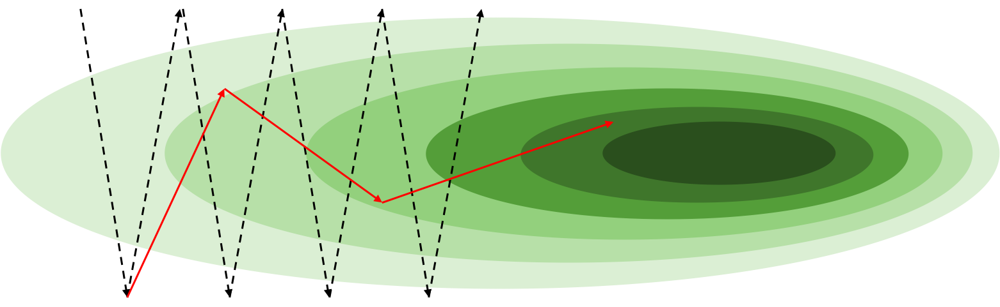

# 적응형 학습률

학습률learning rate은 대표적인 하이퍼파라미터hyper-parameter입니다.
값이 너무 크면 학습이 안정적으로 이루지지 않고, 값이 너무 작으면 학습이 너무 더디기 때문에, 가장 먼저 튜닝이 필요한 파라미터이기도 합니다.

이러한 기존의 경사하강법에 우리는 여러가지 기법을 더함으로써, 좀 더 수월하게 가중치 파라미터를 최적화 할 수 있습니다.
이번 섹션에서는 먼저 여러가지 기법들에 대해 개념을 살펴보고, 이어 수식 단계에서도 이해하도록 하겠습니다.

## 모멘텀

모멘텀momentum은 딥러닝 이전부터 활용되어 온 유서깊은 최적화 기법입니다.
그래서 모멘텀을 통해 여러가지 이점을 얻을 수 있는데요.
먼저 지역최소점local minima을 쉽게 탈출할 수 있을 뿐만 아니라, 학습 속도를 가속화 할 수 있습니다.

모멘텀은 시작부터 매번 계산된 그래디언트gradient를 누적하는 형태로 구현됩니다.
따라서 '관성'이라는 의미의 모멘텀이라는 이름이 붙었습니다.
구체적인 예시를 통해 좀 더 이해해보도록 하겠습니다.
다음 그림과 같이 깊은 골짜기가 있다고 생각해보도록 하겠습니다.

골짜기의 가운데 어느 지점이 우리가 찾고자 하는 전역최소점global minima가 될 것입니다.
하지만 그림의 가로 방향의 기울기는 세로 방향의 기울기에 비해서 훨씬 덜 가파릅니다.
그러므로 그림과 같은 시작 지점에서는 세로 방향의 기울기가 훨씬 강할것이므로 오른쪽으로 가는 와중에도 위 아래로 진동이 매우 심할 것입니다.
즉 오른쪽으로 가야하는 간단한 문제인데, 위아래로 왔다갔다 하느라 최적화가 더디게 진행되는 비효율적인 상황이 될 수 있습니다.

이때 모멘텀의 수식을 적용한다면 위아래로 진동하는 방향은 서로 상쇄되어 작아질 것이고, 오른쪽으로 나아가는 방향은 계속 누적되어 커질 것입니다.
즉, 위아래 진동은 줄어들고 오른쪽으로 진행되는 속도는 더 빨라져 우리가 원하는 형태로 최적화가 더 빨리 진행될 수 있겠지요.

## 적응형 학습률

모멘텀의 경우에는 그래디언트에 노이즈noise가 많은 상황에서도 가속시켜준다는 점에서 널리 활용되었습니다만, 여전히 근본적인 아쉬움은 남아있었습니다.
바로 학습률의 튜닝 이슈입니다.
이후에 수식 단계에서 살펴보겠지만, 모멘텀의 경우에는 여전히 똑같이 기존의 학습률이 모멘텀에 결과값에 곱해짐으로써 파라미터가 업데이트 되어야 하는 양이 결정됩니다.
결국 학습률의 크기에 따라서 여전히 최적화 여부가 좌우될 수 있다는 것이지요.

따라서 예전부터 학습률 자체를 따로 튜닝하지 않아도, 대부분의 상황에서 최적화가 잘 수행될 수 있는 방법들에 대한 연구가 많았습니다.
즉, 우리가 새로운 데이터셋과 새로운 모델 구조를 가지고 학습을 시작할 때, 학습률에 대한 고민을 하지 않고 기본 설정 값을 사용하더라도 잘 학습이 되었으면 하는 것이지요.
결국 상황에 따라 학습률이 자동으로 정해지는 형태가 될 것이고, 이것을 적응형 학습률adaptive learning rate이라고 부르도록 하겠습니다.

### 학습률 스케줄링

적응형 학습률을 본격적으로 이야기하기에 앞서, 학습률 스케줄링learning rate scheduling에 대해서 이야기 해보겠습니다.
보통 데이터셋의 특성과 모델 구조, 그리고 손실 함수loss function에 따라서 손실 표면loss surface의 모양이 바뀌게 됩니다.
따라서 매번 다른 문제를 풀 때 달라지는 최적의 학습률을 찾기 위해 튜닝이 필요한데요.

재미있게도 이와 별개로 한 번의 학습 안에서도 학습 경과(e.g. 에포크epoch)에 따른 학습의 따른 특성이 나뉘게 됩니다.
직관적으로 생각해보면 학습 초반에는 어차피 갈 길이 멀기 때문에 학습률을 크게 가져가면 좋고, 학습 후반에 갈수록 미세한 가중치 파라미터weight parameter 조정이 필요할 수 있기 때문에 학습률이 작아지면 좋을 것입니다.
그런데 우리가 작은 학습률을 갖고 학습을 시작하면 학습 초반에 더딘 진행에 답답할 것이고, 큰 학습률을 갖고 시작하면 학습 후반에 미세한 파라미터 조정이 어려울 것입니다.

따라서 이런 필요성에 의해서 학습률 스케줄링 기법이 활용되기도 합니다.
학습률 스케줄링은 굉장히 다양한 방법이 있는데, 대개는 다음과 같이 적용이 됩니다.

- 초기 학습률initial learning rate을 가지고 모델 최적화를 수행합니다.
- 일정 에포크epoch 또는 이터레이션iteration이 경과한 후에 감쇠decay를 시작합니다.
또는 해당 에포크에서 모델의 학습이 더이상 진전되지 않을 때 감쇠를 하기도 합니다.
- 학습률 감쇠learning rate decay는 선형linear적으로 적용될 수도 있으며 비율ratio이 곱해지는 형태로 적용되거나 코사인cosine함수의 형태로 적용될 수도 있습니다.[[1]](#footnote_1)

이 경우에는 학습 내에서 동적으로 학습률을 가져갈 수 있으나, 오히려 학습률과 관련한 하이퍼파라미터가 더 추가되는 아쉬움이 남습니다.
따라서 실제로 학습률의 스케줄에 모델의 성능이 굉장히 민감한 경우에는 스케줄 튜닝에 어려움을 겪기도 합니다.[[2]](#footnote_2)

<a name="footnote_1">[1]</a>: 감쇠되는 형태 또는 비율 또한 하이퍼파라미터 입니다.

<a name="footnote_2">[2]</a>: 자연어 처리에 널리 활용되는 트랜스포머Transformer의 원형이 아담 옵티마이저Adam optimizer를 사용함에도 학습률 스케줄링이 필요하며, 또한 스케줄링에 굉장히 민감한 악명 높은 사례라고 볼 수 있습니다.

### 아다그래드 옵티마이저

이러한 딥러닝 연구자들의 염원에 힘입어, 아다그래드AdaGrad는 최초로 제안된 적응형 학습률adaptive learning rate 알고리즘이라고 볼 수 있습니다.[[3]](#footnote_3)
아다그래드의 가장 큰 차이점은 가중치 파라미터마다 별도의 학습률을 가진다는 것입니다.
그리고 각 가중치 파라미터의 학습률은 가중치 파라미터가 업데이트 될수록 반비례하여 작아지게 됩니다.
따라서 가중치 파라미터의 업데이트가 각자 다르게 될 경우, 업데이트가 많이 된 파라미터의 경우 작은 학습률을 갖게 되고 업데이트가 적게 된 파라미터의 경우 큰 학습률을 갖게 될 것입니다.

문제는 학습이 진행됨에 따라 파라미터 업데이트가 많이 진행될 경우 학습률이 너무 작아져서, 나중에는 그래디언트가 크더라도 가중치 파라미터 업데이트가 잘 이루어지지 않을 수 있습니다.

<a name="footnote_3">[3]</a>: Adaptive Subgradient Methods for Online Learning and Stochastic Optimization, Duchi et al., 2011

### 아담 옵티마이저

따라서 아다그래드 이후에도 많은 알고리즘들이 제안되었으며, 그 중에서 가장 널리쓰이는 알고리즘은 아담 옵티마이저Adam optimizer입니다.[[4]](#footnote_4)
아담은 기존의 적응형 학습률 방식에 모멘텀이 추가된 알고리즘이라고 볼 수 있습니다.
이외에도 기존 알고리즘들을 보완함으로써, 가장 보편적으로 쓰이는 알고리즘이 되었습니다.
따라서 사용자들은 아담 옵티마이저를 사용하면 기본 설정 값을 가지고도 대부분의 문제들에서 좋은 성능을 얻을 수 있게 됩니다.
즉, 모델이나 학습 방법training scheme이 학습률에 강인robust해지는 효과를 얻을 수 있습니다.

물론 아담도 사실은 학습률을 내부 하이퍼파라미터로 갖고 있고 나중에는 이것을 튜닝해야 하는 경우도 있지만, 아직 이 글을 읽는 독자분들이 접하는 상황에서는 거의 발생하지 않는 일이라고 봐도 좋습니다.
그러므로 독자분들은 일단 아담의 기본 셋팅을 가지고 일단 문제 접근을 시작하셔도 좋습니다.
우리는 학습률 이외에도 고민해야 할 하이퍼파라미터들이 너무나도 많으니까요.

<a name="footnote_4">[4]</a>: Adam: A Method for Stochastic Optimization, Kingma et al., 2015
