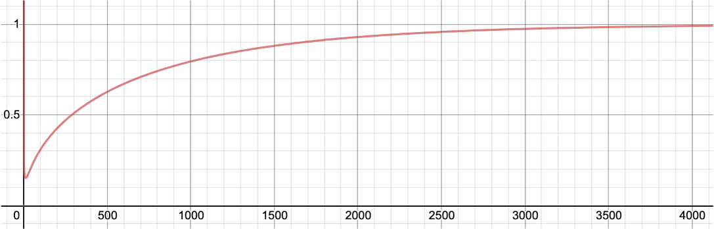

# 적응형 학습률의 수식

앞서 우리는 모멘텀momentum과 아다그래드AdaGrad, 아담Adam에 대해서 개념을 살펴보았습니다.
이제 수식을 통해서 한 단계 더 깊게 이해해보도록 하겠습니다.

먼저 그동안 우리가 활용해온 최적화 방법을 수식으로 나타내면 다음과 같습니다.

$$\begin{gathered}
\mathcal{L}(\theta_t)=\frac{1}{N}\sum_{i=1}^N{
    \Delta\Big(f(x_i;\theta_t),y_i\Big)
} \\
\\
g_t=\nabla_\theta\mathcal{L}(\theta_t)
\end{gathered}$$

손실 함수loss function는 타겟 출력 값과 함수의 출력 값 사이의 차이( $\Delta$ )를 데이터셋의 샘플들에 대해 계산합니다.
그리고 이것을 가중치 파라미터weight parameter에 대해서 미분하면 그래디언트gradient 벡터 $g_t$ 를 얻을 수 있을 것입니다.

그럼 경사하강법gradient descent의 수식은 다음과 같습니다.
앞서 구한 그래디언트에 학습률learning rate, LR을 곱해서 기존 파라미터에서 빼 준 결과를 다음 파라미터로 정합니다.
여기서 $t$ 는 파라미터 업데이트 횟수를 뜻합니다.
즉, 이터레이션iteration을 의미하며, 에포크epoch가 아님을 주의하세요.

$$\begin{gathered}
\theta_{t+1}=\theta_t-\eta\cdot{g_t}
\end{gathered}$$

학습률은 따라서 그래디언트가 얼마나 파라미터 업데이트에 반영될지 나타내며, 학습률의 크기에 따라 학습이 발산하거나 더디게 진행 될 수 있습니다.
따라서 우리는 데이터셋이 바뀌거나 모델 구조가 바뀌는 등의 상황에서, 매번 최적 학습률을 찾기 위한 튜닝 작업을 수행해야 하는 불편함이 있습니다.

## 모멘텀의 수식

모멘텀은 '관성'이라는 의미를 지니고 있는 만큼, 다음 수식을 살펴보면 예전 그래디언트를 누적해서 계산하는 것을 볼 수 있습니다.

$$\begin{gathered}
\begin{aligned}
\tilde{g}_t&=\gamma\cdot{\tilde{g}_{t-1}}-\eta\cdot{g_t} \\
&=-\eta\cdot\sum_{i=1}^t{
    \gamma^{t-i}\cdot{g_i}
},
\end{aligned} \\
\text{where }\tilde{g}_0=0\text{ and }\gamma\text{ is discount factor}.
\end{gathered}$$

우리는 이 수식을 통해 그래디언트를 재정의합니다.
이를 위해서 이전까지의 모멘텀 그래디언트와 현재 그래디언트의 선형 결합linear combination을 계산하는데요.
이것을 다시 표현하면 처음부터 현재까지의 디스카운트discount 파라미터가 곱해진 그래디언트의 누적 합이 됩니다.

그럼 다음 가중치 파라미터를 업데이트하기 위해, 현재 가중치 파라미터에 모멘텀 그래디언트를 더해주게 됩니다.
결국 풀어보면 모든 타임스텝time-step의 그래디언트를 누적하여 빼주는 형태로 수식이 정리되는 것을 볼 수 있습니다.

$$\begin{aligned}
\theta_{t+1}&=\theta_t+\tilde{g}_t \\
&=\theta_t-\eta\cdot\sum_{i=1}^t{
    \gamma^{t-i}\cdot{g_i}
}
\end{aligned}$$

또한 여전히 수식에 학습률 $\eta$ 가 남아있는 것을 볼 수 있고, 결국 누적된 그래디언트가 파라미터 업데이트에 끼치는 영향도를 설정하고 있음을 알 수 있습니다.

## AdaGrad의 수식

이에 따라 이제는 학습률이 자동으로 설정되도록 하고자 합니다.
이전에 소개해드린 학습률 스케줄링과 그 목적은 일맥상통하는데요.
학습 초반에는 큰 학습률을 통해 빠르게 학습되도록 하고, 학습 후반에는 작은 학습률을 통해 파라미터를 미세하게 조정할 수 있도록 하고자 합니다.

따라서 먼저 아다그래드는 각 가중치 파라미터 별로 학습률이 따로 정해지는 것을 기본으로 합니다.
여기에 다음 수식과 같이 그래디언트의 제곱을 누적한 값을 계산하여 활용할 것입니다.

$$\begin{gathered}
\begin{aligned}
r_t&=r_{t-1}+g_t\odot{g_t} \\
&=\sum_{i=1}^t{
    g_i\odot{g_i}
},
\end{aligned} \\
\text{where }r_0=0\text{ and }\odot\text{ is element-wise multiplication}.
\end{gathered}$$

$r_t$ 는 $t$ 까지의 그래디언트의 제곱 값을 누적한 값입니다.
수식에서 언급했듯이, 벡터나 행렬의 같은 위치의 요소element끼리 곱셈을 수행하는 것이므로 제곱 과정에서 벡터나 행렬의 크기는 보존 될 것입니다.
이제 이 누적 값을 초기 학습률initial learning rate에서 나눠줌으로써, 동적으로 학습률이 설정될 수 있습니다.

$$\begin{aligned}
\theta_{t+1}&=\theta_t-\frac{\eta}{\sqrt{r_t+\epsilon}}\odot{g_t} \\
&=\theta_t-\eta\cdot\frac{g_t}{\sqrt{\epsilon+\sum_{i=1}^t{
    g_i\odot{g_i}
}}}
\end{aligned}$$

누적 값 $r_t$ 는 그래디언트 $g_t$ 는 같은 크기를 지닌 벡터 또는 행렬이 될 것이므로, 우리는 $r_t$ 가 각 가중치 파라미터 별 학습률이 됨을 확인할 수 있습니다.
또한 이로인해 그동안 업데이트의 크기가 큰 가중치 파라미터 요소는 작은 학습률이 곱해질 것입니다.

이처럼 적응형 학습률adaptive learning rate을 사용하게 되면 학습 초기에는 큰 학습률과 학습 후기에는 작은 학습률을 가질 수 있게 됩니다.
즉, 여전히 하이퍼파라미터로써 학습률이 존재하지만, 어쨌든 학습이 진행됨에 따라 점점 작아질 것이므로 흐름 자체는 동일하게 진행됩니다.
그러므로 우리는 데이터셋이나 모델 구조가 바뀌었을 때도 학습률에 대한 별다른 튜닝 없이 기본 설정 값을 가지고도 준수한 성능을 얻어낼 수 있다는 것이 장점입니다.
하지만 앞선 수식에서 볼 수 있듯이, 아다그래드의 경우에는 후반부에 갈수록 0에 가까운 학습률이 되어 아직 그래디언트 $g_t$ 가 충분히 큰 상황이더라도 학습이 진전되지 못할 수 있습니다.

## Adam의 수식

아담의 경우, 기존의 적응형 학습률 방식에 모멘텀이 추가된 것이 가장 큰 특징입니다.
또한 기존 아다그래드에서 볼 수 있었던 학습 후반부의 학습 부진 현상을 해소하기 위한 기법들도 추가되어 사실은 다음 수식과 같이 기존 하이퍼파라미터인 학습률 이외에도 하이퍼파라미터가 2개나 더 추가되었습니다.
추가된 하이퍼파라미터들은 다음과 같은 기본 설정 값을 지니고 있습니다.

$$\begin{gathered}
\theta_{t+1}=\theta_t-\eta\cdot{g_t}, \\ 
\text{where }\eta\text{ is learning rate}. \\
\\
\rho_1=0.9\text{ and }\rho_2=0.999.
\end{gathered}$$

먼저 모멘텀의 경우에는 앞서 살펴본 수식과 굉장히 유사하게 진행되는 것을 볼 수 있습니다.
다만 기존에는 현재 그래디언트에 바로 학습률 $\eta$ 가 곱해졌지만, 대신에 $1-\rho_1$ 가 곱해지고 있는 것을 볼 수 있습니다.

$$\begin{aligned}
s_t&=\rho_1\cdot{s_{t-1}}+(1-\rho_1)\cdot{g_t},\text{ where }s_0=0. \\
&=(1-\rho_1)\cdot\sum_{i=1}^t{
    \rho_1^{t-i}\cdot{g_i}
}
\end{aligned}$$

처음부터의 그래디언트가 누적된 모멘텀의 텀term을 $s_t$ 라고 부르겠습니다.
여기에 적응형 학습률을 다음과 같이 정의하고 $r_t$ 라고 부르도록 합니다.

$$\begin{aligned}
r_t&=\rho_2\cdot{r_{t-1}}+(1-\rho_2)\cdot{(g_t\odot{g_t})},\text{ where }r_0=0. \\
&=(1-\rho_2)\cdot\sum_{i=1}^t{
    \rho_2^{t-i}\cdot{(g_i\odot{g_i})}
}
\end{aligned}$$

이 적응형 학습률 수식과 기존의 아다그래드AdaGrad의 가장 큰 차이점은 디스카운트discount 파라미터의 존재 유무입니다.
앞서 소개한 하이퍼파라미터 $\rho_2$ 가 반복되어 곱해짐으로써, 학습 후반에 갈수록 그래디언트 제곱 값의 누적이 마냥 커지기만 하는 것을 방지할 수 있습니다.

이렇게 일단 모멘텀과 적응형 학습률을 위한 수식이 정의되었는데, 여기서 한 발 더 나아가 학습 초반의 좀 더 안정된 학습을 위한 장치가 추가됩니다.
다음 수식과 같이 모멘텀 $s_t$ 와 적응형 학습률 $r_t$ 를 재정의 하는데요.

$$\begin{gathered}
\hat{s}_t=\frac{s_t}{1-\rho_1^t} \\
\hat{r}_t=\frac{r_t}{1-\rho_2^t}
\end{gathered}$$

이 재정의된 수식들을 전체 경사하강법gradient descent 수식에 넣어 전개해보면 다음과 같이 전개됩니다.

$$\begin{aligned}
\theta_{t+1}&=\theta_t-\eta\cdot\frac{\hat{s}_t}{\sqrt{\hat{r}_t+\epsilon}} \\
&\approx\theta_t-\eta\cdot\frac{\hat{s}_t}{\sqrt{\hat{r}_t}} \\
&=\theta_t-\eta\cdot\frac{\sqrt{1-\rho_2^t}}{1-\rho_1^t}
\cdot\frac{1-\rho_1}{\sqrt{1-\rho_2}}
\cdot\frac{\sum_{i=1}^t{
    \rho_1^{t-i}\cdot{g_i}
}}{\sqrt{\sum_{i=1}^t{
    \rho_2^{t-i}\cdot{(g_i\odot{g_i})}
}}}
\end{aligned}$$

이처럼 수식을 온전히 가중치 파라미터 $\theta$ 와 하이퍼 파라미터 $\eta, \rho_1, \rho_2$ , 그리고 그래디언트 $g_t$ 로 나타낼 수 있습니다.
이때, 맨 마지막 줄 수식을 살펴보면 다음과 같은 의미를 지니는 것으로도 생각해볼 수 있습니다.

$$\begin{gathered}
\theta_t-\eta\cdot
\underbrace{\frac{\sqrt{1-\rho_2^t}}{1-\rho_1^t}}_{(1)}
\cdot\underbrace{\frac{1-\rho_1}{\sqrt{1-\rho_2}}}_{(2)}
\cdot\frac{\overbrace{
    \sum_{i=1}^t{
        \rho_1^{t-i}\cdot{g_i}
    }
}^{(3)}}{\underbrace{
    \sqrt{\sum_{i=1}^t{
        \rho_2^{t-i}\cdot{(g_i\odot{g_i})}
    }}
}_{(4)}}
\end{gathered}$$

수식에서 (2)번의 경우에는 하이퍼파라미터들로만 구성되어있으므로 맨 앞의 학습률 파라미터와 함께 단순히 상수로 취급 가능합니다.
(3)번의 경우에는 모멘텀, (4)번은 적응형 학습률에 대응되는 부분으로 볼 수 있습니다.
(1)번의 경우, 학습이 진행되며 $t$ 가 증가함에 따라서 다음과 같은 값이 됩니다.

학습 초반에 작은 값을 가지다가, 학습이 진행됨에 따라 1에 근접하는 것을 볼 수 있습니다.[[1]](#footnote_1)
이것은 편향 수정bias correction으로 불리우며, 특히 학습 극초반에 불안정하게 의도치 않은 방향으로 학습이 진행되는 것을 방지하기 위한 장치입니다.
[[2]](#footnote_2)

이와 같이 아담 옵티아미저Adam optimizer는 모멘텀과 적응형 학습률이 모두 포함되어 있어, 수렴 속도도 굉장히 빠르고 학습률에도 강인한 모습을 보입니다.
물론 아담이 항상 모든 상황에서 완벽하게 동작하는 것은 아니었기 때문에, 이를 보완하기 위한 여러가지 알고리즘[[3]](#footnote_3)[[4]](#footnote_4)들이 많이 제시되었으나, 어쨌든 아담의 큰 흐름은 이어받았습니다.
독자 여러분들도 아담을 주로 활용하시면 모델 훨씬 수월하게 준수한 모델의 성능을 달성할 수 있을 것입니다.

<a name="footnote_1">[1]</a>: 4000번 즈음에서 1에 근접하는데, 이것도 데이터셋이 크다면 여전히 학습 초반이라고 볼 수도 있습니다.

<a name="footnote_2">[2]</a>: 일부 딥러닝 프레임워크framework에는 구현되어 있지 않기도 합니다.

<a name="footnote_3">[3]</a>: RAdam: On the Variance of the Adaptive Learning Rate and Beyond, Liu et al., 2019

<a name="footnote_4">[4]</a>: AdamP: Slowing Down the Slowdown for Momentum Optimizers on Scale-invariant Weights, Heo et al., 2021
