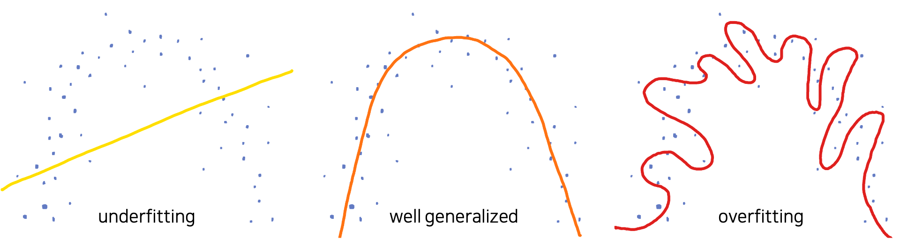
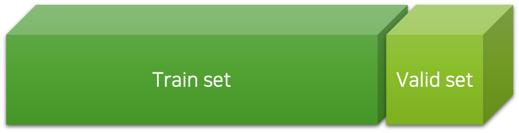
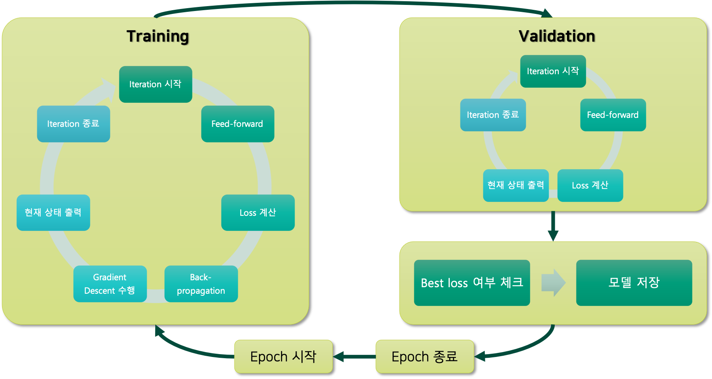
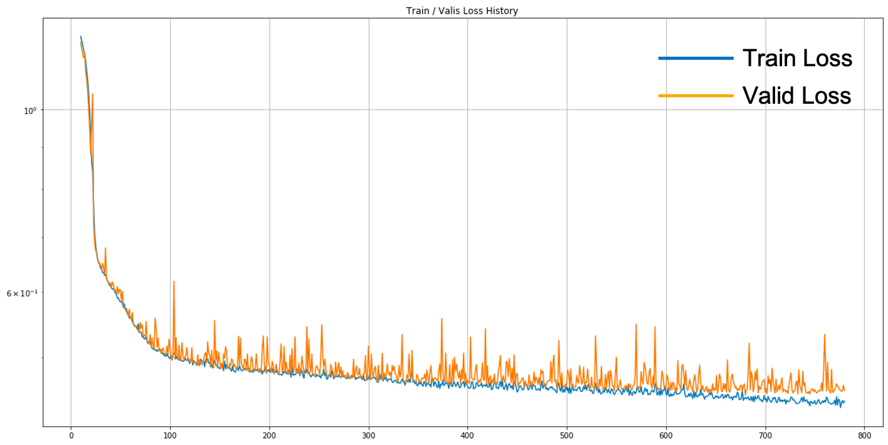

# 오버피팅이란?

이전 장에서 우리는 사실 그동안 우리가 해온 방법은 제대로된 학습 과정이 아니었다고 밝혔습니다.
그럼 이제 왜 이전의 방법이 잘못되었고, 모델을 제대로 학습하는 방법에 대해서 이야기해보도록 하겠습니다.

## 목표 수정

이제까지 우린 학습 데이터로부터 손실 값training loss을 구해서 모델의 학습 여부를 판단하였습니다.

$$\begin{gathered}
\mathcal{D}=\{(x_i, y_i)\}_{i=1}^N \\
\mathcal{L}(\theta)=\frac{1}{N}\sum_{i=1}^N{
    \|y_i-f_\theta(x_i)\|
} \\
\end{gathered}$$

이것은 다른 표현으로 학습 오차training error라고 표현할 수 있습니다.
그런데 만약 학습 데이터에 잘못된 레이블label이 있다면 어떻게 될까요?
또는 데이터셋을 수집하는 과정에서 의도치않게 편향bias이 생긴다면 어떻게 될까요?[[1]](#footnote_1)
아마도 우리가 실무에서 사용하는 데이터는 인터넷에서 크롤링crawling하거나 사람이 직접 레이블링labeling한 것일텐데, 어쩔 수 없이 레이블의 오류나 편향이 존재할 가능성이 충분히 있습니다.
외주 작업자 또는 아르바이트생이 잠깐 졸았을 수도 있고, 애초에 문제가 애매했을 수도 있지요.
그런데도 불구하고 학습 데이터셋의 손실 값을 최소화 시켜서, 만약에 심지어 0이 되었다면 어떻게 될까요?
그럼 실제 배포된 상황에서도 모델이 잘못된 정답을 뱉어낼 수도 있을 것입니다.

책 초반부에 좋은 인공지능이란 무엇인지 설명할 때, 일반화generalization를 잘하는 것이 좋은 인공지능이라는 언급을 한 적이 있습니다.
우리는 보지 못한 데이터unseen data에 대해서 좋은 예측prediction을 하는 것이 목표라는 것인데요.
따라서 우리는 학습 오차training error를 최소화 하는 것이 최종 목표가 아닙니다.
우리의 최종 목표는 일반화 오차generalization error를 최소화 하는 것이 최종 목표입니다.

## 오버피팅과 언더피팅

이제 본격적으로 오버피팅overfitting의 개념을 도입할 차례입니다.
오버피팅이란 '학습 오차training error가 일반화 오차generalization error에 비해서 현격하게 낮아지는 현상'을 이야기합니다.
즉, 앞서 이야기한 사례와 같이 학습 데이터에 편향이나 노이즈noise가 있을 때, 이것까지 모델이 학습함으로써 오히려 모델이 일반화를 수행하는데 방해되는 상태를 이릅니다.

이때 우리는 언더피팅underfitting에 대해서도 이야기 할 수 있는데요.
언더피팅이란 '모델이 충분히 데이터를 학습하지 못하여, 학습 오차training error가 충분히 낮지 않은 현상'을 이야기합니다.
보통 모델의 수용능력capacity이 부족하여, 복잡한 데이터의 관계를 학습하지 못하는 경우에 많이 발생합니다.
또는 최적화 과정에서 경사하강법gradient descent으로 복잡한 손실 표면loss surface을 잘 헤쳐나가지 못하는 과정에서 발생할 수도 있습니다.

우리는 오버피팅과 언더피팅 여부를 통해 우리의 최종 목표에 잘 도달하고 있는지 확인할 수 있습니다.
특히 오버피팅의 경우에, 우리가 무조건 오버피팅을 피해야 하는 것이라기보단, 오버피팅은 모델의 수용능력을 나타내는 좋은 지표로 활용되기도 합니다.
예를 들어, 오버피팅이 발생하였다는 것은 모델의 수용능력이 데이터의 복잡한 관계를 학습하기에 충분하다는 이야기가 될 수 있고[[2]](#footnote_2), 오버피팅 여부를 확인한 이후에 오버피팅을 방지하는 방향으로 모델을 개선하면 되기 때문입니다.

보통 언더피팅과 오버피팅의 개념은 다음의 그림으로도 많이 설명될 수 있는데요.

예를 들어 위와 같이 분포된 데이터를 수집했을 때, 우리는 이 데이터를 생성해낸 어떤 알수 없는 함수 $f^*$ 를 근사하고 싶을 것입니다.
하지만 그림에서 확인할 수 있듯이 이 데이터셋은 편향 또는 노이즈를 포함하고 있기도 합니다.
이때, 왼쪽과 같이 선형 모델linear model(e.g. 선형 회귀linear regression)로 이 데이터를 모델링하고자 한다면 잘 동작하지 않겠지요.
선형 모델은 이 데이터를 학습하기에 너무 수용능력이 작습니다.
따라서 언더피팅이 발생합니다.
또는 오른쪽 그림과 같이 너무 복잡한 형태의 함수로 근사할 수도 있을 것입니다.
하지만 이 경우에는 아마 지나친 일반화가 이루어진것이라고 볼 수 있고, 어쩌면 학습 오차training error는 낮을 수 있지만 일반화 오차generalization error는 높은 상태인 오버피팅이 발생했다고 판단할 수 있습니다.
그러므로 우리는 가운데와 같이 어느정도 노이즈가 편향이 있음을 감안하였을 때, 데이터를 간단하게 일반화 할 수 있는 2차 함수 곡선의 형태로 함수를 근사할 수 있을 것입니다.

<a name="footnote_1">[1]</a>: 데이터셋이 작을수록 모집단에서 랜덤 샘플링random sampling하는 과정에서 편향이 생길 가능성이 높아집니다.

<a name="footnote_2">[2]</a>: 보통 학습 데이터의 편향이나 노이즈는 매우 디테일한 부분일 가능성이 높으므로, 대개 모델의 일반화가 어느정도 진행된 이후에 오버피팅이 발생하곤 합니다.

## 검증 데이터셋

만약 모델의 최적화가 잘 수행되고 있고 모델의 수용능력이 충분하다면, 학습 초반에는 보통 언더피팅으로 시작해서 어느순간 오버피팅으로 전환될 것이라고 예상해볼 수 있습니다.
즉 초반에는 중요한 데이터의 특징feature들을 배우다가, 어느순간부터 학습 데이터의 불필요한 특징들까지 학습되는 순간이 올텐데요.
이것을 잘 감지하고 오버피팅으로 전환되는 순간에 학습을 멈춘다면 아마 가장 이상적이라고 볼 수 있을 것 같습니다.

이것을 수행하기 위해서 우리는 검증 데이터셋validation dataset을 도입합니다.
앞서 언급한 것처럼, 우리는 일반화 오차generalization error를 최소화 하는 것을 목적으로 합니다.
따라서 만약 모델이 오버피팅이 발생하지 않았고, 검증 데이터셋이 학습 데이터셋과 같은 성질(분포)을 갖고 있다면, 모델은 검증 데이터셋에 대해서도 비슷한 손실loss 값을 가질 것입니다.

이를 위해서 우리는 학습 데이터를 일부 임의로 나누어 검증 데이터셋을 구성하고 이것을 학습하는 도중에 주기적으로 모델에 넣어 손실 값을 구함으로써, 오버피팅 여부를 확인할 수 있습니다.
보통 매 에포크epoch마다 이 작업을 수행하며, 이 과정을 검증validation 과정이라 부릅니다.
또한, 검증 과정에서 얻은 검즘 데이터셋에 대한 손실 값을 검증 손실validation loss 값이라고 부릅니다.
여기서 중요한 점은 검증 데이터셋을 통해서는 최적화(학습)를 진행하지 않으며, 데이터셋을 랜덤하게 나누는 과정에서 편향이 있어서는 안된다는 것입니다.

결국 우리는 일반화 오차를 최소화 하는 것이 최종 목적이므로, 검증 손실 값을 최소화 하는 것이라고 볼 수 있습니다.
모델은 학습 데이터에 대해서만 학습된 상태이므로, 검증 데이터셋에 대해서 좋은 예측을 수행한다면 일반화가 잘 되었다고 판단할 수 있습니다.
또는 만약 학습 오차training error는 낮지만 검증 오차validation error가 높다면, 일반화가 잘 되고 있지 않다고 판단할 수 있을 것입니다.
정리하면 우리는 이와 같이 학습 데이터를 통째로 학습시키는 것이 아닌, 일부를 떼어내어 검증 데이터로 활용함으로써, 모델의 일반화 성능을 측정하고 오버피팅을 피할 수 있습니다.

## 모델 학습 과정 정리

앞서 내용을 바탕으로 심층신경망deep neural networks, DNN의 학습 과정을 도식화하면 다음과 같습니다.

전체 학습 과정은 에포크epoch 반복 횟수(e.g. n_epochs) 만큼 반복 될 것이고, 그것은 그림에서 가장 바깥 쪽의 사이클이 의미합니다.
또한 한 에포크는 학습training 과정과 검증validation 과정으로 구성되어 있으며, 각각의 학습 과정과 검증 과정은 미니배치mini-batch로 구성된 여러 이터레이션iteration으로 구성되어 있습니다.
검증 과정에서는 손실 값을 계산하지만, 오류역전파back-propgation 계산과 경사하강법gradient descent의 수행이 없는 것에 주목하세요.

또한 검증 과정 이후에는 현재 에포크의 검증 손실 값이 기존보다 더 낮아졌는지 확인을 통해, 오버피팅 여부를 체크할 수 있습니다.
다만 주의할 점은, 모델 최적화 과정에서는 손실 값이 들쑥날쑥 할 수 있기 때문에, 한번 검증 손실 값이 낮아지지 못했다고 오버피팅이라고 볼 수는 없습니다.
따라서 모든 학습이 종료된 이후에, 최소 검증 손실 값을 기록했던 에포크의 모델 가중치 파라미터weight parameter를 복원하는 과정을 거칩니다.
이 과정을 거치면 우리는 일반화 오차가 가장 낮은 모델을 선택할 수 있고, 오버피팅을 피할 수 있습니다.

다음 그림은 실제 모델이 학습되는 과정에서, 에포크에 따른 학습 손실 값과 검증 손실 값을 기록한 것입니다.

아마도 모델 수용 능력은 충분하기 때문에 파란색 선은 계속해서 내려가는 것을 확인할 수 있습니다.
또한 학습 손실 값과 검증 손실 값 모두 단조 감소하기보단, 들쑥날쑥하게 움직이는 것을 볼 수 있습니다.
마지막으로 두 손실 값이 계속해서 낮아지고 있는 것으로 보이지만, 학습 손실 값과 검증 손실 값도 점점 벌어지고 있는 것을 볼 수 있습니다.
따라서 학습 데이터셋의 불필요한 특징들을 학습하는 오버피팅도 진행되고 있음을 확인할 수 있는데, 어쨌든 검증 손실 값도 낮아지고 있는 상황인 것이지요.
만약 계속해서 검증 손실 값도 감소하는 중이라면 학습은 계속 진행되어야 할 것이고, 충분한 시간이 흘렀을 때도 최소 검증 손실lowest validation loss 값이 갱신되지 않는다면 학습을 종료해도 좋습니다.[[3]](#footnote_3)
학습이 종료된 이후에는 앞서 언급한대로 가장 낮은 검증 손실 값을 갖는 모델을 복원하여 $f^*$ 에 대한 근사 함수로 활용할 수 있을 것입니다.

<a name="footnote_3">[3]</a>: 이 기법을 조기 중단early stopping 기법이라고 부릅니다. 조기 중단을 위해서는 최소 검증 손실이 갱신되지 않았음애도 학습이 종료되지 않을 수 있는 임계치threshold 값이 하이퍼파라미터가 됩니다.
