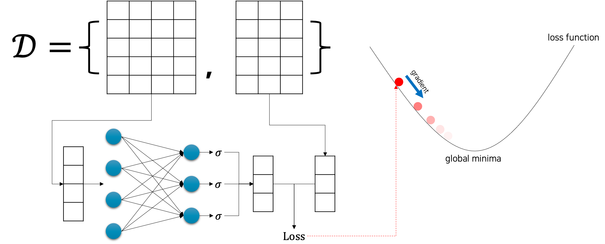
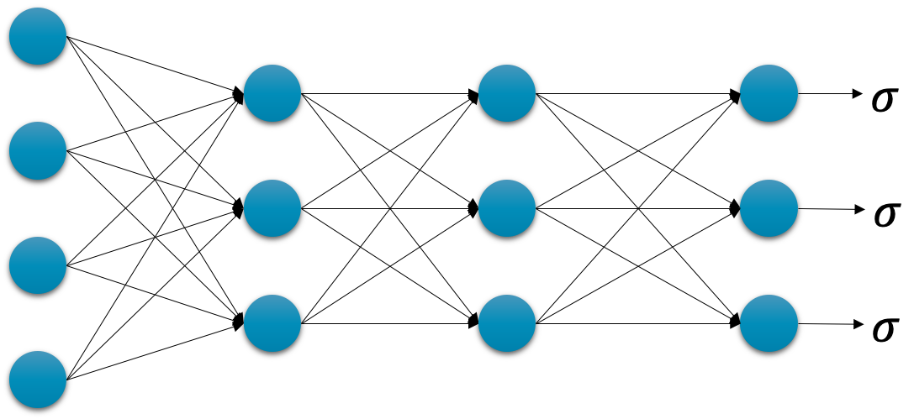
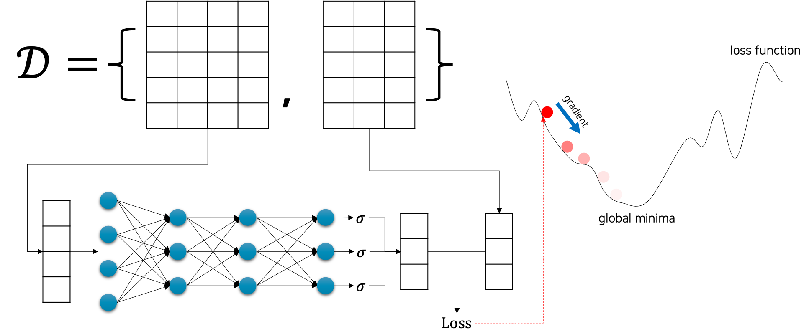

# 이진 분류

이번 챕터에서는 심층신경망을 활용한 분류classification 문제를 해결하는 방법에 대해서 이야기하고자 합니다.
앞서 우리는 로지스틱 회귀logistic regression를 통해 이진 분류binary classification 문제를 해결하는 것을 배웠는데요.
마찬가지로 본격적인 분류 문제에 앞서, 특수 케이스인 이진 분류 문제를 심층신경망으로 해결하는 방법부터 소개하도록 하겠습니다.

## 로지스틱 회귀 복습

앞서 배웠던 로지스틱 회귀를 다시 떠올려보도록 하겠습니다.
로지스틱 회귀는 이름과 달리 이진 분류 문제를 해결하기 위한 방법입니다.
따라서 우리는 입력과 출력 데이터쌍을 N개 수집하였을 때, 다음과 같이 수식으로 표현할 수 있습니다.

$$\begin{gathered}
\mathcal{D}=\{(x_i,y_i)\}_{i=1}^N, \\
\text{where }x_{1:N}\in\mathbb{R}^{N\times{n}}\text{ and }y_{1:N}\in\{0,1\}^{N\times{m}}.
\end{gathered}$$

앞선 수식과 같은 상황에서 다음 그림은 로지스틱 회귀 모델의 학습 과정을 간단하게 나타낸 것입니다.

그림에서 볼 수 있듯이, 로지스틱 회귀 모델은 사실 선형 회귀linear regression 모델에서 단순하게 마지막 활성 함수activation function를 시그모이드sigmoid로 추가해준 것이라고 볼 수 있습니다.

$$\begin{gathered}
\hat{y}_i=f_\theta(x_i)=\sigma(x\cdot{W}+b), \\
\text{where }\theta=\{W,b\}.
\end{gathered}$$

또한, 시그모이드 함수를 마지막에 활용하였기 때문에, 우리는 확률 문제로 이진 분류 문제를 접근해볼 수 있었는데요.
가능한 정답 클래스가 2개인 관계로, 입력 $x$ 가 주어졌을 때 출력 클래스에 대한 확률 값은 다음과 같은 관계를 가집니다.

$$\begin{gathered}
0\le{P(y=\text{True}|x)}\le1 \\
P(y=\text{True}|x)=1-P(y=\text{False}|x)
\end{gathered}$$

다만, 회귀와 달리 이진 분류 문제에는 BCEBinary Crossentropy 손실 함수를 사용하는 것을 잊지 마세요.

$$\begin{gathered}
\text{BCE}(y_{1:N},\hat{y}_{1:N})=-\frac{1}{N}\sum_{i=1}^N{
    y_i^\top\cdot\log{\hat{y}_i}+(1-y_i)^\top\cdot\log{(1-\hat{y}_i)}
} \\
\\
\hat{\theta}=\underset{\theta\in\Theta}{\text{argmin}}\text{ BCE}(y_{1:N},\hat{y}_{1:N})
\end{gathered}$$

또한 앞서 처음 심층신경망을 소개한 챕터에서, 우리는 회귀 문제를 심층 신경망을 통해 풀고자 하였는데요.
당시에도 선형 회귀 모델을 단순히 심층신경망 모델로 바꿔서 똑같은 학습 방법을 통해 문제를 해결할 수 있었습니다.
이 두가지 기억을 합쳐보면, 아마 이번에도 비슷한 방법을 풀릴 것 같지 않나요?

## 심층신경망을 활용한 이진 분류

이전 심층신경망을 활용한 회귀 문제를 해결하였을 때와 마찬가지로 기존 $f_\theta$ 를 심층신경망으로 교체하면 바로 해결됩니다.
다음 그림과 같이 심층신경망을 구성하고, 마지막 계층의 출력에 시그모이드 함수를 씌워줍니다.

이후에 이 모델을 이제 우리의 모델 $f_\theta$ 로 삼아서 기존 이진 분류 학습 방식에 집어 넣으면 끝 입니다.

앞서 로지스틱 회귀에서 살펴보았던 수식들은 $\theta=\{W,b\}$ 만 빼고 현재의 그림에서도 전부 그대로 유효합니다.
그럼 우리의 새로운 $\theta$ 는 다음과 같이 $\ell$ 개의 계층layer을 가진 심층신경망의 가중치 파라미터weight parameter들의 집합으로 정의되겠지요.

$$\begin{gathered}
\theta=\{W_1,b_1,\cdots,W_\ell,b_\ell\}
\end{gathered}$$

그럼 BCE 손실 함수를 미분할 때 체인 룰chain rule을 통해 오류역전파가 적용되고, 각 가중치 파라미터 별로 경사하강법gradient descent이 적용되는 것을 제외하면 모두 똑같이 동작 할 것입니다.
이것이 굳이 딥러닝을 다루는 책에서 선형 회귀와 로지스틱 회귀를 짚고 넘어갔던 이유겠지요.
