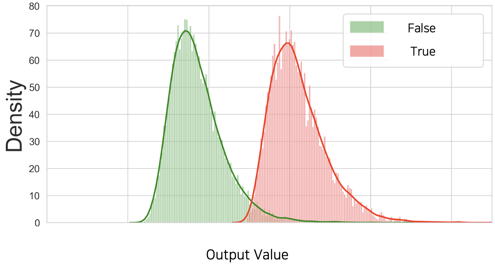

# 평가 지표

분류 문제의 경우 레이블label이 이산discrete 데이터로 표현됩니다.
따라서 손실 값 이외에도 정확도accuracy와 같은 다른 평가 지표가 존재하는데요.
이번 장에서는 이러한 다양한 평가 지표를 살펴보도록 하겠습니다.

## 임계값 설정과 그에 따른 상충 문제

이제까지 이진 분류 문제를 설명할 때, 모델의 출력 값은 시그모이드 함수를 거쳤기 때문에 0에서 1사이의 값을 가진다고 하였습니다.
따라서 우리는 0.5를 기준으로 1번 클래스(참True)에 속하는지 0번 클래스(거짓False)에 속하는지 결정한다고 설명하였습니다.
하지만 경우에 따라서 클래스 결정을 위한 임계값threshold을 0.5가 아닌 다른 값으로 설정하기도 합니다.
이 경우에는 이 임계값은 하이퍼파라미터가 되어, 사용자에의해 결정되는 값이 됩니다.

다음 그림은 이진 분류 분류기classifier가 검증 데이터셋validation dataset의 참과 거짓 샘플들에 대해서 뱉어낸 출력값들에 대한 분포를 나타낸 것입니다.[[1]](#footnote_1)
빨간색 분포가 원래 정답이 참인 샘플들의 실제 모델 출력 값들의 분포를 나타낸 것이고, 초록색 분포는 원래 정답이 거짓인 샘플들에 대한 실제 모델 출력 값들의 분포입니다.
초록색과 빨간색 분포가 대부분은 겹치지 않게 위치하고 있지만, 일부 가운데 겹치는 구간에 존재하는 것을 확인할 수 있습니다.

우리는 이러한 상황에서 풀고자 하는 문제의 성격에 따라 임계값을 설정할 수 있습니다.
만약 참True 클래스를 하나라도 놓치는 것이 심각한 문제라면, 임계값을 최대한 왼쪽으로 보내야 할 것입니다.
또는 참 클래스를 잘못 예측하는 것이 치명적인 상황이라면, 임계값을 최대한 오른쪽으로 보내야 할 것입니다.

이렇게 임계값을 설정하기 위한 정책policy은 우리가 풀고자하는 문제의 성격에 따르게 됩니다.
예를 들어 우리가 원자력 발전소의 누출 감지 여부를 이진 분류 문제로 풀고자 한다면 어떤 임계값 정책을 가져가야 할까요?
누출 클래스의 샘플을 하나라도 놓치면 안될 것입니다.
또는 우리의 전재산을 주식에 올인한다면 어떤 정책이 필요할까요?
저라면 전재산을 잃는 것은 훨씬 두렵기 때문에, 하락 이벤트 발생 여부를 최대한 놓치지 않도록 임계값을 설정할 것입니다.

재미있는 것은 같은 모델 하에서 임계값의 움직임에 따라 각 클래스에 대한 성능이 상충tradeoff된다는 것입니다.
만약 참 클래스를 놓치지 않기 위해 임계값을 왼쪽으로 움직인다면, 참 클래스는 놓치지 않는 대신 거짓 클래스를 참 클래스로 잘못 예측하는 빈도도 늘어날 것입니다.
이처럼 우리는 임계값 설정을 통해 추가적으로 분류기의 성격을 우리가 원하는대로 이끌어갈 수 있습니다.

<a name="footnote_1">[1]</a>: 임계값 하이퍼파라미터를 설정하기 위한 과정이기 때문에, 테스트 데이터셋이 아닌 검증 데이터셋의 샘플들에 대한 분포임을 꼭 명심하세요.

## 정답과 예측에 따른 명칭

이진 분류 문제는 정답이 두 가지 클래스 중 하나에 속하는 문제입니다.
따라서 실제 정답 2가지와 예측 클래스 2가지의 조합이 맞물려, 총 4가지 경우의 수를 고려할 수 있습니다.
다음 표는 이 4가지 케이스에 대한 각각의 명칭을 나타낸 것입니다.

일단 모델이 1번 클래스라고 예측한 것을 양성positive이라고 하고, 0번 클래스라고 예측한 것을 음성negative라고 부르도록 하겠습니다.
이때 양성이라고 예측한 결과 중에서, 실제 양성이 맞는 경우 TPTrue Positive라고 하고, 가짜 양성에 해당될 경우 FPFalse Positive라고 부릅니다.
마찬가지로 음성이라고 예측한 결과 중에서, 실제 음성이 맞는 경우 TNTrue Negative라고 하고, 가짜 음성일 경우 FNFalse Negative라고 부릅니다.
즉, 양성과 음성을 떠나 실제 맞춘 경우에는 앞에 참True가 붙고, 틀린 경우에는 거짓False가 붙습니다.
우리는 이 4가지 결과물들을 가지고 다양한 평가 지표를 도입할 수 있습니다.

## 정확도, 그리고 정밀도와 재현율

앞서 소개한 개념들을 활용하여 가장 널리 쓰이는 지표가 먼저 정확도accuracy 입니다.
정확도의 수식은 다음과 같이 정의됩니다.

$$\begin{gathered}
\text{Accuracy}=\frac{TP+TN}{TP+FP+FN+TN}
\end{gathered}$$

정확도는 '전체 예측 갯수'와 '전체 예측 중에서 실제로 맞춘 참True 갯수'의 비율을 나타냅니다.
정확도의 경우에는 테스트 데이터셋의 클래스가 불균형imbalance할 경우 모델의 성능을 정확하게 반영하지 못합니다.
또한 각 클래스 별 성능을 자세히 파악하고자 할 때 어려움을 겪을 수 있습니다.

이때 우리가 고려해볼 수 있는 또 다른 지표는 바로 정밀도precision와 재현율recall입니다.
정밀도와 재현율은 다음 수식과 같이 정의됩니다.

$$\begin{gathered}
\text{Precision}=\frac{TP}{TP+FP} \\
\text{Recall}=\frac{TP}{TP+FN} \\
\end{gathered}$$

정밀도는 '모델이 1번 클래스라고 예측한 갯수'와 '예측 중에서 실제로 맞춘 갯수'의 비율을 나타냅니다.
재현율은 '실제로 1번 클래스인 샘플의 갯수'와 '예측 중에서 실제로 맞춘 갯수'의 비율을 나타냅니다.[[2]](#footnote_2)
이 정밀도와 재현율이 바로 앞서 이번 장 초반에 설명한 임계값 설정에 따른 상충되던 성능의 명칭입니다.
보통 같은 모델 안에서 임계값을 바꾸게 되면 정밀도와 재현율이 서로 반대로 움직이는 것을 확인할 수 있습니다.
특정 클래스에 대해 정밀도가 올라가면 재현율이 떨어지고, 재현율이 올라가면 정밀도가 떨어지게 됩니다.

<a name="footnote_2">[2]</a>: 사실 많은 분들이 정밀도와 재현율에 대해서 많이 헷갈려하곤 합니다.
이때 recall의 실제 또 다른 의미인 '회수'를 기억하면, 헷갈리지 않을 수 있습니다.
즉, 실제 1번 클래스 중에서 모델이 얼마나 회수했는지에 대한 비율이라고 기억하면 됩니다.

## F1 점수

우리는 결국 여러 모델들 중에서 가장 좋은 모델을 고르는 일을 하고 있을 것입니다.
그럼 모델들을 점수에 따라 줄 세우는 일을 해야할 것입니다.
하지만 정밀도와 재현율처럼 여러개의 점수가 상존한다면 어떤 점수를 기준으로 줄을 세워야 할까요?
그래서 결국 1개의 종합 총점을 뽑아내야 합니다.

F1 점수도 그런 의미에서 정밀도와 재현율을 기반으로 계산할 수 있는 유용한 지표입니다.
F1 점수는 다음과 같이 정의됩니다.

$$\begin{gathered}
\text{F1-Score}=2\times\frac{\text{Recall}\times\text{Precision}}{\text{Recall}+\text{Precision}}
\end{gathered}$$

사실 F1의 경우에는 임계값threshold이 고정되어 있을 때, 정밀도와 재현율을 기반으로 계산하게 됩니다.
따라서 만약 모델이 다양한 분야에 적용 가능하고, 적용되는 어플리케이션application에 따라 정책policy과 임계값이 달라지게 된다면 F1 점수도 바뀌겠지요.
다행히 F1 점수가 항상 일정하게 유지되거나, 여러 베이스라인들중에서 순위가 유지된다면 상관 없을 것입니다.
하지만 그렇지 않다면 사용자 입장에서는 F1 점수만으로는 모델의 성능을 파악하기 어렵가도 봐야겠지요.

## AUROC

앞선 상황에서 필요한 것이 바로 AUROCArea Under

