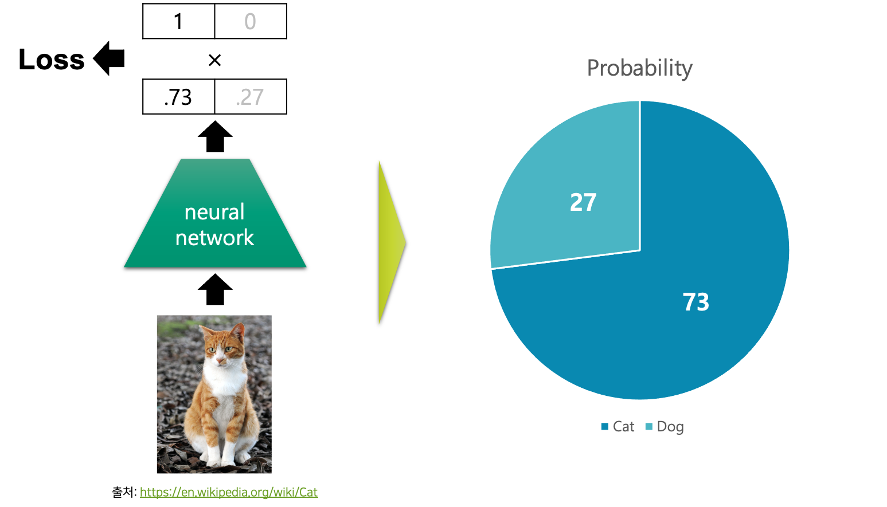
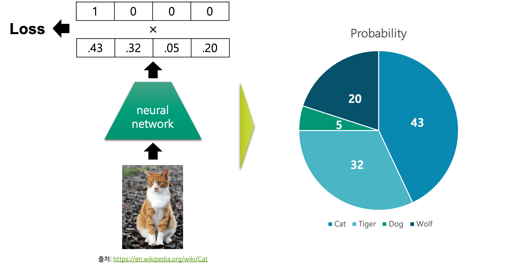
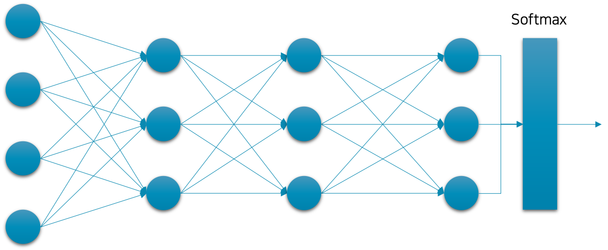

# 심층신경망을 활용한 분류

앞서 우리는 심층신경망deep neural networks, DNN을 활용하여 이진 분류를 수행하는 방법을 이야기하였습니다.
이진분류를 위해서 우리는 심층신경망의 가장 마지막 계층layer 이후에 시그모이드sigmoid 활성 함수activation function를 넣어주어 확률 값 $P(\text{y}=\text{True}|x)$ 으로 취급할 수 있었습니다.

'주어진 이미지는 고양이인가?'라는 물음에 답하기 위한 이진 분류 문제를 그림으로 표현하면 다음과 같습니다.

이진 분류의 경우에는 클래스가 단 두 개 뿐이므로, 한 클래스에 대한 확률 값을 알면 나머지 클래스의 확률 값도 자연스럽게 알 수 있습니다.
따라서 비록 시그모이드의 출력 값은 참True 클래스에 대한 확률 값이지만, 거짓False 클래스에 대한 확률 값이 존재하는 것과 마찬가지입니다.
그러므로 그림에서 옅은 확률 값으로 표현되었는데요.
결과적으로 우리는 심층신경망이 입력 $x$ 가 각 클래스에 속할 확률 값을 출력한다고 생각할 수 있습니다.

이것을 우리는 다중 클래스 분류multi-class classification 문제로 확장할 수 있습니다.[[1]](#footnote_1)
이진 분류와 마찬가지로 어떤 구조를 가진 심층신경망을 통해, 입력 $x$ 에 대한 각 클래스별 조건부 확률 값을 출력하면 좋겠지요.
이러한 우리의 바램을 '주어진 이미지는 어떤 클래스인가?'라는 물음에 답하기 위한 다중 클래스 분류 문제에 대한 그림으로 나타내면 다음과 같습니다.

앞서 이진 분류와 달리 정답 레이블은 다양한 클래스가 될 수 있습니다.
따라서 모델의 출력 벡터는 각 후보 클래스에 대한 확률 값을 요소element로 가지고 있도록 하면 되겠군요.

그림의 확률 값 위에 0과 1로만 채워져있는 정답 벡터가 있는 것을 주목해주세요.
쉽게 생각하면 실제로 주어진 그림이 고양이 그림이므로, 고양이의 확률 값이 100%로 되어 있는 것이라고 생각해볼 수 있습니다.
이 정답 벡터는 원핫one-hot 벡터로써, 이와 관련된 내용은 추후에 다른 챕터에서 다루도록 하겠습니다.

각 클래스별 확률 값이 담긴 모델의 출력 벡터 $\hat{y}$ 와 실제 정답 레이블 벡터 $y$ 를 비교하면 손실loss 값을 계산할 수 있을 것입니다.
그럼 우리는 이 손실 값을 최소로 만드는 모델의 파라미터를 찾으면 되겠지요.

<a name="footnote_1">[1]</a>: 이진 분류가 분류 문제의 특수 케이스입니다.

## 분류 문제를 위한 심층신경망의 구조와 손실 함수

앞서 언급한 것처럼 모델이 입력 $x$ 에 대한 조건부 확률 값을 갖도록 하기 위해 심층신경망을 구성하는 방법을 살펴보도록 하겠습니다.
이진 분류를 위한 심층신경망에는 시그모이드 함수를 활용하였던과 비슷하게, 일반 분류 문제를 위한 심층신경망에서는 소프트맥스softmax 함수를 활용합니다.

이진 분류의 경우 출력 벡터 $\hat{y}$ 의 차원만큼 별도의 이진 분류 문제가 있었던 것에 비해, 일반 다중 클래스 분류의 경우에는 한 모델이 하나의 분류 문제만 풀 수 있습니다.[[2]](#footnote_2)
좀 더 상세히 이야기하면, 시그모이드 함수의 경우에는 벡터를 입력으로 받더라도 각 차원이 독립적으로 계산되어 출력 벡터가 반환되지만, 소프트맥스 함수의 경우에는 벡터를 입력으로 받으면 각 차원이 상호 작용하여 출력 벡터가 계산됩니다.
수식은 다음 장에서 좀 더 자세히 살펴보도록 하겠습니다.

이렇게 구성된 심층신경망을 분류 문제를 위한 교차 엔트로피cross entropy, CE 손실 함수를 활용하여 $f^*$ 를 근사할 수 있도록 합니다.
CE 손실 함수의 경우에도, BCE 손실 함수와 마찬가지로 확률 및 정보 이론과 밀접한 연관이 있으며, 이와 관련된 내용은 추후에 다시 다루도록 하겠습니다.

<a name="footnote_2">[2]</a>: 신경망의 마지막 계층의 값을 여러 소프트맥스 함수에 통과시키는 방법도 있지만, 일단 논외로 하겠습니다.

## 회귀 vs 분류

여러분이 접하는 대부분의 머신러닝 문제들은 회귀regression 또는 분류classification 문제에 속할 것입니다.

|범주|타겟 값|손실 함수|마지막 계층의 활성 함수|
|-|-|-|-|
|회귀regression|연속continuous형 실수 벡터|MSE 손실 함수|없음|
|이진 분류binary classification|0 또는 1|BCE 손실 함수|시그모이드 함수|
|분류classification|카테고리 또는 이산discrete 값|CE 손실 함수|소프트맥트 함수|
