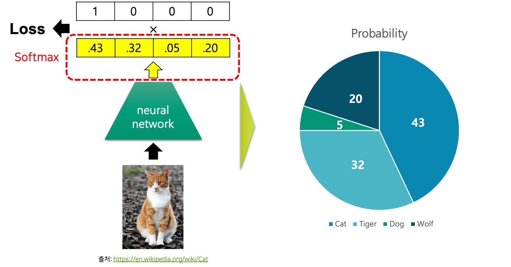

# 소프트맥스 함수와 교차 엔트로피 손실 함수

이번 장에서는 분류 문제를 위한 소프트맥스softmax 함수와 교차 엔트로피cross entropy 손실 함수를 좀 더 상세히 살펴보도록 하겠습니다.

## 소프트맥스 함수

소프트맥스 함수는 임의의 벡터를 입력을 받아 이산 확률 분포discrete probability distribution의 형태로 출력을 반환합니다.
따라서 출력 벡터의 요소들의 합은 1이 됩니다.

그림과 같이 실제 정답 벡터를 맞추기 위해서, 가장 첫 번째 클래스 요소의 확률 값은 1이 되어야 할 것입니다.
그럼 자연스럽게 다른 요소들의 값은 0에 가까워질 것입니다.

소프트맥스는 그 이름에서 알 수 있듯이, 맥스max 함수의 소프트soft 버전 입니다.[[1]](#footnote_1)
예를 들어 다음과 같이 임의의 벡터가 주어져 있다고 해보겠습니다.

$$\begin{gathered}
v=\begin{bmatrix}
-7 \\
5 \\
10
\end{bmatrix}
\end{gathered}$$

그럼 벡터 $v$ 에서 가장 큰 값의 인덱스index를 찾기 위한 맥스(또는 argmax) 함수를 활용하면 다음과 같은 결과가 나올것이라고 가정해보죠.

$$\begin{gathered}
\text{max}(v)=\begin{bmatrix}
0 \\
0 \\
1
\end{bmatrix}
\end{gathered}$$

살펴보면 가장 큰 값의 인덱스가 1이 되고, 나머지는 0이 되도록 동작하고 있는 것을 볼 수 있습니다.
여기에 소프트맥스는 이 맥스 함수의 소프트soft 버전이기 때문에, 모든 벡터 요소의 합이 1이 되도록 0에서 1사이의 실수 값을 반환합니다.

### 소프트맥스 함수의 수식

그럼 소프트맥스의 수식을 살펴보도록 하겠습니다.

$$\begin{gathered}
\text{softmax}_i(x)=\frac{e^{x_i}}{\sum_{j=1}^n{e^{x_j}}} \\
\text{where }x\in\mathbb{R}^n.
\end{gathered}$$

수식을 살펴보면 $i$ 번째 차원의 값을 결정하기 위해, $j=1$ 부터 $n$ 까지 다른 차원이 관여하는 것을 볼 수 있습니다.
시그모이드sigmoid 함수의 경우에는 각 차원이 다른 차원과 상호작용 없이 독립적으로 값이 결정 됩니다.
하지만 앞서 언급한 것처럼 소프트맥스 함수의 경우에는 벡터 내의 다른 차원과 상호작용하여 해당 차원의 값이 결정 됩니다.

그러므로 전체 소프트맥스 함수는 다음 수식과 같이 표현해 볼 수 있을 것입니다.

$$\begin{gathered}
\text{softmax}(\begin{bmatrix}
    x_1 \\
    \vdots \\
    x_n
\end{bmatrix})=\begin{bmatrix}
    \text{softmax}_1(x) \\
    \vdots \\
    \text{softmax}_n(x)
\end{bmatrix},
\text{ where }x=\begin{bmatrix}
    x_1 \\
    \vdots \\
    x_n
\end{bmatrix}.
\end{gathered}$$

소프트맥스 함수의 결과는 각 차원에 대한 소프트맥스 결과를 모아서 벡터로 만든 것이라고 볼 수 있을 것입니다.

그럼 우리는 이 소프트맥스 함수에 $\ell$ 개의 계층을 가진 심층신경망deep neural networks, DNN의 마지막 계층 결과 값을 집어 넣습니다.
그 이후에 소프트맥스 함수 결과 값을 다음 수식과 같이 모델의 출력 벡터 $\hat{y}$ 로 삼을 것입니다.
그리고 이 출력 벡터는 입력 $x$ 가 주어졌을 때, 입력 샘플이 어떤 클래스에 속할지에 대한 조건부 확률 분포로 볼 수도 있습니다.
이 내용을 수식으로 나타내면 다음과 같이 표현될 수 있습니다.

$$\begin{gathered}
P_\theta(\text{y}|x)\approx\hat{y}=\text{softmax}(h_\ell), \\
\text{where }h_i=f_i(h_{i-1})\text{ and }\ell\text{ is a number of layers.}
\end{gathered}$$

이처럼 소프트맥스 함수의 결과 값은 확률 분포와 비슷한 형태를 가지고 있고, 따라서 우리는 그 결과 값을 확률 분포로 생각해서 활용하게 됩니다.
그럼 우리는 이 확률 분포 벡터를 정답 원핫one-hot 벡터와 똑같아지도록 손실 함수를 통해 경사하강법gradient descent을 수행하면 될 것입니다.

<a name="footnote_1">[1]</a>: 보통 하드hard라 불리우는 경우 이산discrete적으로 값이 변화하며, 소프트한 경우에는 연속continuous하게 값이 바뀝니다.

## 교차 엔트로피 손실 함수

앞서 이진 분류binary classification에 대해서 배웠을 때, 회귀에서 사용하던 MSE 손실 함수를 사용하지 않고, BCEbinary cross entropy 손실 함수를 사용한다고 이야기했습니다.
다중 클래스 분류multi class classification 문제는 이진 분류 문제의 일반화 버전이기 때문에, 마찬가지로 BCE 손실 함수의 일반 버전인 교차 엔트로피cross entropy, CE 손실 함수를 사용합니다.
다음 수식은 N개 샘플에 대한 손실 값을 구하기 위한 CE 손실 함수를 나타낸 것입니다.

$$\begin{gathered}
\begin{aligned}
\text{CE}(y_{1:N},\hat{y}_{1:N})&=-\frac{1}{N}\sum_{i=1}^N{
    y_i^\top\cdot\log{\hat{y}_i}
} \\
&=-\frac{1}{N}\sum_{i=1}^N{
    \sum_{j=1}^m{
        y_{i,j}\times\log{\hat{y}_{i,j}}
    }
},
\end{aligned} \\
\text{where }y_{1:N}\in\{0,1\}^{N\times{m}}\text{ and }\hat{y}_{1:N}\in[0,1]^{N\times{m}}.
\end{gathered}$$

이전 BCE 손실 함수와 비교해서 어떤 부분이 달라졌는지 느껴지시나요?
BCE 손실 함수는 전체 2개의 클래스만 존재하기 때문에 정답이 1번 클래스일 때의 텀term과 정답이 0번 클래스일 때의 텀을 각각 구해서 더하도록 동작합니다.
이에 대응하여 CE 손실 함수는 전체 m개의 클래스에 대해서, 정답이 $m-1$ 번 클래스일 때의 텀들을 더하도록 되어 있는 것을 볼 수 있습니다.

이 수식에서 $\hat{y}_i$ 는 소프트맥스 함수의 결과 값입니다.
앞서 이 벡터가 각 클래스에 대한 확률 값을 가지고 있고, 따라서 우리는 이 벡터를 확률 분포로 취급할 수 있다고 했습니다.
이것을 수식으로 나타내면 다음과 같습니다.

$$\begin{gathered}
\begin{aligned}
\text{CE}(y_{1:N},\hat{y}_{1:N})&=-\frac{1}{N}\sum_{i=1}^N{
    y_i^\top\cdot\log{\hat{y}_i}
} \\
&=-\frac{1}{N}\sum_{i=1}^N{
    \sum_{j=1}^m{
        y_{i,j}\times\log{\hat{y}_{i,j}}
    }
} \\
&=-\frac{1}{N}\sum_{i=1}^N{
    \log{P_\theta(y_i|x_i)}
},
\end{aligned} \\
\text{where }y_{1:N}\in\{0,1\}^{N\times{m}}\text{ and }\hat{y}_{1:N}\in[0,1]^{N\times{m}}.
\end{gathered}$$

정답 벡터 $y_i$ 는 정답 인덱스가 1이고 나머지는 0으로 채워진 원핫one-hot 벡터였음을 기억해보죠.
따라서 모델 출력 벡터 $\hat{y}_i$ 에 로그log를 취하고 정답 벡터와 내적을 수행하면 정답 클래스의 확률 값이 나오게 됩니다.

예를 들어 다음과 같이 정답 벡터와 모델 출력 벡터가 구성되어 있다고 생각해보죠.

$$\begin{gathered}
y_i=\begin{bmatrix}
    0 \\
    0 \\
    1 \\
    0
\end{bmatrix}
\text{ and }
P_\theta(\text{y}|x_i)=\hat{y}_i=\begin{bmatrix}
    .2 \\
    .1 \\
    .65 \\
    .05
\end{bmatrix}.
\end{gathered}$$

그럼 이 두 벡터를 내적하면 다음과 같은 결과를 얻을테지요.

$$\begin{aligned}
y_i^\intercal\cdot\log{\hat{y}_i}&=[0,0,1,0]\times\log{\begin{bmatrix}
    .2 \\
    .1 \\
    .65 \\
    .05
\end{bmatrix}} \\
&=0\times\log{0.2}+0\times\log{0.1}+1\times\log{0.65}+0\times\log{0.05} \\
&=\log{0.65} \\
&=\log{P_\theta(\text{y}=2|x_i)}
\end{aligned}$$

즉, 교차 엔트로피 내부 수식은 입력 $x_i$ 가 주어졌을 때, 정답 클래스에 대한 로그 조건부 확률 값을 구하는 과정이 됩니다.
이 확률 값은 1이 되면 잘 동작하는 것일테지요.
따라서 우리는 로그 확률 값이 최대화 되도록 파라미터를 움직여야 하는 것이고, 가장 바깥쪽에 마이너스가 붙어 있으므로 전체 손실 함수 입장에서는 최소화 문제로 바뀌게 됩니다.

## 로그 소프트맥스 함수와 음의 로그 가능도 손실 함수

사실 앞서 살펴본 수식은 다른 이름의 수식들로 대체되어 표현될 수 있습니다.
파이토치에서는 음의 가능도negative log-likelihood, NLL 손실 함수를 제공합니다.
또한 소프트맥스 함수와 같이 로그소프트맥스log-softmax 함수도 제공하는데요.
소프트맥스에 그냥 로그를 취한 형태인, 로그소프트맥스 함수의 수식은 다음과 같습니다.

$$\begin{gathered}
\text{log-softmax}_i(x)=\log{\frac{e^{x_i}}{\sum_{j=1}^n{e^{x_j}}}}
\end{gathered}$$

그럼 로그소프트맥스 함수의 결과 값을 모델 출력 벡터 $\hat{y}_i$ 로 삼을 경우, 우리는 각 클래스별 로그 확률log probability 값을 얻을 수 있는 것인데요.
그럼 NLL 손실 함수의 경우에는 애초에 로그소프트맥스의 결과 값을 활용하여 다음과 같이 표현됩니다.

$$\begin{gathered}
\begin{aligned}
\text{NLL}(y_{1:N},\hat{y}_{1:N})&=-\frac{1}{N}\sum_{i=1}^N{
    y_i^\top\cdot\hat{y}_i
} \\
&=-\frac{1}{N}\sum_{i=1}^N{
    \log{P_\theta(y_i|x_i)}
}, \\
\end{aligned} \\
\text{where }\hat{y}_i=\log{P_\theta(y_i|x_i)}\text{ from log-softmax}.
\end{gathered}$$

수식 첫 줄에 $\log{\hat{y}_i}$ 가 아닌 $\hat{y}_i$ 임을 주의하세요.

즉, 소프트맥스 함수에 CE 손실 함수를 사용하는 것은, 로그소프트맥스 함수에 NLL 손실 함수를 사용하는 것과 같은 결과를 얻을 수 있습니다.
지수함수를 사용하는 소프트맥스의 특성상, 로그소프트맥스가 좀 더 빠른 연산 속도를 제공[[2]](#footnote_2)할 수 있기 때문에 후자가 좀 더 선호되는 편입니다.
앞으로 이 책에서도 다중 클래스 분류 문제를 풀 때에는 로그소프트맥스에 NLL 손실 함수를 주로 사용하도록 하겠습니다.

<a name="footnote_2">[2]</a>: 그런데 애초에 둘 다 연산 속도가 워낙 빨라서 큰 차이는 없습니다.
