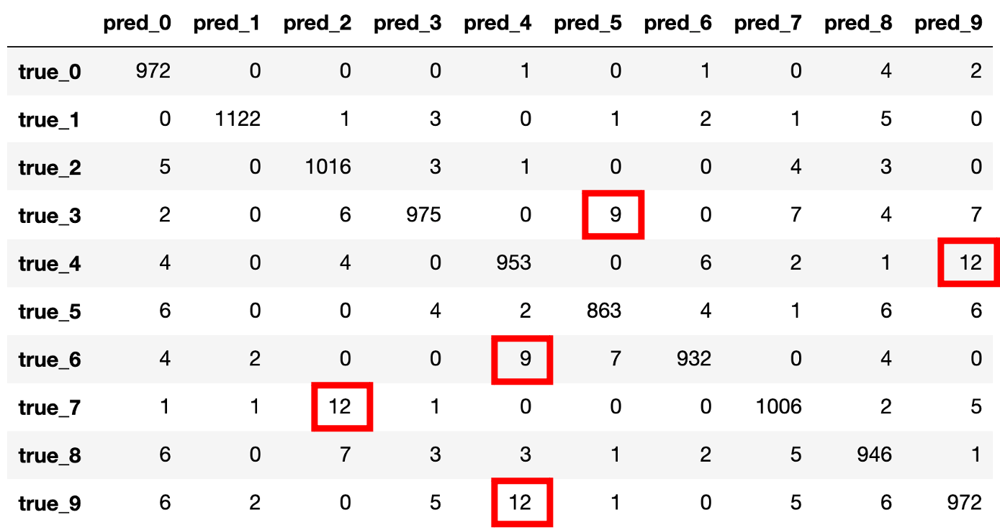

# 다중 클래스 분류 결과 분석하기

실제 서비스나 배포를 염두에 두고 있는 머신러닝 프로젝트를 수행중이라면, 모델을 배포하기에 앞서 면밀하게 모델의 성능을 검토하는 작업을 수행해야 합니다.
이번 장에는 다중 클래스 분류multi class classification의 결과 분석을 위한 방법인 혼동 행렬confusion matrix에 대해서 소개하도록 하겠습니다.

## 혼동 행렬

보통 분류 문제는 정확도accuracy를 통해서 모델의 성능을 평가할 수 있습니다.
하지만 서비스를 위해서는 단순히 정확도만 살펴보기보단, 어떤 케이스에서 모델이 약하고 쉽게 틀릴 수 있는지 파악할 수 있어야 합니다.
또한 모델의 단점에 대한 면밀한 분석이 있어야지만, 이후 모델의 개선에 있어서도 올바른 방향으로 효율적인 개선을 수행할 수 있을 것입니다.
이런 의미에서 혼동 행렬confusion matrix은 매우 유용하게 활용될 수 있습니다.

다음 그림은 MNIST 분류에 대해서 테스트셋 예측 결과에 대해 혼동 행렬을 구성한 표입니다.

행렬 표의 대각 성분은 정답을 맞춘 갯수를 의미합니다.
또한 표에서 'true_3' 행의 'pred_2' 열에 위치한 값이 6으로 되어 있는데요.
이것은 실제 3이 정답인데, 2로 예측해서 틀린 샘플의 숫자가 6개라는 의미입니다.

사실 이미 테스트셋 기준 정확도 98%가 넘는 상황이므로, 대부분의 샘플들이 올바르게 예측되고 있는 것을 볼 수 있습니다.
다만 그럼에도 불구하고 일부 틀리는 샘플들은 존재하고 있는데요.
특히, 그림에서 빨간색 네모로 강조된 영역들은 모델이 잘 예측하지 못하는 케이스를 가리킵니다.

예를 들어 'true_4' 행의 'pred_9' 열의 경우에는, 정답이 4인데 예측을 9라고 해서 틀린 경우가 12개였음을 의미하는데요.
실제로 4와 9는 비슷한 모양을 가지고 있으므로 헷갈릴 여지가 있어 보입니다.
따라서 만약 배포를 염두에 두고 모델 개선을 하고자 한다면, 4와 9에 대한 데이터를 더 모으거나, 4와 9를 구별하기 위한 장치를 고안해야겠지요.
이후에 그렇게 모든 영역에서 쏠림 없이 용납되는 수준의 오류만 보인다면, 배포 준비가 되었다고 판단할 수 있을 것입니다.
