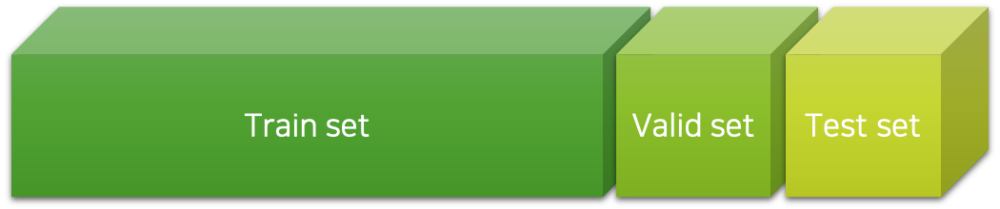

# 정규화란

이번 챕터에서는 오버피팅을 최소화하고 일반화 성능을 올리기 위한 정규화regularization에 대해 이야기하겠습니다.
사실 저는 정규화라는 한글 표현을 좋아하지 않습니다.
경우에 따라 normalization도 정규화로 번역되기 때문입니다.
그래도 일단 이 챕터에서 정규화라 함은 regularization을 가리키는 것으로 하겠습니다.

## 오버피팅 복습

우리는 앞선 챕터에서 오버피팅overfitting이란 무엇인가에 대해서 이야기하였습니다.
오버피팅이란 '학습 오차training error가 일반화 오차generalization error에 비해서 현격하게 낮아지는 현상'을 이야기한다고 하였습니다.
이는 모델이 학습 데이터의 불필요한 편향bias이나 노이즈noise까지 학습함으로써, 모델의 일반화 성능이 떨어지는 상황을 이야기합니다.

따라서 우리는 검증 데이터셋validatation datset과 테스트 데이터셋test dataset을 도입하여 모델의 최적화 과정에서 발생할 수 있는 오버피팅 현상을 방지할 수 있다고 하였습니다.
결과적으로 다음의 표와 같이 3가지 데이터셋에 대해서 가중치 파라미터weight parameter와 하이퍼파라미터hyper-parameter, 그리고 알고리즘의 결정과 검증을 수행할 수 있습니다.

|범주|학습 데이터셋|검증 데이터셋|테스트 데이터셋|
|:-:|:-:|:-:|:-:|
|가중치 파라미터|결정|**검증**|**검증**|
|하이퍼파라미터| |결정|**검증**|
|알고리즘| | |결정|

## 정규화란?

앞서와 같은 오버피팅에 대한 관점에서, 정규화regularization란 오버피팅을 늦추고 모델이 학습데이터로부터 적절한 특징feature들을 학습하여 일반화 오차generalization error를 낮춰줄 수 있는 기법을 이야기합니다.
일반화 오차를 낮추는 정규화 과정에서 종종 학습 오차training error가 높아질 수 있습니다.
이것은 다양한 정규화 방식들이 보통 학습 오차를 최소화 하는 것을 방해하는 형태로 적용되기 때문인데요.
이와 같은 과정을 통해 얻어진 '잘 일반화된' 모델은 노이즈에 더 강인한robust 모델이 됩니다.
