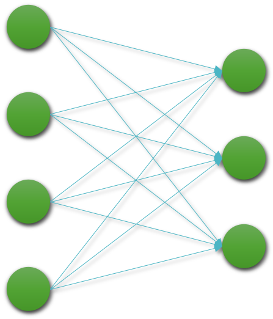
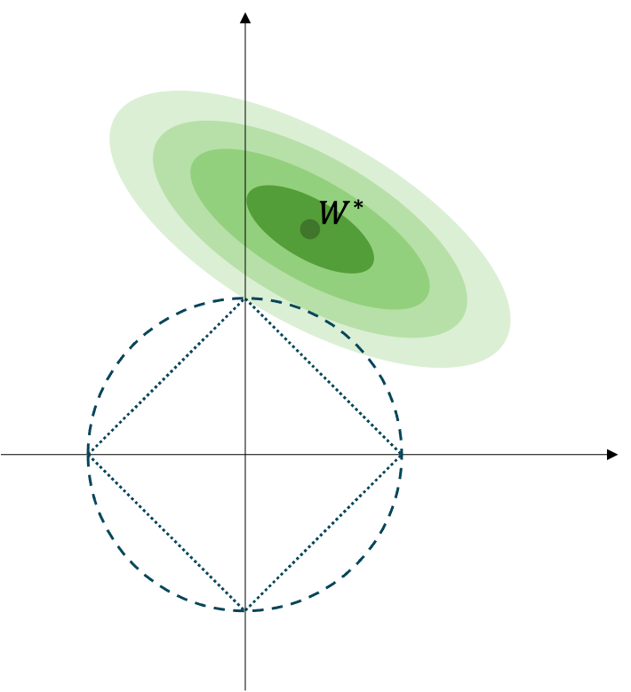
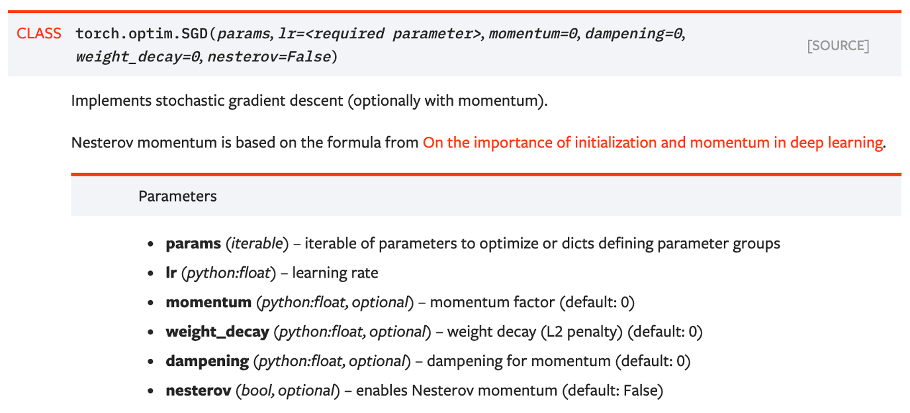

# 가중치 감쇠

이번 장에서는 가중치 파라미터weight parameter가 학습되는 것을 방해하여 오버피팅overfitting을 방지하는 정규화reguarlization 기법인 가중치 감쇠weight decay에 대해서 이야기하고자 합니다.

## 가중치 감쇠의 수식 표현

가중치 감쇠 기법은 기본적으로 손실 함수를 수정하는 방법을 통해 적용됩니다.
가중치 파라미터의 L2 노름norm을 구하고, 기존의 손실 함수와 함께 이 노름을 같이 최소화하도록 함으로써, 모델의 학습을 방해하는 형태로 동작합니다.

다음은 기존의 손실 함수에서 가중치 감쇠를 위한 텀term이 추가된 새로운 손실 함수의 수식입니다.

$$\begin{gathered}
\begin{aligned}
\mathcal{\tilde{L}}(\theta)&=\mathcal{L}(\theta)+\alpha\|W\|_2^2 \\
&=\mathcal{L}(\theta)+\alpha{W^\top\cdot{W}},
\end{aligned} \\
\text{where }\theta=\{W,b\}.
\end{gathered}$$

수식에서 볼 수 있듯이, 가중치 파라미터의 L2 노름과 기존의 손실 값을 동시에 최소화하도록 손실 함수가 수정되었습니다.
또한 $\alpha$ 라는 하이퍼파라미터가 추가되어, L2 노름과 기존의 손실 값 사이의 균형을 맞춰주도록 합니다.
주의할 점은 가중치 파라미터 중에서 편향bias $b$ 는 가중치 감쇠에서 제외된다는 점입니다.
이 손실 함수 때문에, 가중치 파라미터가 학습 과정에서 점점 원점으로부터 멀어지는 것을 방지하는 효과가 발생합니다.

## 왜?

가중치 파라미터에서 $W$ 의 각 요소들은 선형 계층linear layer에서 입출력 노드 사이의 관계를 나타냅니다.

요소 값의 크기가 클수록 강한 관계임을 의미한다고 볼 수 있는데요.
$W$ 에 L2 노름norm을 취하여 최소화함으로써, 노드 사이의 관계의 강도를 제한하여 각 계층의 출력 노드가 다수의 입력 노드로부터 많이 학습하는 것을 제한하게 됩니다.

## L1 노름의 사용

우리는 L2 노름norm 대신, L1 노름을 사용하여 가중치 감쇠를 실행할 수도 있습니다.
다음은 가중치 감쇠 기법에 L1 노름을 활용한 수식 표현입니다.

$$\begin{gathered}
\tilde{\mathcal{L}}(\theta)=\mathcal{L}(\theta)+\alpha\|W\|_1, \\
\text{where }\theta=\{W,b\}.
\end{gathered}$$

L1 노름도 마찬가지로 가중치 파라미터의 크기를 나타내지만 특성은 조금 다른데요.
다음 그림이 이를 잘 표현해줍니다.

$W^*$ 은 정규화가 적용되지 않은 기존의 손실 함수 $\mathcal{L}(\theta)$ 로 최적화를 수행하였을 때, 얻을 수 있는 가중치 파라미터라고 생각해보죠.[[1]](#footnote_1)
또한 $W^*$ 주변의 점점 옅어지는 타원의 색깔은 $W^*$ 로부터 멀어질수록 높아지는 손실 값을 의미합니다.

학습이 수행됨에 따라 가중치 파라미터 초기값 $W_0$ 은 $W^*$ 에 가까이 다가갈 것입니다.
하지만 L1 또는 L2 노름이 적용된 가중치 감쇠 정규화 기법이 적용되면, 예전마냥 $W^*$ 에 가까이 다가가지 못할텐데요.

L2의 경우에는 점선으로 구성된 원 위에 점들은 원점으로부터 같은 거리로 인식됩니다.
마찬가지로 L1의 경우에는 점선으로 구성된 사각형 위의 점들이 원점으로부터 같은 거리로 인식됩니다.

따라서 L1 노름을 활용하여 가중치 감쇠를 적용할 경우, 가중치 파라미터의 값들이 희소sparse하도록 제한됩니다.[[2]](#footnote_2)

<a name="footnote_1">[1]</a>: 여기서는 $W^*$ 가 최적의 정답 파라미터라는 이야기는 아닙니다.

<a name="footnote_2">[2]</a>: 보통 벡터나 행렬이 희소할수록 많은 요소 값들이 0이 됩니다.

## 손실 함수의 최소화를 방해하는 성질

가중치 감쇠를 적용하는 경우는 매우 흔하지는 않지만, 종종 최신 논문들에도 쓰이곤 합니다.
사실 개인적으로 저자는 가중치 감쇠를 그닥 선호하지 않기도 한데요.
이후 소개할 다른 정규화 기법에 비하면 너무 학습을 방해하는 성격이 강해서 좋은 성과를 얻지 못한 경험이 많기 때문입니다.

이처럼 가중치 감쇠의 경우, 손실 함수에서 최소화를 방해하는 수식이 추가됨으로써, 정규화를 달성하고자 하는데요.
가중치 감쇠의 수식을 다시 살펴보면, 원래의 손실 함수와 가중치 파라미터의 L2 노름을 동시에 최소화 하도록 되어 있습니다.

$$\begin{gathered}
\mathcal{\tilde{L}}(\theta)=\underbrace{\mathcal{L}(\theta)}_{(1)}+\underbrace{\alpha\|W\|_2^2}_{(2)}
\end{gathered}$$

우리는 보통 학습을 진행하게되면 (1)번 텀term을 최소화하도록 할 것입니다.
그런데 앞서 이야기한대로, 이러한 학습 과정은 (2)번 텀을 커지게 만듭니다.
즉 (2)번 텀을 최소화 한다는 것은, (1)번 텀이 최소화 되는 것을 방해하는 것이 됩니다.

이 과정에서 (2)번 텀의 스케일을 설정하는 하이퍼파라미터 $\alpha$ 의 역할도 굉장히 중요한데요.
스케일 설정 값이 0에 가까울수록 (1)번 텀을 최소화 하는데 방해가 적어지게 될 것이고, 커질수록 가중치 파라미터가 $W^*$ 에 가까이 다가가는데 어려움이 커질 것입니다.
따라서 해당 하이퍼파라미터에 따라서 모델의 성능이 결정되게 됩니다.

이처럼 가중치 감쇠와 같이 다양한 정규화 기법들이 보통 학습을 방해하는 형태를 취함으로써 오버피팅을 최소화하는 목적을 달성하고자 합니다.

## 가중치 감쇠의 구현

가중치 감쇠의 경우 신경망을 구성할 때 계층을 추가하는 형태가 아닌, 파이토치 옵티마이저optimizer를 생성할 때 설정을 통해 구현할 수 있습니다.

그림의 weight_decay 파라미터가 앞서 수식에서의 하이퍼파라미터 $\alpha$ 를 의미합니다.
기본 설정 값은 0으로 되어 있으므로 가중치 감쇠가 적용되지 않도록 설정되어 있음을 볼 수 있습니다.
