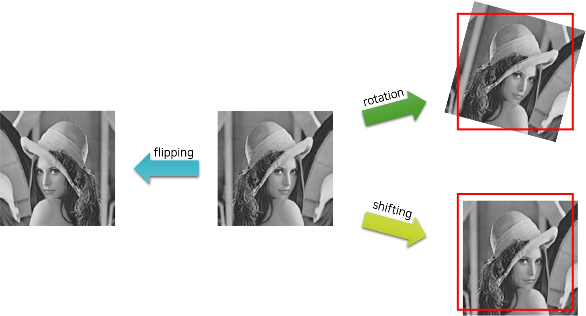
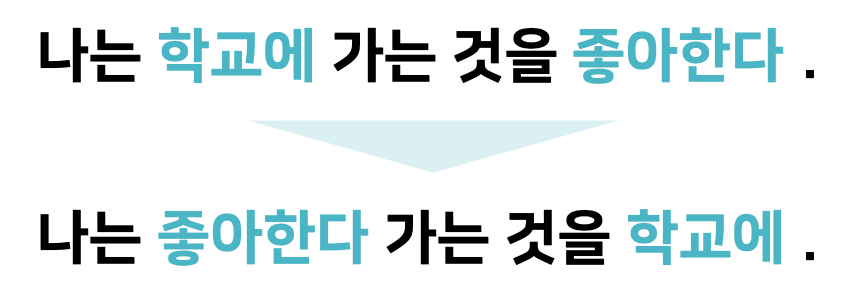

# 데이터 증강

이번에는 데이터를 통해 오버피팅을 피하고 모델의 일반화 성능을 개선하는 방법을 알아보겠습니다.
데이터 증강data augmentation 기법은 데이터의 핵심 특징feature은 간직한 채, 노이즈noise를 더하여 데이터를 확장하는 방법을 이릅니다.
보통은 데이터에 대한 핵심 특징에 대한 가정을 가지고 휴리스틱한 방법을 사용하여 데이터를 증강하는데요.
이를 통해 더욱 노이즈에 강인한robust 모델을 얻을 수 있습니다.

이번 장에서는 이미지와 텍스트에 대한 증강 기법을 주로 살펴보도록 하겠습니다.

## 이미지 증강 기법

### 소금과 후추 노이즈 추가

가장 간단하게 이미지를 증강할 수 있는 방법으로, 소금salt과 같이 하얀색 점들을 임의로 흩뿌리거나, 후추pepper와 같이 검정색 점들을 임의로 흩뿌리는 기법입니다.

이와 같이 일부 노이즈가 추가되더라도 여전히 사람 눈에는 같은 이미지인것처럼, 컴퓨터도 마찬가지로 같은 이미지라고 판단할 수 있어야 하기 때문에, 굉장히 간단하면서도 효과적인 노이즈 추가noise injection 기법 입니다. 이러한 노이즈 추가 과정에서 불필요한 특징들이 노이즈에 의해 제거되거나 변형될 수 있으며, 이로인해 모델의 일반화 성능이 높아질 수 있습니다.

### 회전과 이동, 뒤집기

예제 그림과 같이 사람의 얼굴 같은 경우에는 눈코입의 위치라던가 다양한 가정을 도입할 수 있습니다.
예를 들어 눈은 2개이고 코는 눈 사이에 위치하며, 그 아래에 입이 위치한다던지와 같은 내용들이죠.
우리는 이런 가정을 통해 형태의 이미지 변형을 수행함으로써, 데이터의 증강을 수행할 수 있습니다.

뒤집기flipping의 경우에는 사람의 얼굴은 좌우 대칭이므로, 좌우 수평 뒤집기 기법은 얼굴 데이터 증강에 유용하게 활용될 수 있습니다.
예를 들어 MNIST와 같이 글씨를 인식하고자 할 때에는 일부 뒤집기가 가능한 경우(e.g. 0, 8)도 있겠지만 대부분은 뒤집기를 할 경우 존재하지 않는 글씨가 될 수 있습니다.
이와 같이 데이터를 면밀히 분석한 후, 데이터에서 성립하는 가정을 통해 데이터 증강을 수행할 수 있을 것입니다.

마찬가지로 회전rotation과 이동shifting의 경우에도 데이터의 주요 특징들을 손상시키지 않는 범위내에서 수행할 수 있습니다.
당장 이러한 기법들을 적용하면 최소 수 배에서 최대 수십 배에 이르는 데이터의 확장을 기대할 수 있을 것입니다.

### 생성 모델을 활용한 데이터 증강

추가적으로 데이터에 의한 것은 아니지만, 비슷한 컨셉으로 생성 모델generative model을 활용한 데이터 증강 기법이 있습니다.
생성 모델은 데이터셋의 분포 자체를 학습하여, 모델로부터 데이터셋의 샘플과 유사한 샘플들을 생성해낼 수 있는 모델을 이야기합니다.
생성적 적대 신경망generative adversarial networks, GAN이나 오토인코더autoencoder가 대표적인 사례인데요.
자연어 생성 분야에서의 언어 모델language model이나 시퀀스-투-시퀀스sequence to sequence도 이에 속합니다.

따라서 이러한 생성 모델을 활용하여 생성한 이미지를 데이터 증강에 활용하면 좀 더 다양한 데이터를 학습에 활용할 수 있을 것입니다.
다만, 이 경우에는 생성 모델에 데이터셋이 편향될 수 있다는 점에서 너무 많은 생성된 샘플들을 데이터셋에 포함시키는 것은 위험할 수 있습니다.

## 텍스트 증강 기법

텍스트의 경우에도 노이즈를 추가하는 방식을 통해 데이터를 확장 및 증강할 수 있습니다.
다만 자연어 문장의 경우 생각보다 어순 변화나 단어의 변화에 민감하기 때문에 생각처럼 잘 동작하지 않을 수 있습니다.
또한 규칙에 의해서 문장을 변형할 경우, 규칙 자체를 신경망이 학습할 수 있기 때문에 위험할 수 있습니다.
따라서 이미지만큼 쉽게 데이터를 증강할 수는 없지만, 종종 다음과 같은 방법을 통해 데이터를 증강합니다.

### 단어의 생략

다음 그림과 같이 임의로 일정 확률로 단어를 생략하는 것입니다.
만약 생략 확률이 너무 높다면 문장의 의미가 왜곡될 가능성이 높아지고, 생략 확률이 낮다면 단어 증강의 효과가 줄어들겠지요.

### 단어 교환

다음 그림과 같이 임의로 일정 윈도우window 내에서 단어를 교환하는 것입니다.
예를 들어 다음 그림과 같이 '학교에'라는 단어를 앞뒤 3단어까지의 범위 내에서 임의의 단어를 선택하여 교환하는 것입니다.

### 단어 이동

다음 그림과 같이 임의로 일정 윈도우 내에서 단어를 이동하는 것입니다.
교환보다는 조금 더 공격적인 방법이 될 수 있는데요.

한국어는 교착어에 속하며 어순에 제한받지 않기 때문에, 이러한 단어의 교환 및 이동 등은 한국어의 경우 훨씬 더 잘 동작할 수 있습니다.
따라서 일부 언어에서는 이에 비해 훨씬 제한적일 수 있으므로, 언어에 대한 면밀한 고찰이 수행된 이후에 데이터 증강 작업이 수행되어야 할 것입니다.

## 데이터 증강의 장점과 한계

데이터 증강의 경우에는 쉽게 데이터를 확장시킬 수 있고, 신경망의 구조나 학습 기법의 수정 없이 정규화를 적용할 수 있다는 장점이 있습니다.
즉, 공짜로 데이터를 더 얻을 수 있는 것과 비슷한 느낌을 얻을 수 있는데요.
하지만 데이터를 실제로 더 수집하는 것에 비해서는 훨씬 낮은 성능 개선을 얻을 수 밖에 없고, 그 한계도 굉장히 명확합니다.
예를 들어서 백인 얼굴 이미지를 아무리 증강한다해도, 인종에 대한 다양성을 확보할 수 없는 것과 마찬가지입니다.
다만 다양한 백인 얼굴들 사이의 중간 빈 공간을 메꿔줄 수는 있을 것입니다.
다시말해 데이터를 증강한다는 것은 새로운 지식을 배우는 것이 아니라, 오히려 최적화를 수월하게 수행할 수 있도록 도와주는 측면이 더 강하다고 볼 수 있습니다.
