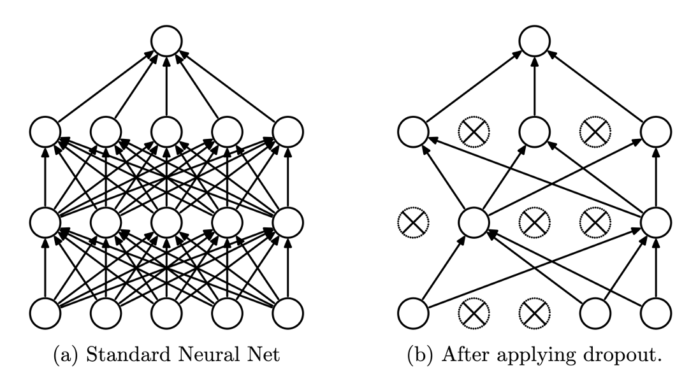
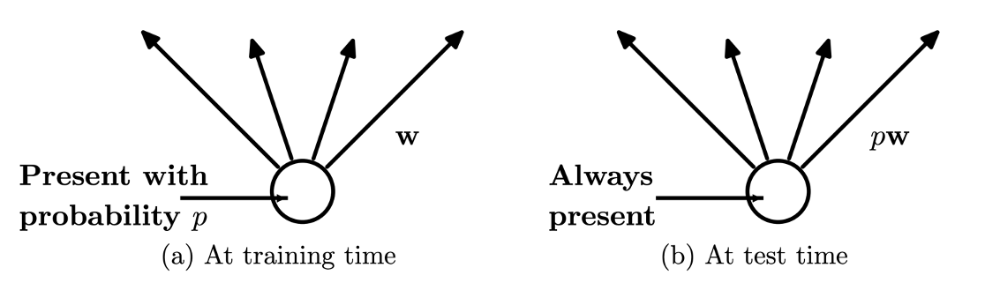
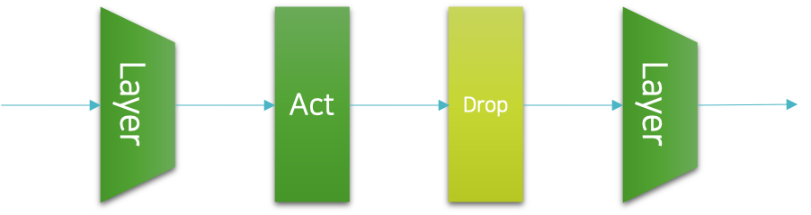

# 드랍아웃

앞서 데이터 증강<sup>data augmentation</sup> 기법은 데이터에 노이즈를 추가함으로써, 불필요한 특징<sup>feature</sup>들을 모델이 학습하는 것을 방지하고자 하였는데요.
이것은 신경망의 입력 또는 출력 위치에 노이즈를 추가하는 것으로 볼 수도 있습니다.
그렇다면 만약 신경망의 중간에 노이즈를 추가 할 수는 없을까요?

## 드랍아웃의 동작 방식

드랍아웃<sup>dropout</sup>이 어쩌면 그 답이 될 수 있을 것 같습니다.
드랍아웃은 임의의 노드를 일정 확률로 드랍<sup>drop</sup>해서 학습에 참여하지 않도록 하는 방법입니다.
데이터를 신경망에 통과시키는 과정<sup>feed-forward</sup>에서 노드가 생략되므로, 자연스럽게 오류역전파<sup>back-propgatiopn</sup>에서도 제외됩니다.
다음 그림은 드랍아웃의 개략적인 동작 방식을 보여줍니다.



그림과 같이 일부 노드가 드랍되어, 해당 노드와 연결된 가중치들도 끊어지는 것을 볼 수 있습니다.
드랍되는 노드는 매 미니배치마다 랜덤으로 선정됩니다.
이때 노드의 드랍 확률 $p$ 가 하이퍼파라미터가 되어, 사용자가 최적의 설정 값을 찾아주어야 합니다.

## 학습과 추론 방식의 차이

드랍아웃에서 또 하나 특기해야 할 점은 바로 학습과 추론 방법의 차이입니다.
앞서 설명한 드랍아웃의 동작 방법은 학습에서만 적용되는 방법인데요.
추론<sup>inference</sup>에서는 드랍되는 노드 없이 모든 노드가 항상 추론에 참여합니다.



이때 또 하나 중요한 점은 가중치 파라미터 $W$ 에 드랍 확률 $p$ 를 곱해주어야 한다는 것입니다.
예를 들어 하나의 4개의 입력 노드와 1개의 출력 노드를 가진 선형 계층<sup>linear layer</sup>를 상상해보죠.
그런데 만약 입력 노드에 $p=0.5$ 의 확률로 드랍아웃이 적용되었다면, 학습할 때에는 평균적으로 2개의 입력 노드로부터만 값을 전달 받을 것입니다.
하지만 추론시에는 4개의 모든 입력 노드로부터 값을 전달 받겠죠.
따라서 출력 노드는 추론 시에 평균적으로 2배 큰 입력 값을 전달 받을 것입니다.
그러므로 추론시에는 가중치 파라미터에 확률을 곱해주어 이것을 상쇄해야 합니다.

## 드랍아웃의 구현

드랍아웃은 이전까지 소개한 정규화 기법과 달리 신경망의 계층으로 구현될 수 있습니다.
파이토치에서는 미리 구현된 드랍아웃 계층을 제공하는데요.
우리는 이것을 활용하여 쉽게 드랍아웃을 구현할 수 있습니다.

보통 드랍아웃이 구현되는 위치는 다음 그림과 같이 활성 함수<sup>activation function</sup>와 다음 계층<sup>layer</sup> 사이가 됩니다.



이 그림에서는 이전 계층과 활성 함수 다음에 드랍아웃이 삽입되고, 이후에 다음 계층이 존재하는 것을 확인할 수 있습니다.
이를 코드로 적용하면 다음과 같이 될 것입니다.

```python
p = 0.3

net = nn.Sequential(
    nn.Linear(300, 200),
    nn.LeakyReLU(),
    nn.Dropout(p),
    nn.Linear(200, 100),
    nn.LeakyReLU(),
    nn.Dropout(p),
    nn.Linear(100, 50),
    nn.LeakyReLU(),
    nn.Dropout(p),
    nn.Linear(50, 10)
)
```

보통은 신경망의 양 끝단인 입력 계층 이전과 출력 계층 이후에는 드랍아웃이 적용되지 않습니다.

또한 추론과 학습이 다르게 동작하도록 해야 하기 때문에 학습과 추론 코드 상에서 추가적인 구현이 필요합니다.
파이토치의 nn.Module 을 상속받은 클래스는 train() 과 eval() 이라는 메서드를 제공하여 모델의 학습 모드와 추론 모드를 쉽게 왔다갔다 할 수 있도록 합니다.
train() 과 eval() 이 호출되면 해당 객체 안에 포함된 드랍아웃과 같이 학습과 추론에서 다르게 동작하는 계층들은 자동으로 학습 모드와 추론 모드로 전환됩니다.
물론 드랍아웃 자체도 nn.Module 을 상속받은 클래스의 객체일테니, train() 과 eval() 을 통해 모드를 직접 전환할 수 있습니다.

```python
for epoch_idx in range(n_epochs):
    net.train()
    for iter_idx in range(n_train_iters):
        # Training procedure

    net.eval()
    for iter_idx in range(n_valid_iters):
        # Validation procedure
```

따라서 학습<sup>training</sup>과 검증<sup>validation</sup>으로 구성되는 에포크<sup>epoch</sup>는 내부에서 모델의 학습 모드와 추론 모드의 전환 과정이 포함되어 있어야 합니다.
모델의 기본 모드는 학습 모드이기 때문에, 만약 테스트와 같은 추론을 수행할 때 추론 모드로의 전환을 깜빡한다면 모델의 성능이 실제 성능이 비해서 낮게 나올 것입니다.
그러므로 적절한 위치에서 train() 과 eval() 의 호출을 해주는 것을 잊지 않도록 해야 합니다.

## 드랍아웃의 의미와 한계

앞서 드랍아웃을 처음 소개할 때, 드랍아웃은 신경망의 중간에 노이즈를 추가하는 기법으로 볼 수 있다고 하였습니다.
다시 생각해보면, 드랍아웃은 임의의 노드를 학습에서 생략하는 과정을 통해 특정 노드 사이의 관계가 불필요하게 강해지는 것을 방지하며, 앞서 다른 정규화 방식과 마찬가지로 학습을 방해하는 방식으로 동작하는 것임을 알 수 있습니다.

따라서 드랍아웃이 적용되면 비록 일반화 성능이 개선될 수는 있어도 손실 값의 수렴<sup>convergence</sup> 속도가 저하될 수 있고 학습 오차<sup>training error</sup>가 증가될 수 있습니다.
또한 노드의 드랍 확률 값 $p$ 가 하이퍼파라미터<sup>hyper-parameter</sup>가 추가됨으로써, 사용자의 추가적인 튜닝을 요구하게 됩니다.
다행히 보통은 해당 하이퍼파라미터를 0.1 에서 0.5 사이의 값으로 0.1 단위로 튜닝하므로 많은 실험이 필요하진 않습니다.
