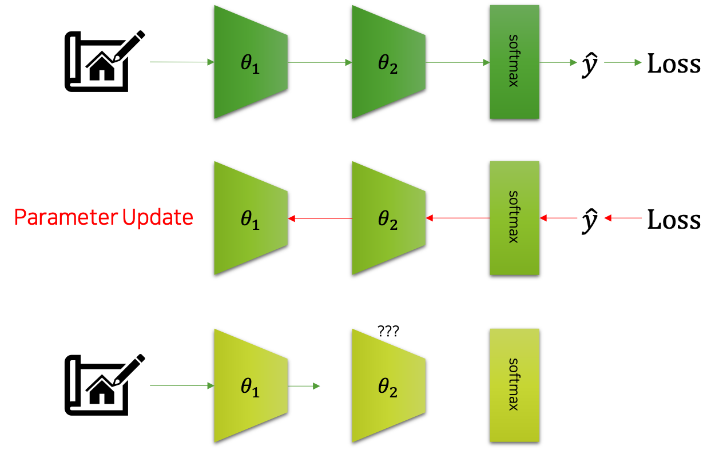
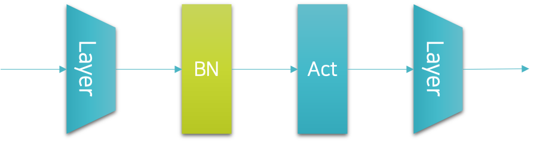
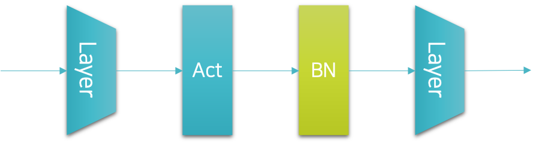

# 배치정규화

이번엔 가장 널리 쓰이는 정규화 기법인 배치정규화<sup>batch normalization</sup><sup>[[1]](#footnote_1)</sup>에 대해서 살펴보도록 하겠습니다.
배치정규화 기법은 드랍아웃과 마찬가지로 신경망 계층으로 구현되어 작동할 수 있는 정규화 기법입니다.
또한 이 뿐만 아니라, 드랍아웃처럼 모델의 모드 전환에 따라 다르게 동작한다는 점도 같습니다.

드랍아웃을 비롯하여 기존의 정규화 기법들은 대부분 학습을 방해하는 형태로 작용합니다.
따라서 대부분 일반화 성능을 개선하기 위해 학습 및 수렴 속도가 느려지게 되는 단점도 존재합니다.
하지만 배치정규화 기법의 경우, 학습 속도를 비약적으로 향상시킬 수 있을 뿐만 아니라, 일반화 성능까지 대폭 개선할 수 있는 훌륭한 방법입니다.

<a name="footnote_1">[1]</a>: Batch Normalization: Accelerating Deep Network Training by Reducing Internal Covariate Shift, Ioffe et al., ICML, 2015

## 공변량 변화 문제

배치정규화는 공변량 변화<sup>covariate shift</sup> 문제를 해결하고자 제안되었습니다.
여기서 이야기하는 공변량 변화 문제가 무엇인지 잠시 이야기해보도록 하겠습니다.
다음 그림은 공변량 변화를 도식화 한 것입니다.



그림에서 볼 수 있는 것처럼 어떤 입력이 주어졌을 때, 신경망은 이에대한 모델의 출력 $\hat{y}$ 을 반환할 것입니다.
그럼 우리는 이를 활용하여 손실<sup>loss</sup>을 계산할 것이고, 곧이어 오류역전파<sup>back-propagation</sup>와 경사하강법<sup>gradient descent</sup>을 통해 파라미터를 업데이트 할 것입니다.
문제는 심층신경망의 각 계층들이 서로가 어떻게 바뀔지 협의하에 상호작용하며 파라미터 업데이트가 이루어지는 것이 아니라는 것입니다.

예를 들어, $\ell$ 개의 계층을 가진 신경망 내부에 i번째 계층과 i+1번째 계층이 있다고 가정해보죠.
먼저 입력 미니배치 $x$ 가 주어졌을 때, 이를 바탕으로 $\hat{y}$ 과 손실이 계산될 것입니다.
그리고 이것을 가중치 파라미터 $\theta$ 로 미분하여, 각 계층의 파라미터들을 업데이트 합니다.
그럼 다음 미니배치 $x'$ 가 주어졌을 때, i번째 계층을 통과<sup>feed-forward</sup>하겠지요.
문제는 그럼 i+1번째 계층에서 발생합니다.
앞서 i+1번째 계층은 i번째 계층의 결과 값을 바탕으로 더 나은 모델의 출력을 만들기 위한 파라미터 업데이트를 수행하였습니다.
그런데 기껏 업데이트를 했더니, i번째 계층이 다른 출력을 반환하는 것이 아닌가요?
따라서 i번째 계층은 또 다시 성능이 떨어질 수 밖에 없습니다.

이처럼 신경망의 계층은 연쇄적으로 동작하기 때문에, 학습 과정에서 공변량 문제가 발생할 수 있고, 이것이 학습의 효율과 성능 개선을 저하하는 문제로 지적될 수 있습니다.

## 배치정규화의 동작

배치정규화는 미니배치 분포를 정규화<sup>normalization</sup>하여 이러한 문제를 해결하고자 합니다.
다음은 배치정규화의 동작을 수식으로 표현한 것입니다.

$$\begin{gathered}
\text{batch}\_\text{norm}(x)=\gamma\frac{(x-\mu)}{\sqrt{\sigma^2+\epsilon}}+\beta \\
\\
\mu=x.\text{mean}(\text{dim}=0) \\
\sigma=x.\text{std}(\text{dim}=0) \\
\\
\text{where }x\in\mathbb{R}^{N\times{n}}.
\end{gathered}$$

수식을 살펴보면, 미니배치를 단위 가우시안<sup>unit gaussian</sup> 분포로 바꾸는 정규표준분포화<sup>standardization</sup>한 이후에 스케일 파라미터 $\gamma$ 와 이동<sup>shift</sup> 파라미터 $\beta$ 를 적용합니다.
이때, $\gamma$ 와 $\beta$ 는 학습되는 가중치 파라미터<sup>weight parameter</sup>로써, 신경망 내의 비선형적<sup>non-linearity</sup>인 성질을 유지하는 것을 돕습니다.<sup>[[2]](#footnote_2)</sup>

<a name="footnote_2">[2]</a>: 예를 들어 단순히 평균이 0이고 표준편차가 1인 표준정규분포인 경우, 대부분의 값이 0 근처에 몰려 있을 것입니다.
그런데 이 분포에 시그모이드<sup>sigmoid</sup>를 통과시키면 대부분은 직선 구간을 통과하면서 비선형성이 적용되기 힘들겠지요.

## 학습과 추론의 동작 차이

배치정규화 기법도 드랍아웃과 마찬가지로 학습과 추론에서의 동작 방식이 다릅니다.
배치정규화가 추론에서 동작이 다른 이유는 바로 미니배치의 평균과 표준편차를 구하는 방식 때문입니다.
앞서 소개한 수식에 따르면 매 신경망을 통과하는 미니배치마다 평균과 표준편차를 구하고, 이를 활용하여 표준정규분포화를 수행한다고 되어 있는데요.
예를 들어, 미니배치가 256개의 샘플들로 이루어져 있다고 했을 때, 우리는 전체 256개의 샘플들을 살펴보고 이들의 통계 수치를 계산하는 것이라고 봐야 합니다.
그런데 추론 과정은 비록 미니배치로 병렬 연산을 수행할 수 있더라도, 미니배치 내에서 i번째 샘플에 대한 추론을 수행할 때, i번 이후의 샘플들을 살펴보는 것은 반칙과 다름없습니다.
즉, 추론 과정에서 미니배치의 전체 샘플들을 살펴보고 통계를 구하는 것은 올바르지 못한 방법입니다.

따라서 추론 과정에서는 들어오는 샘플들에 대한 이동평균과 이에 따른 표준편차를 계산하고, 이를 활용하여 각 샘플들에 대략적인 표준정규분포화를 수행합니다.
결과적으로 이 경우에는 학습 방식에 비해서 평균과 표준편차가 비교적 덜 정확할 수 있기 때문에, 추론 모드에서의 배치정규화가 적용된 신경망의 성능은 학습 모드일 때보다 성능이 조금 더 떨어질 수도 있습니다.

## 배치정규화의 구현

배치정규화 기법은 신경망 내부에 계층으로 구현할 수 있습니다.
따라서 파이토치에서는 배치정규화 계층을 제공하고 있습니다.
그럼 우리는 이 배치정규화 계층을 적절한 위치에 삽입해야 할텐데요.
원래 배치정규화를 제안한 저자는 다음 그림과 같이 배치정규화 계층을 선형 계층<sup>linear layer</sup>과 활성 함수<sup>activation function</sup> 사이에 넣을 것을 제안하였습니다.



하지만 이 경우에는 드랍아웃과 위치가 달라지게 되어 구현시 왜인지 모르게 마음이 불편해지는 상황이 연출되기도 합니다.
따라서 저의 경우에는 배치정규화 계층을 다음 그림과 같이 원래 드랍아웃 계층을 삽입하던 위치에 삽입하곤 합니다.



이 경우에도 배치정규화가 훌륭하게 동작하기 때문에 큰 문제가 없습니다.
학계에서도 오히려 두 번째 선택을 좀 더 선호하는 것 같기도 합니다.
이것을 코드로 옮기면 다음과 같이 표현될 것입니다.

```python
net = nn.Sequential(
    nn.Linear(300, 200),
    nn.LeakyReLU(),
    nn.BatchNorm1d(200),
    nn.Linear(200, 100),
    nn.LeakyReLU(),
    nn.BatchNorm1d(100),
    nn.Linear(100, 50),
    nn.LeakyReLU(),
    nn.BatchNorm1d(50),
    nn.Linear(50, 10)
)
```

배치정규화 계층을 생성할 때의 파라미터 입력은 이전 계층으로부터 나온 출력 벡터의 크기를 넣어주면 됩니다.

독자분들도 기호에 따라서 좋은 위치를 선택하여 배치정규화를 사용하시면 됩니다.
또한 배치정규화를 활용하게 되면 보통 드랍아웃을 쓰지 않습니다.
따라서 독자분들은 배치정규화의 드랍아웃 중에서 필요에 따라 정규화<sup>regularization</sup>를 위한 계층을 선택하여 쓰면 좋습니다.

## 배치정규화의 장점과 한계

기존의 정규화 기법들과 달리, 배치정규화의 경우 하이퍼파라미터가 추가되지 않는다는 점이 가장 큰 특징이자 장점입니다.
더욱이 배치정규화를 적용할 경우, 정규화<sup>regularization</sup>로 인한 일반화 성능 개선 뿐만 아니라, 학습과 수렴 속도가 빨라지는 장점도 존재합니다.
거의 단점은 존재하지 않는 장점만 존재하는 훌륭한 방법이라고 볼 수 있는데요.
그러므로 사용할 수 있는 조건이라면, 거의 무조건 써야 하는 정규화 기법이라고 볼 수 있습니다.<sup>[[3]](#footnote_3)</sup>

<a name="footnote_3">[3]</a>: 아쉽게도 순환신경망<sup>recurrent neural networks, RNN</sup>이나 트랜스포머<sup>Transformer</sup>와 같이 시퀀셜<sup>sequential</sup> 데이터를 다루는 환경에서는 사용할 수 없습니다.
