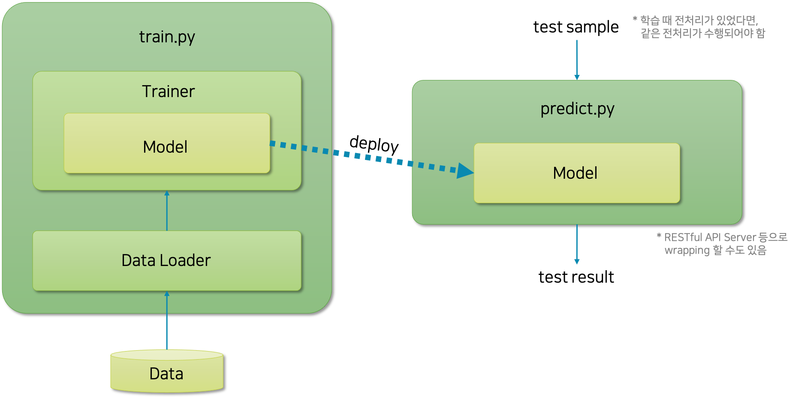

# 실무를 진행하듯이 실습하기

이번 챕터에서는 좀 더 실무에 가까운 형태의 실습을 진행해보려 합니다.
그동안은 주피터 노트북을 활용한 실습이었는데요.
사실 실무에서 머신러닝 프로젝트를 진행할 때, 주피터 노트북은 일부만 쓰이게 됩니다.
그 이유는 주피터 노트북의 경우에는 복잡한 프로그램 개발에 적합하지 않은 형태일 뿐만 아니라, 배포에 적합한 형태가 아니기 때문입니다.
주피터 노트북의 경우에는 바로 각 셀cell의 실행 결과를 확인할 수 있기 때문에, 데이터를 분석하는 과정과 같이 각 셀의 결과에 따라 해야하는 일이 바뀌는 경우에 적합합니다.
하지만 해야할 작업이 명확하고 반복되는 경우에는 py 확장자를 가진 파이썬 스크립트로 제작하여 CLIcommand line interface 환경에서 작업을 수행하는 것이 좀 더 바람직합니다.

따라서 머신러닝 프로젝트에서 데이터 분석 과정을 제외한 대부분의 과정은 CLI 환경에서 수행됩니다.
특히 모델링 및 하이퍼파라미터hyper-parameter 튜닝 작업시에는 반복적인 실험이 수행될 것이기 때문에, 코드를 수정하여 실험을 수행하는 것이 아닌, CLI 환경에서 파이썬 스크립트 실행과 함께 실행 파라미터를 넣어주어 실험을 수행하도록 하는 것이 낫습니다.

그러므로 주피터 노트북을 활용한 실습을 벗어나서, 실제 실무에서 머신러닝 프로젝트를 수행하는 것처럼 프로젝트 또는 솔루션을 설계하고 구현할 수 있어야 실무에 투입되었을 때 잘 적응할 수 있을 것입니다.
사실 대부분의 머신러닝 프로젝트들의 설계 구조도 결국 다음에 소개될 구조에서 크게 벗어나지 않기 때문에, 이러한 형태의 프로젝트들을 많이 설계하고 구현해본 경험이 많으면 효율적인 업무를 진행할 수 있습니다.

## 머신러닝 프로젝트 파일 구조 예시

가장 간단한 형태의 머신러닝 프로젝트를 구현한다면 다음과 같은 구조를 지닐 것입니다.

|파일명|설명|
|-|-|
|model.py|모델 클래스가 정의된 코드|
|trainer.py|데이터를 받아와 모델 객체를 학습하기 위한 트레이너trainer가 정의된 코드|
|dataloader.py|데이터 파일을 읽어와 전처리를 수행하고, 신경망에 넣기 좋은 형태로 변환하는 코드|
|train.py|사용자로부터 하이퍼파라미터를 입력 받아, 필요한 객체들을 준비하여 학습을 진행|
|predict.py|사용자로부터 기학습된 모델과 추론을 위한 샘플을 입력받아, 추론을 수행|

기능에 따라 각 모듈을 나누고 클래스를 정의하고, 다른 프로젝트에 재활용하기도 합니다.
또한 모델 개선이나 기타 수정 작업이 필요할 때, 코드 전체를 바꾸거나 영향을 끼칠 필요 없이 필요한 최소한의 부분만 수정하여 사용할 수 있습니다.
사실 이런 방식으로 코드를 구성하는 것은 머신러닝 뿐만 아니라 당연히 다른 모든 프로젝트에서도 권장되는 방식입니다.

다음 그림은 앞서 소개한 파일들이 어떤 식으로 상호작용하는지 나타낸 것입니다.

train.py는 사용자가 학습을 진행할 때 직접 실행할 파이썬 스크립트 파일입니다.
이 파일은 사용자로부터 필요한 하이퍼파라미터를 입력받아 각 클래스의 객체들을 생성하고 학습을 진행합니다.
사용자는 이 train.py를 통해서 코드의 수정 없이 다양한 하이퍼파라미터들을 변경해가며 반복적인 실험을 수행할 수 있습니다.

또한 트레이너trainer의 경우에는 데이터로더data loader로부터 준비된 데이터를 넘겨받아 모델에 넣어 학습과 검증을 진행하는 역할을 수행합니다.
이렇게 학습이 완료되면 모델의 가중치 파라미터weight parameter는 보통 피클pickle 형태로 다른 필요한 정보(e.g. 모델을 생성하기 위한 각종 설정 및 하이퍼파라미터)들과 함께 파일로 저장됩니다.

그럼 predict.py는 저장된 피클 파일을 읽어와서 모델 객체를 생성하고, 학습된 가중치 파라미터를 그대로 복원합니다.
그리고 사용자로부터 추론을 위한 샘플이 주어지면 모델에 통과시켜 추론 결과를 반환하는데요.
이때, predict.py에 선언된 함수들을 감싸서 RESTful API 서버로 구현할 수도 있을 것입니다.

이처럼 실제 머신러닝 프로젝트들은 반복적으로 수행되는 작업들을 효율적으로 수행하기 위해서 복잡한 구조들을 좀 더 추상화하여 각각 모듈들로 구현하도록 합니다.
복잡한 머신러닝 프로젝트일지라도 결국 데이터와 모델을 불러와서 학습하고, 기학습된 모델을 가지고 추론을 수행하는 업무는 근본적으로 같습니다.
따라서 이러한 형태에서 발전된 형태일 뿐, 근본적인 뼈대는 비슷한 형태를 취할수 밖에 없습니다.
이번 챕터에서는 이러한 방식을 통해 기존의 MNIST 분류를 학습하고 추론하는 코드를 구현해보도록 하겠습니다.
