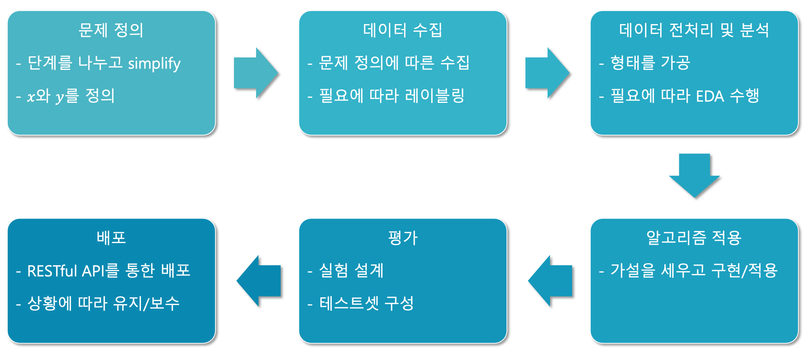
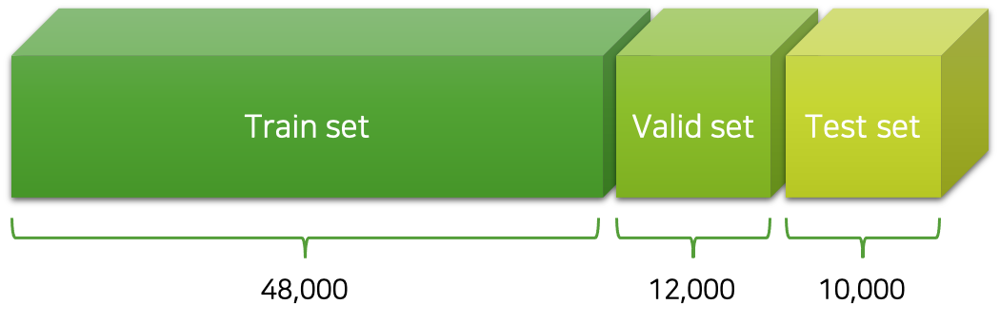
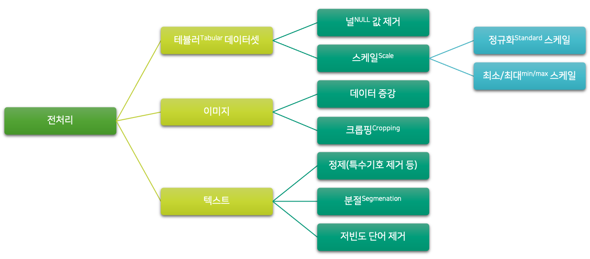
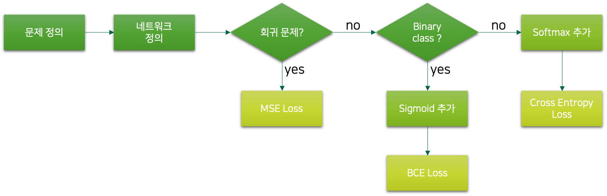
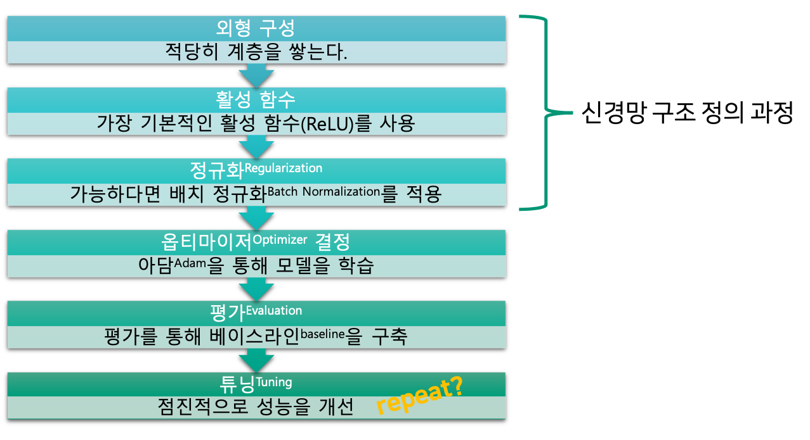
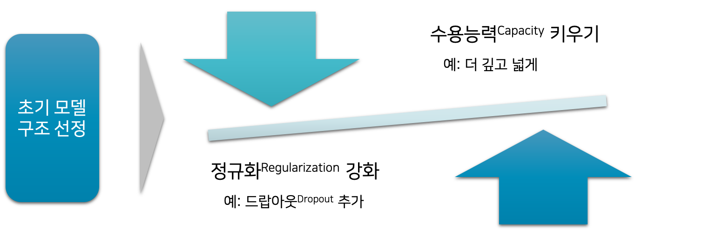

# 워크플로우 돌아보기

우리는 이번 챕터에서 MNIST 분류를 실제 머신러닝 프로젝트를 수행하듯이 각 기능별 모듈들을 구성하여 구현하고자 합니다.
이를 위해서 이 책 초반에 이야기하였던, 머신러닝 프로젝트의 워크플로우workflow를 돌아보며 복습하도록 하겠습니다.

## 문제 정의

우리는 숫자 손 글씨를 인식하는 함수 $f^*$ 를 근사approximate하고 싶습니다.
따라서 우리가 근사한 모델 함수 $f_\theta$ 는 이미지를 입력받아 숫자 레이블label을 출력하도록 구성될 것입니다.
이 모델을 만들기 위해서 우리는 숫자 손 글씨를 수집하고, 이에 대한 레이블링labeling도 수행합니다.
그렇게 데이터셋 구축 작업을 수행한 것이 바로 MNIST 데이터셋[[1]](#footnote_1)입니다.

이 샘플과 같이 한 장의 이미지는 $28\times28$ 크기의 흑백grayscale으로 구성되어 있습니다.
따라서 우리가 만들 함수의 입력은 784차원의 벡터를 입력받아, 각 숫자 클래스별 확률값을 출력으로 반환하도록 구현 될 것입니다.

<a name="footnote_1">[1]</a>: https://ko.wikipedia.org/wiki/MNIST_%EB%8D%B0%EC%9D%B4%ED%84%B0%EB%B2%A0%EC%9D%B4%EC%8A%A4

## 데이터 수집

지금이야 MNIST라는 기존의 공개된 데이터셋을 활용하는 행복한 상황이지만, 실무에서는 데이터가 없거나 데이터가 있더라도 레이블label이 존재하지 않는 상황일 것입니다.
이러한 데이터 수집 및 레이블링 작업을 수행하기 위해서는 두 가지 선택지가 있는데요.
첫 번째로는 직접 데이터 수집 및 레이블링을 진행하는 것입니다.
두 번째로는 외주를 맡기거나 단기 계약직을 고용하는 방법이 있겠지요.
두 선택지 중에서 어떤 선택을 하든지, 업무의 크기를 산정해야하고 예산을 준비하는 작업도 필요할 것입니다.

그럼 만약 데이터 수집은 여차저차 완료된 상태에서, 레이블링을 직접 수행한다고 가정해보도록 하겠습니다.
MNIST 데이터셋과 같이 70,000장의 손 글씨에대한 레이블링을 진행할텐데요.
파일이 이름 순서대로 정렬되어 있을 때, 파일 이름과 이에 대한 레이블을 적을 수 있도록 엑셀 파일을 준비합니다.[[2]](#footnote_2)
그럼 그림을 차례대로 띄워가면서, 엑셀 시트에 정답 레이블을 기입해야 할 것입니다.

이러한 상황에서 기대되는 레이블링 속도는 넉넉잡아 1장의 이미지당 5초가 소요된다고 가정하겠습니다.
따라서 70,000장 전체 이미지 데이터셋에 대한 레이블링을 위한 예상 소요시간은 다음과 같이 계산 가능할 것입니다.

$$\begin{gathered}
5\text{ secs}/\text{sample}\times70,000\text{ samples}=350,000\text{ secs}\approx97.22\text{ hours}
\end{gathered}$$

약 100시간이 소요될 것으로 예상되는군요.
만약 팀원 3명이서 이 작업을 나눠서 한다면 약 33시간 내외가 소요될 것입니다.
그럼 산술적으로 하루에 8시간씩 4일이면 전체 70,000장에 대한 레이블링 작업이 완료될 수 있습니다.
물론 이 과정에서 팀원들의 멘탈이 바스라질 수 있기 때문에 약간의 버퍼buffer와 회식비가 추가 될 수는 있겠네요.

이런 계산 과정을 통해 제가 독자분들께 말씀드리고 싶은 것은 사실 레이블링이 생각보다 직접 수행할만하다는 점입니다.
이러한 머신러닝 서비스 또는 프로젝트를 기획하고 수행하는 단계에서, 무턱대고 회사로부터 예산을 받아와서 데이터를 수집하고 모델을 만드는 것은 사실 프로젝트가 잘 진행되지 않았을 때 위험한 행동이 될 수 있습니다.
따라서 개념 증명proof of conecept, PoC 과정을 거쳐서 실현 가능성을 확인한 이후에 본격적인 자원을 투입하는 것이 훨씬 바람직합니다.
이때 보통 프로토타입prototype 모델은 실제 서비스 또는 배포를 위한 모델만큼 뛰어날 필요는 없고, 다만 데이터셋이 수집되었을 때의 가능성만 증명할 수 있으면 될 것입니다.
그러므로 프로토타입 모델을 학습하기 위한 데이터셋은 위와 같이 70,000장이나 모을 필요도 없고 10,000장 정도면 충분할 수도 있습니다.[[3]](#footnote_3)
그렇게 개념 증명이 완료된 이후에, 이를 바탕으로 예산을 확보하고 외주를 맡기는 등의 작업 진행 방향이 훨씬 바람직 할 것입니다.

그럼 외주를 맡길 경우에 견적을 내볼까요?
보통 작업의 난이도에 따라서 샘플당 몇 십원에서 많게는 몇 백원까지 책정됩니다.[[4]](#footnote_4)
문제는 이외에도 비용과 노력이 필요하다는 점인데요.
아무래도 실제 프로젝트를 수행하는 직원분들이 레이블링을 직접 수행하는 것이 아니다보니, 레이블링의 정확도나 품질이 떨어질 수도 있습니다.
따라서 레이블링 결과물들의 품질을 관리하는 업무가 수반되어야 합니다.
즉, 외부에 작업을 맡기더라도 데이터 수집에서 마냥 손을 놓을 수 없다는 의미입니다.
따라서 데이터 수집 업무를 수행할 때, 이러한 점들이 모두 고려되어야 할 것입니다.

<a name="footnote_2">[2]</a>: 엑셀 파일을 준비하든지 전용 프로그램을 제작하든지간에 효율성이 이 작업의 핵심입니다.

<a name="footnote_3">[3]</a>: 그럼 대략 3명이서 하루 정도면 해결할 수 있는 분량입니다.

<a name="footnote_4">[4]</a>: 이미지 내에서 특정 객체들의 영역을 표시하는 등의 훨씬 어려운 작업들도 많기 때문에, 지금과 같이 숫자 이미지에 레이블링을 하는 작업은 매우 쉬운 편에 속합니다.

## 데이터 전처리

이제 데이터셋을 학습용과 검증용 그리고 테스트용으로 나누는 작업을 수행할 차례입니다.
MNIST 데이터셋의 경우 기본적으로 60,000장의 학습 데이터셋training dataset과 10,000장의 테스트 데이터셋test dataset으로 구분되어 있습니다.
따라서 테스트셋은 주어진 10,000장을 사용하도록 하고, 60,000장을 8:2의 비율로 학습 데이터셋과 검증 데이터셋validation dataset으로 나누어줍니다.
그럼 최종적으로 다음 그림과 같이 학습 데이터셋 48,000장, 검증 데이터셋 12,000장, 그리고 테스트 데이터셋 10,000장을 얻을 수 있습니다.

데이터를 분할한 이후에 데이터 전처리를 수행합니다.
이때, 데이터의 성격에 따라 필요한 전처리가 굉장히 다릅니다.
따라서 우리는 전처리를 본격적으로 수행하기에 앞서, 데이터가 어떠한 분포와 형태를 띄고있는지 면밀하게 분석해야 합니다.
이후에 분석을 바탕으로 다음과 같이 적절한 다양한 전처리를 수행할 수 있습니다.

일부 전처리 기법들은 데이터를 기반으로 파라미터가 결정됩니다.
예를 들어 정규화standard 스케일의 경우에는 평균과 표준편차를 계산하여 표준정규분포 형태로 변환하는 것인데요.
당연히 평균과 표준편차는 데이터로부터 계산되어야겠지요.
따라서 중요한 점은 이러한 평균과 표준편차 계산과 같은 데이터 기반의 전처리 기법은 학습 데이터셋training dataset 기준으로 수행되어야 한다는 것입니다.
즉, 학습 데이터만을 가지고 평균과 표준편차를 계산한 뒤, 학습/검증/테스트 데이터셋에 일괄 적용하는 형태가 되어야 합니다.
만약 전체 데이터셋을 기반으로 평균과 표준편차를 계산하여 정규화 스케일을 적용하게 되면 테스트셋을 보고 테스트를 평가하는 것과 같습니다.
결과적으로 전처리는 학습/검증/테스트 데이터셋을 분할하는 작업 이후에 수행하는 것이 바람직합니다.

다행히도 MNIST 데이터셋의 경우 별다른 전처리가 필요하지 않습니다.
0에서 255사이의 값들로 채워진 픽셀 값들을 255로 나누어주어, 0에서 1사이의 값으로 정규화normalize해주는 작업 정도면 충분합니다.

## 알고리즘 적용

데이터 전처리 과정에서 수행된 분석을 통해 우리는 데이터의 분포나 성질을 파악할 수 있었을 것입니다.
따라서 우리는 분석 결과를 바탕으로 알맞은 가설을 설정하고 알고리즘을 구현 및 적용해야 합니다.
이 과정에서 꼭 심층신경망이 적용될 필요도 없고, 분석 결과에 따라 가장 적절한 머신러닝 알고리즘을 적용하면 될 것입니다.

만약 심층신경망을 적용하기로 결정하였다면, 다음 그림과 같이 신경망의 구조를 결정하는 작업이 수행될 것입니다.

신경망 내부의 자세한 구조의 결정에 앞서, 회귀 문제인지 분류 문제인지에 따라 손실 함수와 마지막 계층의 활성 함수가 결정됩니다.
그럼 계층의 갯수, 활성 함수의 종류, 정규화 방법 등의 하이퍼파라미터hyper-parameter들이 많이 남아있는데요.
이들을 결정하기 위한 프로세스는 다음과 같습니다.

먼저 적당한 선택들로 초기 하이퍼파라미터를 설정한 다음에 오버피팅이 발생할 때까지 신경망을 깊고 넓게 만듭니다.
오버피팅이 발생하는 것을 확인함으로써, 신경망이 데이터셋의 복잡한 데이터를 충분히 학습할만한 수용능력capability을 지녔음을 알 수 있습니다.
또한 오버피팅이 발생하더라도 어쨌든 우리는 매 에포크epoch마다 검증 데이터셋에 대한 손실 값을 추적하고 있을 것이므로 큰 문제가 되지 않습니다.
이후에 적절한 채점 공식score metric을 적용하여 모델을 평가하여 모델의 성능을 수치화 합니다.
여기까지가 한 번의 모델링 과정을 거친 것이 되고, 이후에 하이퍼파라미터를 수정하며 이 과정을 반복하여 모델의 성능을 점진적으로 개선합니다.
또는 단순한 하이퍼파라미터의 수정만으로는 충분한 성능의 개선이 이루어지지 않는다면, 성능 저하 문제의 원인에 대한 적절한 가설을 설정하고 모델의 구조를 바꾸는 등의 수정을 거쳐서 성능을 개선할 수도 있습니다.

## 평가

서비스 또는 배포를 위해서 공정하고 객관적인 평가가 이루어져야 하는 것 뿐만 아니라, 앞서 '알고리즘 적용' 항목에서 소개한 것처럼 모델의 성능 개선을 위해서도 적절한 평가가 수행되어야 합니다.

예를 들어 초기 모델의 구조를 선정한 이후에, 평과 결과에 따라서 언더피팅underfitting이 의심될 경우에는 모델의 수용능력을 더 키우는 방향으로 하이퍼파라미터를 튜닝하고, 오버피팅overfitting으로인해 일반화 성능이 저하되는 것이 우려될 경우에는 정규화regularization 기법을 강화하는 방향으로 튜닝을 하며, 학습과 평가를 반복 수행하게 될 것입니다.

|범주|학습 데이터셋|검증 데이터셋|테스트 데이터셋|
|:-:|:-:|:-:|:-:|
|가중치 파라미터|결정|**검증**|**검증**|
|하이퍼파라미터| |결정|**검증**|
|알고리즘| | |결정|

이와 같은 모델 성능 개선 작업이 종료되고 나면, 테스트 데이터셋을 활용하여 평가를 수행함으로써 진정한 모델(또는 알고리즘)의 성능을 공정하게 평가할 수 있습니다.

## 배포

이제 우리의 알고리즘이 실전에 투입될 준비가 되었다고 판단되면 본격적으로 배포 과정에 들어가게 될텐데요.
이번 실습에서는 손쉬운 시각화를 위해서 주피터 노트북을 통해서 구현하고자 합니다.
다만 주피터 노트북에 함수 형태로 잘 기능별로 나누어 구현하면, 아마 실무에서는 이 함수들을 별도의 스크립트 파일에 구현하는 형태로 활용할 수 있을 것입니다.
