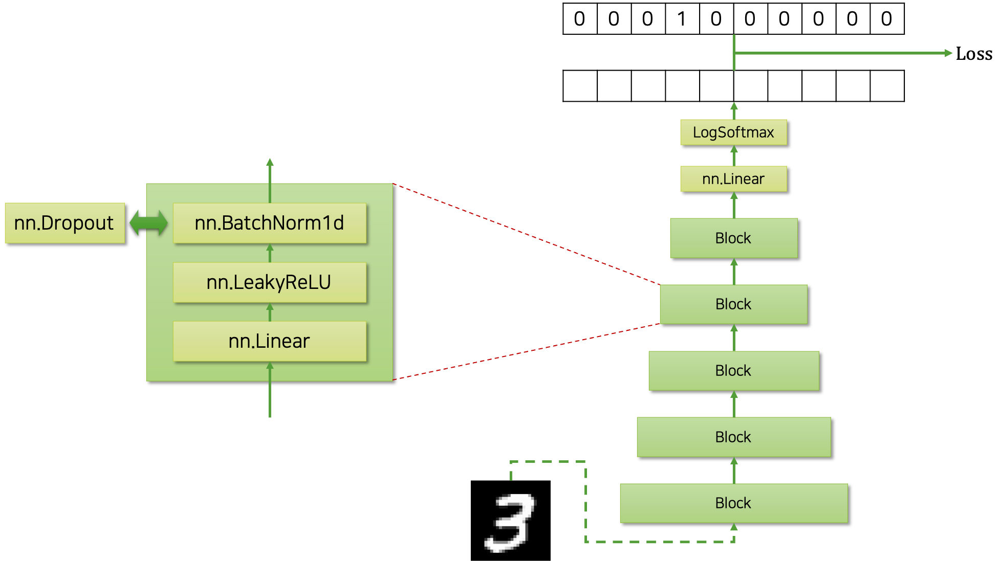
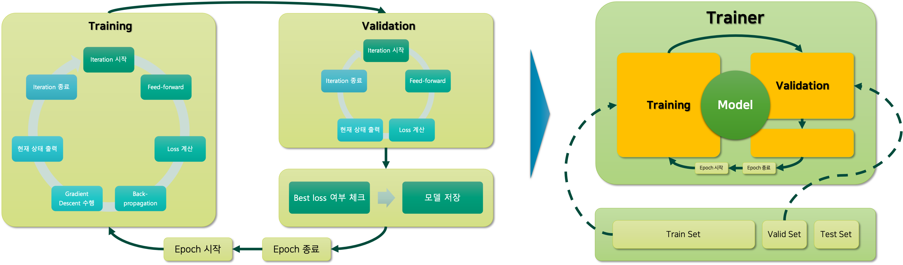

# 실습 소개

본격적인 실습에 앞서, 실습에서 어떤 내용을 구현할지 이야기해보도록 하겠습니다.

## 모델 구조 설계

우리는 MNIST 분류기를 만들 것입니다.
따라서 모델은 $28\times28$ 크기의 이미지를 784차원의 벡터로 펼쳐서 입력 받아, 각 숫자 클래스별 확률 값을 반환해야 합니다.

다음은 우리가 구현할 모델의 구조를 그림으로 나타낸 것입니다.

반복되는 계층을 쌓아 구현할 것이므로, 반복되는 부분을 깔끔하게 블록block 클래스로 정의하고, 블록 클래스를 쌓아 올릴 것입니다.
하나의 블록 내에는 선형 계층linear layer과 비선형 활성 함수non-linear activation function인 리키렐루leaky ReLU, 그리고 정규화regularization를 위한 배치정규화batch normalization 계층이 차례대로 들어있습니다.
기본 값은 배치정규화 계층이지만, 사용자의 필요에 따라 드랍아웃dropout을 대체하여 사용할 수 있도록 구현해 놓을 것입니다.
이후에는 분류를 위해 클래스 갯수(MNIST의 경우에는 10차원)만큼의 차원으로 변환하는 선형 계층과 로그소프트맥스log-softmax함수를 배치 할 것입니다.

이렇게 하면 모델은 각 클래스(MNIST의 경우에는 0부터 9까지의 숫자)별 로그 확률log probability 값을 뱉어낼 것이고, 이것을 정답 원핫one-hot 벡터와 비교하면 손실 값을 계산할 수 있습니다.
이때 주의할 점은, 그냥 소프트맥스 함수가 아닌 로그소프트맥스 함수를 활용하였기 때문에, 손실 값 계산을 위해서 NLL 손실 함수를 사용해야 할 것입니다.

재미있는 점은 이 모델을 구현할 때, 우리가 풀고자 하는 MNIST와 연관된 하드코딩hard-coding을 거의 하지 않도록 할 것이므로, 이 모델이 MNIST 이외의 분류 문제에도 바로 적용 가능할 것이라는 점입니다.
따라서 만약 다른 문제에 바로 우리의 코드를 적용하고자 한다면, 데이터 로더data loader 부분만 수정하면 거의 그대로 동작할 것입니다.
이와 같이 애초에 구현 단계에서 최소한의 수정으로 최대한 재활용과 확장이 가능하도록 설계하고 구현하는 것이 매우 중요합니다.
또한 이를 위해서, 각 기능을 위한 모듈들이 잘 나뉘어 독립적으로 구현되어 있어야 할 것입니다.

## 학습 과정

심층신경망DNN을 학습하기 위한 과정은 다음과 같습니다.

학습/검증/테스트 데이터셋으로 구성된 데이터를 트레이너Trainer 모듈에 넣어주어 모델을 학습할 것입니다.
이때, 학습을 위한 전체 n_epochs 만큼의 반복이 진행 될 것이고, 이것은 왼쪽 그림의 맨 바깥쪽에 싸이클로 표현되어 있는 것을 확인할 수 있습니다.
그럼 하나의 에포크epoch는 학습을 위한 부분과 검증을 위한 부분으로 나뉘어 있을 것입니다.
각각의 학습과 검증은 미니배치별로 이터레이션iteration을 위한 반복문으로 구현되어 있을 것이며, 이중 학습 과정에서는 손실 계산 후 오류역전파back-propagation와 경사하강법gradient descent을 통한 가중치 파라미터weight parameter 업데이트 과정이 포함되어 있을 것입니다.

이 과정을 구현할 때, MNIST 분류 또는 상기한 모델과 직접적으로 연관되어 있는 부분은 하드코딩hard-coding을 통해 구현하지 않을 것이므로, 트레이너 코드는 다른 문제나 다른 모델 구조를 학습할 때에도 활용 가능할 것입니다.
더욱이 손실 함수도 사용자로부터 따로 입력받아 계산하도록 한다면, 분류 문제 뿐만 아니라 회귀 문제에도 적용 가능할 수도 있겠네요.

### 학습 과정을 수식으로 표현

앞서 소개한 모델 학습 과정을 수식으로 표현하면 다음과 같습니다.

우리는 N개의 입출력 쌍을 모아 데이터셋을 구축합니다.

$$\begin{gathered}
\mathcal{D}=\{(x_i, y_i)\}_{i=1}^N \\
\text{where }x\in[0,1]^{N\times(28\times28)}\text{ and }y\in\{0,1\}^{N\times10}.
\end{gathered}$$

이때, 입력 샘플의 경우에 $28\times28$ 의 이미지를 변환하여 784차원의 벡터로 만들어주는 점에 주의해주세요.
또한 정답 출력 벡터는 클래스 갯수만큼의 차원인 10차원의 원핫 벡터입니다.

그럼 우리는 가중치 파라미터weight parameter $\theta$ 를 갖는 모델 $f_\theta$ 를 통해 $f^*$ 를 근사approximate하고자 합니다.
이때 우리는 확률 문제로써 이 문제를 접근할 수 있고, 따라서 모델 $f_\theta$ 의 출력 벡터 $\hat{y}$ 은 각 클래스별 로그 확률 값이 담겨있는 벡터라고 볼 수 있습니다.
우리는 이것을 로그소프트맥스 함수를 활용하여 구현할 수 있구요.

$$\begin{gathered}
\log{P_\theta(\cdot|x_i)}=\hat{y}_i=f_\theta(x_i)
\end{gathered}$$

그럼 이제 손실 함수를 정의해볼 수 있을텐데요.
손실 함수는 NLL 손실함수를 통해 구현할 수 있습니다.
여러분은 NLL 손실함수를 직접 구현할 필요는 없고, 파이토치에서 제공하는 nn.NLLLoss 클래스를 활용하시면 됩니다.

$$\begin{aligned}
\mathcal{L}(\theta)&=-\frac{1}{N}\sum_{i=1}^N{
    \log{P(\text{y}=y_i|\text{x}=x_i;\theta)}
} \\
&=-\frac{1}{N}\sum_{i=1}^N{
    y_i^\intercal\cdot\hat{y}_i
}
\end{aligned}$$

이렇게 정의된 손실 함수를 최소화 하는 입력 파라미터를 찾게 되면, 우리가 원하는 $f^*$ 를 잘 근사하는 가중치 파라미터가 될 것입니다.

$$\begin{gathered}
\hat{\theta}=\underset{\theta\in\Theta}{\text{argmin }}\mathcal{L}(\theta)
\end{gathered}$$

이러한 최소화 작업을 수행하기 위해, 우리는 경사하강법을 통해 파라미터를 업데이트하여 손실 값을 최소화하는 가중치 파라미터를 점진적으로 찾을 수 있습니다.

$$\begin{gathered}
\theta\leftarrow\theta-\eta\cdot\frac{\partial\mathcal{L}(\theta)}{\partial{\theta}}
\end{gathered}$$

독자 여러분은 이 수식들이 어떻게 실제 코드로 구현되는지 이 챕터를 통해 주의깊게 살펴봐주시면 좋을 것 같습니다.

## 파일 구조

앞서 이 챕터의 시작에서 머신러닝 프로젝트의 파일 구조에에 대해서 설명한 적이 있는데요.
이 실습 프로젝트의 파일 구조도 당시의 설명과 대동소이합니다.

|파일명|설명|
|-|-|
|model.py|nn.Module을 상속 받아 모델 클래스를 정의|
|predict.ipynb|학습이 완료된 모델 피클 파일을 불러와, 샘플을 입력받아 추론 수행|
|train.py|사용자가 학습을 진행하기 위한 진입 지점|
|trainer.py|모델 객체와 데이터를 받아, 실제 학습 이터레이션을 수행하는 클래스를 정의|
|utils.py|프로그램 내에서 공통적으로 활용되는 모듈들을 모아 놓은 스크립트|

지금은 일단 굉장히 작은 프로젝트이므로 한 디렉터리 내에 이 파일들이 전부 위치하도록 할 것이지만, 나중에 프로젝트가 커지고 파일들이 많아지게 되면 따로 디렉터리 구조를 추가하여 좀 더 일목요연하게 관리할 수 있을 것입니다.
예를 들어 현재의 선형 계층을 활용한 모델 이외에도 다른 신경망 구조를 활용한 모델들(e.g. 순환신경망RNN 또는 컨볼루션 신경망CNN)이 추가될수도 있겠지요.
